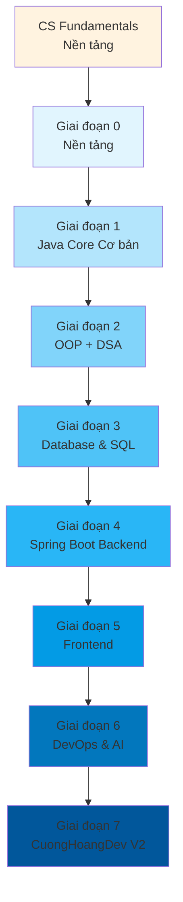

# Lộ trình Học tập: Từ Con Số 0 đến CuongHoangDev V2

> **Từ Con Số 0 đến Chuyên gia - Cẩm nang học tập toàn diện nhất**
>
> Tổng thời gian: ~14-18 tháng (nếu học 20-25h/tuần)
>
> Tech stack: Java 17/21, Spring Boot 3.x, Next.js 14, PostgreSQL, Redis, Docker, Spring AI + RAG
>
> Ghi lại tiến độ MỖI NGÀY. Viết ít nhất 3 dòng: hôm nay học gì, làm được gì, khó khăn gì.

---

## MỤC LỤC

- [Tổng quan](#tổng-quan)
- [CS Fundamentals - Nền tảng Khoa học Máy tính](#cs-fundamentals---nền-tảng-khoa-học-máy-tính)
- [Giai đoạn 0: Nền tảng & Tư duy lập trình](#giai-đoạn-0-nền-tảng--tư-duy-lập-trình-2-3-tuần)
- [Giai đoạn 1: Java Core cơ bản](#giai-đoạn-1-java-core-cơ-bản-8-10-tuần)
- [Giai đoạn 2A: OOP & Design Patterns](#giai-đoạn-2a-oop--design-patterns-6-8-tuần)
- [Giai đoạn 2B: Cấu trúc dữ liệu & Giải thuật](#giai-đoạn-2b-cấu-trúc-dữ-liệu--giải-thuật-6-8-tuần)
- [Giai đoạn 3: Database & SQL](#giai-đoạn-3-database--sql-4-6-tuần)
- [Giai đoạn 4: Spring Boot Backend](#giai-đoạn-4-spring-boot-backend-10-14-tuần)
- [Giai đoạn 5: Frontend Development](#giai-đoạn-5-frontend-development-8-12-tuần)
- [Giai đoạn 6: DevOps & AI Integration](#giai-đoạn-6-devops--ai-integration-6-8-tuần)
- [Giai đoạn 7: CuongHoangDev V2 Sprint 30 ngày](#giai-đoạn-7-cuonghoangdev-v2-sprint-30-ngày)
- [Giai đoạn 8: Nâng cao](#giai-đoạn-8-nâng-cao)
- [Phụ lục A: 100 bài LeetCode](#phụ-lục-a---100-bài-leetcode)
- [Phụ lục B: Interview Preparation Guide](#phụ-lục-b---interview-preparation-guide)
- [Phụ lục C: Resources Library](#phụ-lục-c---resources-library)
- [Phụ lục D: Nhật ký hàng ngày & Checkpoint](#phụ-lục-d---nhật-ký-hàng-ngày--checkpoint)

---

# TỔNG QUAN

## Sơ đồ các giai đoạn



## Lộ trình theo tháng

| Tháng | Giai đoạn | Trọng tâm |
|-------|-----------|-----------|
| 1 | CS Fundamentals + 0 | Máy tính hoạt động thế nào, Setup Java |
| 2-3 | 1 | Java Core: biến, vòng lặp, method, String, exception |
| 4-6 | 2 | OOP + Cấu trúc dữ liệu & Giải thuật |
| 7 | 3 | Database & SQL (PostgreSQL) |
| 8-11 | 4 | Spring Boot Backend |
| 12-14 | 5 | Frontend: HTML/CSS/JS → React → Next.js |
| 15-16 | 6 | DevOps + AI Integration |
| 17-18 | 7 | CuongHoangDev V2 hoàn chỉnh |
| 18+ | 8 | System Design, Clean Architecture, Chứng chỉ |

**Tổng cộng: ~54-65 tuần (12-15 tháng)**

## Ký hiệu theo dõi

- **Trạng thái:** `[ ]` chưa làm | `[-]` đang làm | `[+]` hoàn thành | `[~]` làm một phần
- **Mức độ hiểu:** `___/5` (tự đánh giá 1-5 sau mỗi giai đoạn)
- **LeetCode:** `[ ]` chưa làm | `[D]` Done | `[S]` Solved

## Công cụ cần cài đặt

| Công cụ | Mục đích | Link |
|---------|----------|------|
| JDK 21 | Môi trường Java | [Adoptium](https://adoptium.net/) |
| IntelliJ IDEA CE | IDE Java (miễn phí) | [JetBrains](https://www.jetbrains.com/idea/download/) |
| PostgreSQL 15+ | Database | [postgresql.org](https://www.postgresql.org/download/) |
| DBeaver | Database client | [dbeaver.io](https://dbeaver.io/download/) |
| VS Code | Code editor | [code.visualstudio.com](https://code.visualstudio.com/) |
| Postman | API testing | [postman.com](https://www.postman.com/downloads/) |
| Docker Desktop | Container | [docker.com](https://www.docker.com/products/docker-desktop/) |
| Git | Version control | [git-scm.com](https://git-scm.com/downloads) |
| Node.js 20 LTS | Frontend runtime | [nodejs.org](https://nodejs.org/) |

---

# CS FUNDAMENTALS - NỀN TẢNG KHOA HỌC MÁY TÍNH

> **Phần này học SONG SONG với Giai đoạn 0-1. Giúp bạn HIỂU SÂU tại sao code chạy được, máy tính hoạt động ra sao. Không bỏ qua phần này!**

## 1. Máy tính hoạt động như thế nào?

### 1.1. Phần cứng - Các thành phần bên trong

```
┌─────────────────────────────────────────────────────┐
│                    MÁY TÍNH                         │
│                                                      │
│  ┌──────────┐   ┌──────────┐   ┌──────────┐       │
│  │   CPU    │◄──│   RAM    │◄──│   SSD    │       │
│  │ (não)   │   │ (bộ nhớ  │   │ (kho lưu│       │
│  │ 3.0 GHz │   │  tạm)    │   │  trữ)   │       │
│  └──────────┘   └──────────┘   └──────────┘       │
│      ▲                                       │       │
│      │                            ┌──────────┐│       │
│      └────────────────────────────│    GPU   ││       │
│                                   │(đồ họa)│        │
│                                   └──────────┘        │
│  ┌──────────────────────────────────────────┐        │
│  │           MAINBOARD (Bo mạch chủ)        │        │
│  └──────────────────────────────────────────┘        │
└─────────────────────────────────────────────────────┘
```

**CPU (Central Processing Unit) - Bộ não máy tính:**
- Thực thi **tất cả** phép tính và logic
- Tốc độ đo bằng **GHz** (3.0 GHz = 3 tỷ chu kỳ/giây)
- Mỗi chu kỳ CPU làm được 1 việc nhỏ (cộng 2 số, so sánh)
- **Cache**: bộ nhớ siêu nhanh bên trong CPU (L1, L2, L3)

**RAM (Random Access Memory) - Bộ nhớ tạm:**
- Lưu dữ liệu **đANG SỬ DỤNG** khi máy chạy
- **Volatile**: mất hết khi tắt máy
- Khi mở Chrome: RAM lưu trang web, khi tắt RAM trống
- 8GB, 16GB, 32GB - càng nhiều càng chạy được nhiều chương trình cùng lúc

**SSD/HDD (Storage) - Kho lưu trữ:**
- Lưu trữ **VĨNH VIỄN** (không mất khi tắt máy)
- SSD: nhanh nhưng đắt (NVMe PCIe)
- HDD: chậm nhưng rẻ (quay đĩa từ)
- Máy tính của bạn: SSD chứa hệ điều hành, HDD chứa file

**GPU (Graphics Processing Unit) - Bộ xử lý đồ họa:**
- Hàng ngàn core nhỏ, xử lý **song song** nhiều phép tính cùng lúc
- Ban đầu: render game, video
- Giờ: AI/ML training (học từ dữ liệu lớn)

### 1.2. CPU chạy code như thế nào? (Cực kỳ quan trọng!)

```
Bước 1: FETCH     ──► CPU đọc lệnh từ RAM
Bước 2: DECODE    ──► CPU hiểu lệnh đó là gì (cộng? trừ? nhớ?)
Bước 3: EXECUTE   ──► CPU thực hiện phép tính
Bước 4: WRITE    ──► CPU ghi kết quả vào RAM/Register
```

**Register** = Bộ nhớ siêu nhanh bên trong CPU (chỉ vài byte)
- `EAX`, `EBX` trong CPU x86
- Khi code `int a = 5 + 3;`:
  1. Load 5 vào register
  2. Load 3 vào register
  3. CPU cộng 2 giá trị
  4. Ghi kết quả (8) vào biến `a` trong RAM

### 1.3. Bộ nhớ (Memory Hierarchy) - HIỂU SÂU điều này!

```
Tốc độ & Giá thành giảm dần xuống
┌─────────────┐  ◄── CPU Cache (L1/L2/L3)  - Cực nhanh, cực đắt, cực ít
│  REGISTER  │     ~1KB, 1 chu kỳ CPU
├─────────────┤
│    L1      │     ~64KB/core, 1-2 chu kỳ CPU
├─────────────┤
│    L2      │     ~256KB/core, 3-10 chu kỳ CPU
├─────────────┤
│    L3      │     ~16MB, 10-20 chu kỳ CPU (chia sẻ)
├─────────────┤
│    RAM     │     ~8-32GB, 50-100 chu kỳ CPU
├─────────────┤
│    SSD     │     ~256GB-2TB, 100,000 chu kỳ CPU
├─────────────┤
│    HDD    │     ~TB, 10,000,000 chu kỳ CPU
└─────────────┘
```

**Tại sao điều này quan trọng với lập trình?**
- Khi code chậm: thường do đọc/ghi RAM/SSD quá nhiều (không phải CPU)
- Cache locality: code chạy tốt khi dữ liệu gần nhau trong bộ nhớ
- Loop qua mảng 1000 phần tử: cache load 1 lần. Loop tới lui random: cache miss liên tục = CHẬM

### 1.4. Hệ điều hành (OS) làm gì?

```
┌────────────────────────────────────────┐
│          USER SPACE (không gian người dùng) │
│                                            │
│    App A    │ App B    │ App C │  Browser │  ← Các ứng dụng của bạn
│   (chrome) │  (game)  │(music)│          │
└────────────┴──────────┴───────┴──────────┘
┌────────────────────────────────────────┐
│            KERNEL SPACE (không gian hệ thống)  │
│                                              │
│   Process Manager  │ Memory Manager │ File Sys │  ← OS core
│   CPU Scheduler   │  Device Driver │ Network  │
└──────────────────┴──────────────┴──────────┘
```

**Process** = Chương trình đang CHẠY
- Mỗi process có bộ nhớ riêng (memory space riêng)
- Windows Task Manager = danh sách process đang chạy

**Thread** = Đơn vị nhỏ nhất mà OS có thể lên lịch
- 1 process có thể có nhiều threads
- Threads trong cùng process **CHIA SẺ** bộ nhớ
- Thread A đọc biến X → Thread B có thể thấy X (cần synchronization!)

**Memory Management:**
- Virtual Memory: mỗi process nghĩ nó có bộ nhớ riêng (0x0000 - 0xFFFF)
- OS ánh xạ virtual → physical memory
- Page = khối bộ nhớ 4KB (đơn vị OS quản lý)
- Swap/Paging: khi RAM đầy, OS đẩy page ra SSD (SWAP file)

**System Call = Cầu nối User ↔ Kernel:**
- Khi code gọi `System.out.println()`:
  1. App gọi println() trong Java library
  2. Java library gọi `write()` system call
  3. CPU chuyển từ User mode → Kernel mode (privileged instruction)
  4. Kernel viết ra console
  5. Quay lại User mode

### 1.5. Bài tập CS Fundamentals

1. [ ] Tự giải thích bằng lời: "Khi tôi mở Chrome, điều gì xảy ra từ lúc bấm icon đến khi trang web hiện lên?"
2. [ ] Giải thích: tại sao mảng (array) truy cập tuần tự nhanh hơn truy cập ngẫu nhiên?
3. [ ] Giải thích: khi RAM đầy, máy tính chạy chậm - TẠI SAO?
4. [ ] Giải thích: Thread vs Process - khi nào dùng cái nào?
5. [ ] Tìm hiểu: Memory Leak là gì? Tại sao memory leak làm app chậm?

**Tài liệu:**
- Video: [Crash Course Computer Science (Ep 1-20)](https://www.youtube.com/playlist?list=PL8dPuuaLjXtNpTlJ2_9uhxuTglGP手脚)
- Video: [How CPU Works](https://www.youtube.com/watch?v=FZGugFq6aLw)

---

## 2. Networking - Mạng máy tính cơ bản

### 2.1. Cách Internet hoạt động

```
┌──────────────┐      ┌──────────────┐      ┌──────────────┐
│   COMPUTER    │      │    ROUTER    │      │   INTERNET    │
│   (bạn)      │ ──► │  (nhà)      │ ──► │  (cloud)     │
│  IP: 192.168 │      │              │      │               │
│  .1.1        │      │  NAT gateway │      │  google.com  │
│               │      │              │      │  142.250.xxx  │
└──────────────┘      └──────────────┘      └──────────────┘
```

**IP Address** = Địa chỉ nhà của máy tính trên mạng
- IPv4: `192.168.1.1` (4 tỷ địa chỉ)
- IPv6: `2001:0db8:85a3::8a2e:0370:7334` (vô hạn)
- Local IP: `192.168.x.x` - chỉ dùng trong mạng nhà
- Public IP: IP thật trên internet

**DNS (Domain Name System) = Danh bạ điện thoại của internet:**
```
Bạn gõ:     google.com
     │
     ▼
DNS Server: google.com = 142.250.185.46
     │
     ▼
Máy tính gửi request đến IP 142.250.185.46
```

### 2.2. TCP/IP Model - Các tầng giao tiếp

```
┌─────────────────────────────────────────────────────────────┐
│  Tầng 4: Application Layer (HTTP, FTP, SMTP, DNS)          │
│  Ai gửi: Web browser, Email client, Chat app              │
├─────────────────────────────────────────────────────────────┤
│  Tầng 3: Transport Layer (TCP, UDP)                        │
│  Làm gì: Chia dữ liệu thành packets, đảm bảo đến đủ       │
├─────────────────────────────────────────────────────────────┤
│  Tầng 2: Internet Layer (IP, ICMP, ARP)                   │
│  Làm gì: Tìm đường từ A đến B (routing)                  │
├─────────────────────────────────────────────────────────────┤
│  Tầng 1: Network Access Layer (Ethernet, WiFi, ARP)       │
│  Làm gì: Gửi bits vật lý qua cáp/quang/sóng               │
└─────────────────────────────────────────────────────────────┘
```

**Ví dụ: Bạn gửi "Xin chao" đến google.com:**

```
Bước 1: DNS lookup       "google.com" → "142.250.185.46"
Bước 2: TCP handshake    SYN → SYN-ACK → ACK (3 bước setup connection)
Bước 3: HTTP Request     GET / HTTP/1.1\r\nHost: google.com\r\n\r\n
Bước 4: TCP segmentation "Xin chao" → chia thành packets
Bước 5: IP routing      Tìm đường qua nhiều routers
Bước 6: Ethernet/WiFi   Gửi bits qua cáp/quang
Bước 7: Google server nhận, đọc, phản hồi
Bước 8: TCP ACK         Xác nhận đã nhận đủ packets
Bước 9: HTTP Response   Trả về HTML page
```

### 2.3. TCP vs UDP - Biết khi nào dùng cái nào

| Đặc điểm | TCP | UDP |
|-----------|-----|-----|
| Connection | Phải handshake 3 bước | Không cần |
| Reliability | Đảm bảo đến đủ, đúng thứ tự | Không đảm bảo |
| Speed | Chậm hơn (phải đợi ACK) | Nhanh hơn |
| Use cases | Web, Email, File transfer | Video call, Game, DNS |

**TCP 3-way Handshake:**
```
Client: SYN (seq=x) ───────────► Server
Client: ◄─────────── SYN-ACK (seq=y, ack=x+1)
Client: ACK (ack=y+1) ────────► Server
       = Kết nối đã được thiết lập! Bây giờ gửi dữ liệu.
```

### 2.4. HTTP - Ngôn ngữ Web giao tiếp

**HTTP Request/Response:**
```
GET /blog/my-first-post HTTP/1.1        ← Request line
Host: cuonghoang.dev                    ← Headers
Accept: text/html
User-Agent: Mozilla/5.0

                                     ← Blank line (body start)

POST /api/users HTTP/1.1              ← Request với body
Host: api.cuonghoang.dev
Content-Type: application/json
Content-Length: 47

{"name":"Hoang","email":"h@h.com"}    ← JSON body
```

**HTTP Status Codes - PHẢI THUỘC:**
| Code | Ý nghĩa | Ví dụ |
|------|---------|--------|
| 200 | OK - Thành công | GET thành công |
| 201 | Created - Tạo thành công | POST tạo user mới |
| 204 | No Content - Thành công, không trả gì | DELETE thành công |
| 400 | Bad Request - Lỗi từ client | Validate thất bại |
| 401 | Unauthorized - Chưa đăng nhập | Token hết hạn |
| 403 | Forbidden - Không có quyền | User không đủ quyền |
| 404 | Not Found - Không tìm thấy | Route sai |
| 500 | Server Error - Lỗi server | Exception không xử lý |

### 2.5. REST API - Quy tắc thiết kế API

**REST = Representational State Transfer**

| Nguyên tắc | Giải thích |
|------------|-----------|
| Client-Server | Client và Server độc lập, không biết gì về nhau |
| Stateless | Mỗi request phải chứa đủ thông tin (server không lưu session) |
| Cacheable | Response có thể cache được để tăng tốc |
| Uniform Interface | Dùng chuẩn HTTP (verbs, status codes) |

**HTTP Methods trong REST:**
| Method | CRUD | Semantics | Idempotent |
|--------|------|-----------|------------|
| GET | Read | Lấy resource | Yes |
| POST | Create | Tạo resource mới | No |
| PUT | Update (full) | Thay thế toàn bộ | Yes |
| PATCH | Update (partial) | Cập nhật một phần | No |
| DELETE | Delete | Xóa resource | Yes |

**URL Naming Convention:**
```
GET    /api/users              ← Lấy tất cả users (plural)
GET    /api/users/123          ← Lấy user có id=123
POST   /api/users              ← Tạo user mới
PUT    /api/users/123          ← Thay thế user 123
PATCH  /api/users/123          ← Cập nhật user 123
DELETE /api/users/123          ← Xóa user 123

GET    /api/users/123/posts    ← Lấy posts của user 123
POST   /api/users/123/posts    ← Tạo post mới cho user 123
```

### 2.6. CORS - Cross-Origin Resource Sharing

**Vấn đề:** Frontend (port 3000) gọi Backend (port 8080) = 2 origins khác nhau → Browser chặn!

```
Origin A (http://localhost:3000)     Origin B (http://localhost:8080)
┌────────────────┐                 ┌────────────────┐
│   Next.js      │   AJAX/Fetch   │  Spring Boot   │
│   Frontend     │ ───────────────► │   Backend     │
│                │  ❌ CORS ERROR  │                │
└────────────────┘                 └────────────────┘
```

**CORS Headers:**
```
Request (from frontend):
Origin: http://localhost:3000

Response (from backend):
Access-Control-Allow-Origin: http://localhost:3000  ← Cho phép
Access-Control-Allow-Methods: GET, POST, PUT, DELETE
Access-Control-Allow-Headers: Authorization, Content-Type
```

**Preflight Request (OPTIONS):**
- Browser tự động gửi OPTIONS trước khi gửi POST/PUT/DELETE
- Backend phải trả lời OPTIONS với headers trên

### 2.7. WebSocket - Kết nối liên tục

**HTTP: Request-Response = Client hỏi, Server trả lời**
```
Client: GET /messages ───────────► Server
Client: ◄─────────── HTTP Response
(Phải hỏi lại để lấy tin nhắn mới = polling)
```

**WebSocket: Mở kênh 2 chiều = Server có thể PUSH tin nhắn**
```
Client: ──► CONNECT /ws ──────────► Server
          ◄─── WebSocket Open ───── ◄──
Client: ◄─── PUSH: "Tin nhanh 1" ── ◄── Server (AI chatbot typing...)
Client: ◄─── PUSH: "Tin nhanh 2" ── ◄── Server
(Connection mở, cả 2 bên đều gửi được)
```

**Use cases:**
- Chat real-time (AI chatbot)
- Game online
- Live dashboard (stock prices, notifications)

### 2.8. Bài tập Networking

1. [ ] Tự giải thích: "Khi tôi gõ google.com, điều gì xảy ra?" (DNS → TCP → HTTP)
2. [ ] Giải thích: Tại sao API DELETE nên là idempotent?
3. [ ] Giải thích: CORS là gì? Tại sao cần nó?
4. [ ] Giải thích: WebSocket khác HTTP ở điểm nào?
5. [ ] Giải thích: Load Balancer là gì? Tại sao cần?

---

## 3. Web Fundamentals - Nền tảng Web

### 3.1. Browser hoạt động như thế nào?

```
1. User gõ URL
         │
         ▼
2. DNS lookup → IP address
         │
         ▼
3. TCP Connection (3-way handshake)
         │
         ▼
4. HTTP Request (GET index.html)
         │
         ▼
5. Server trả HTML về
         │
         ▼
6. Browser PARSE HTML → DOM Tree
         │
         ▼
7. Browser thấy <link CSS> → FETCH CSS
         │
         ▼
8. Browser thấy <script> → FETCH JS
         │
         ▼
9. Browser EXECUTE JS → Có thể thay đổi DOM
         │
         ▼
10. Browser RENDER → Hiển thị pixels
```

**Critical Rendering Path:**
```
HTML → DOM Tree
         │
         ▼ (khi gặp <link>)
CSS  → CSSOM Tree
         │
         ▼
DOM + CSSOM → Render Tree (chỉ nodes visible)
         │
         ▼
Layout (tính toán vị trí, kích thước)
         │
         ▼
Paint (vẽ pixels ra màn hình)
         │
         ▼
Composite (ghép layers)
```

### 3.2. JavaScript Engine (V8) - Code JS chạy thế nào?

```
┌─────────────────────────────────────────────────────────┐
│                    JavaScript Engine (V8)                  │
│                                                          │
│  Source Code: "let x = 5"                               │
│         │                                                │
│         ▼                                                │
│  ┌─────────────┐                                        │
│  │  PARSER     │──► AST (Abstract Syntax Tree)          │
│  └─────────────┘                                        │
│         │                                                │
│         ▼                                                │
│  ┌─────────────┐                                        │
│  │ Interpreter  │──► Bytecode (nhanh hơn)                │
│  │ (Ignition)  │   (V8 hiểu được ngay)                 │
│  └─────────────┘                                        │
│         │                                                │
│         ▼ (hot code = chạy nhiều lần)                  │
│  ┌─────────────┐                                        │
│  │  Compiler   │──► Machine Code (cực nhanh)           │
│  │  (TurboFan) │   ← JIT: Just-In-Time compilation      │
│  └─────────────┘                                        │
└─────────────────────────────────────────────────────────┘
```

**Event Loop - JS chạy bất đồng bộ thế nào?**
```
┌──────────────────────────────────────────────────┐
│                 MAIN THREAD                       │
│                                                  │
│  console.log("1")  ← Synchronous: chạy ngay      │
│  setTimeout(cb, 0) ← Async: đẩy vào Web API     │
│  console.log("3")  ← Synchronous: chạy ngay      │
│                                                  │
│  Khi main thread RẢNH:                           │
│  ┌─────────────────────────────────────────┐   │
│  │            TASK QUEUE (Macrotasks)        │   │
│  │  callback1, callback2...                 │   │
│  └─────────────────────────────────────────┘   │
│         ▲                                        │
│         │                                        │
│  Web API ── (sau khi setTimeout done)           │
│                                                  │
│  ┌─────────────────────────────────────────┐   │
│  │          MICROTask Queue (Priority)      │   │
│  │  Promise.then, queueMicrotask            │   │
│  └─────────────────────────────────────────┘   │
└──────────────────────────────────────────────────┘

LUỒNG THỰC THI (mỗi vòng lặp):
1. Execute 1 microtask (ưu tiên cao nhất)
2. Execute 1 macrotask
3. Render (nếu cần)
→ Lặp lại
```

### 3.3. CORS thực sự hoạt động thế nào?

```
Browser gửi POST /api/users với body {name: "Hoang"}

Bước 1: Preflight (OPTIONS) - Browser tự động
───────────────────────────────────────────────────────
Browser ──── OPTIONS /api/users ────────────► Server
             Origin: http://localhost:3000
             Access-Control-Request-Method: POST

Server ──── 200 OK ───────────────────────► Browser
             Access-Control-Allow-Origin: *
             Access-Control-Allow-Methods: GET,POST,PUT,DELETE

Bước 2: Actual Request (POST)
───────────────────────────────────────────────────────
Browser ──── POST /api/users ────────────────► Server
             Origin: http://localhost:3000
             {name: "Hoang"}

Nếu Server không trả Access-Control-Allow-Origin:
───► Browser: "Access to fetch has been blocked by CORS policy"
```

### 3.4. Authentication vs Authorization

| Khái niệm | Giải thích | Ví dụ |
|-----------|-----------|--------|
| **Authentication** (AuthN) | Xác thực: "BẠN LÀ AI?" | Đăng nhập = kiểm tra username/password |
| **Authorization** (AuthZ) | Phân quyền: "BẠN ĐƯỢC LÀM GÌ?" | User thường đọc, Admin được sửa/xóa |

**JWT = JSON Web Token - Token gốc:**
```
eyJhbGciOiJIUzI1NiJ9.eyJzdWIiOiIxMjM0NTY3ODkwIiwibmFtZSI6IkpvaG4gRG9lIiwiaWF0IjoxNTE2MjM5M
 ↑                                          ↑
Header                               Payload (JSON, không mã hóa!)
```

**Payload chứa:**
```json
{
  "sub": "1234567890",    ← userId
  "name": "Hoang",         ← username
  "role": "USER",          ← quyền
  "iat": 1516239022,       ← issued at
  "exp": 1516242622        ← hết hạn (15 phút)
}
```

### 3.5. Session vs JWT vs OAuth2

**Session-based Authentication:**
```
1. User login → Server tạo Session ID (lưu trong Database/RAM)
2. Server trả Cookie: sessionId=abc123
3. Browser gửi Cookie kèm mọi request
4. Server lookup sessionId → biết ai → cho phép/truy cập
```

**JWT (Stateless):**
```
1. User login → Server KHÔNG lưu gì, trả JWT
2. JWT chứa user info + expiry + signature
3. Browser gửi JWT kèm mọi request (Authorization: Bearer xyz)
4. Server verify signature → biết ai → cho phép
```

**OAuth2 (Delegated Authorization):**
```
1. User bấm "Login with Google"
2. Redirect → Google Login Page
3. User đồng ý → Google trả CODE
4. Backend đổi CODE → ACCESS_TOKEN + REFRESH_TOKEN
5. Backend dùng token gọi Google API → lấy thông tin user
```

---

# GIAI ĐOẠN 0: NỀN TẢNG & TƯ DUY LẬP TRÌNH (2-3 tuần)

**Checkpoint:** Viết được chương trình Java đầu tiên, giải thích được Java chạy trên JVM

## 0.1. Máy tính hoạt động thế nào? (Học song song với CS Fundamentals)

**Kiến thức cần hiểu:**
- Máy tính gồm những gì? (CPU, RAM, ổ cứng, GPU)
- Phần mềm vs Phần cứng - ai điều khiển ai?
- Chương trình (code) là gì? Tại sao máy tính cần code?
- Ngôn ngữ lập trình là gì? Tại sao có nhiều ngôn ngữ?
- **Trình biên dịch (Compiler) vs Trình thông dịch (Interpreter)**
- **Java hoạt động thế nào:**

```
Source Code (.java)
       │
       ▼
   Compiler javac
       │
       ▼
  Bytecode (.class)
       │
       ▼
      JVM
  ┌────┴────┐
  │  OS cụ  │
  │  thể    │
  └─────────┘
```

**Điều này giải thích: "Write Once, Run Anywhere"**

**Bài tập:**
1. [ ] Tự lắp ráp/hiểu cấu hình một máy tính (dù là lý thuyết)
2. [ ] Tự giải thích được: code chạy từ trên xuống dưới, dòng nào chạy trước?
3. [ ] Giải thích: tại sao Java chạy được trên cả Windows, Mac, Linux mà không cần biên dịch lại?

## 0.2. Cài đặt Java & IntelliJ

**Kiến thức cần hiểu:**
- JDK vs JRE vs JVM: JDK chứa JRE chứa JVM
- Java 17/21 LTS: tại sao dùng LTS? (hỗ trợ dài hạn, ổn định)
- IDE là gì? IntelliJ giúp gì?

**Bài tập:**
1. [ ] Cài đặt JDK 21 từ [Adoptium](https://adoptium.net/)
2. [ ] Kiểm tra: `java -version` và `javac -version` trong terminal
3. [ ] Cài đặt IntelliJ IDEA Community Edition
4. [ ] Tạo project Java đầu tiên trong IntelliJ
5. [ ] Cấu hình project JDK đúng phiên bản đã cài

## 0.3. Chương trình Java đầu tiên

**Kiến thức cần hiểu:**
```java
public class Main {                          // class = blueprint, đặt tên trùng tên file
    public static void main(String[] args) { // main = điểm bắt đầu
        System.out.println("Xin chao!");   // in ra màn hình
    }
}
```

- `public class Main`: class phải trùng tên file `Main.java`
- `public static void main(String[] args)`: JVM tìm method này để chạy đầu tiên
- `System.out.println()`: in ra console và xuống dòng
- Compile: `javac Main.java` → tạo `Main.class`
- Run: `java Main`

**Bài tập:**
1. [ ] Viết chương trình in ra: `"Xin chao, toi la [ten]!"`
2. [ ] Viết chương trình tính tổng 2 số nguyên
3. [ ] Viết chương trình tính diện tích hình tròn (nhập bán kính từ bàn phím)
4. [ ] Chạy bằng terminal (javac + java) thay vì IntelliJ

**Tài liệu:**
- Video: [Java Tutorial for Beginners - Bro Code](https://www.youtube.com/watch?v=xn7Bp_pKeQk)
- [How Java Works - GeeksforGeeks](https://www.geeksforgeeks.org/java-how-java-works/)

**Checkpoint Giai đoạn 0:**
- [ ] Giải thích được Java chạy trên JVM, không phải trực tiếp trên máy
- [ ] Tự tạo project Java, viết và chạy được chương trình trong IntelliJ
- [ ] Hiểu được khái niệm biến, kiểu dữ liệu, input/output cơ bản

**Ngày pass checkpoint:** __/__/____

---

# GIAI ĐOẠN 1: JAVA CORE CƠ BẢN (8-10 tuần)

**Checkpoint:** Pass-by-value, sắp xếp mảng, 50+ bài HackerRank/LeetCode

## 1.1. Biến, Kiểu dữ liệu & Toán tử

### Kiến thức - ĐI SÂU từng khái niệm:

**8 kiểu dữ liệu nguyên thủy (Primitive Types):**
```
┌──────────┬────────┬──────────┬─────────────────────────┐
│  Type    │  Bits  │  Range                        │
├──────────┼────────┼──────────┼─────────────────────────┤
│  byte    │    8   │  -128 → 127                   │
│  short   │   16   │  -32,768 → 32,767             │
│  int     │   32   │  -2B → 2B                     │
│  long    │   64   │  -9Q → 9Q (Q = tỷ tỷ)       │
│  float   │   32   │  ±3.4e38 (số thập phân)       │
│  double  │   64   │  ±1.7e308 (số thập phân)     │
│  boolean │    1   │  true hoặc false               │
│  char    │   16   │  '\u0000' → '\uffff' (ký tự) │
└──────────┴────────┴──────────┴─────────────────────────┘
```

**Tại sao cần nhiều kiểu số như vậy?**

| Tình huống | Nên dùng | Lý do |
|------------|----------|--------|
| Tuổi (0-150) | byte | Tiết kiệm bộ nhớ |
| Dân số Việt Nam (100M) | int | byte không đủ |
| Số nguyên rất lớn | long | int tràn số |
| Giá tiền (99.99đ) | double | float thiếu chính xác |

**Primitive vs Reference - HIỂU SÂU điều này!**

```
Primitive (lưu GIÁ TRỊ):
┌──────────────────┐
│ int a = 5;      │ a = 5
│ int b = a;      │ b = 5  (COPY giá trị)
│ a = 10;         │ a = 10
│ // b vẫn = 5!   │ b = 5  (KHÔNG đổi)
└──────────────────┘

Reference (lưu ĐỊA CHỈ):
┌──────────────────┐
│ int[] arr1 = {1,2};  │ arr1 → [1, 2] (địa chỉ 0x1000)
│ int[] arr2 = arr1;    │ arr2 → [1, 2] (cùng địa chỉ 0x1000!)
│ arr1[0] = 99;        │ arr1[0] = 99
│ // arr2[0] CŨNG = 99!│ arr2[0] = 99  (cùng object!)
└──────────────────┘
```

**Điều này cực kỳ quan trọng khi truyền vào method!**

### Bài tập:

1. [ ] Viết chương trình đổi độ C sang độ F
2. [ ] Tính chu vi, diện tích các hình (tròn, chữ nhật, tam giác)
3. [ ] Ép kiểu: double → int, int → double, int → long
4. [ ] Bài tập trên [HackerRank - Java Introduction](https://www.hackerrank.com/domains/java/java-introduction)

## 1.2. Vòng lặp & Điều kiện

### Kiến thức - ĐI SÂU:

**`for` vs `while` vs `do-while`:**
```java
// for: KHI BIẾT SỐ LẦN LẶP
for (int i = 0; i < 10; i++) { }

// while: KHI CHƯA BIẾT SỐ LẦN
while (isRunning) { }

// do-while: CHẠY ÍT NHẤT 1 LẦN (dù điều kiện sai ngay)
do {
    // code
} while (condition);
```

**Enhanced for (for-each) - Duyệt collection:**
```java
int[] nums = {1, 2, 3, 4, 5};
for (int n : nums) {
    System.out.println(n); // chỉ đọc, không sửa được nums
}
```

**Nested loop - Vòng lặp lồng nhau:**
```java
// In bảng cửu chương:
for (int i = 1; i <= 9; i++) {
    for (int j = 1; j <= 9; j++) {
        System.out.println(i + " x " + j + " = " + (i * j));
    }
}
```

**Switch Expression (Java 14+):**
```java
// Cách cũ:
switch (day) {
    case 1: System.out.println("Monday"); break;
    case 2: System.out.println("Tuesday"); break;
    // ...
}

// Java 14+:
String result = switch (day) {
    case 1, 2, 3, 4, 5 -> "Weekday";
    case 6, 7 -> "Weekend";
    default -> "Invalid";
};
```

### Bài tập:

1. [ ] Kiểm tra năm nhuận (chia hết cho 4, không chia hết cho 100, trừ chia hết cho 400)
2. [ ] Giải phương trình bậc 2 (ax² + bx + c = 0)
3. [ ] Bảng cửu chương từ 1 đến 9
4. [ ] Đếm số nguyên tố trong khoảng 1-100
5. [ ] Dãy Fibonacci (20 số đầu tiên)
6. [ ] Game đoán số (máy sinh ngẫu nhiên 1-100)

**LeetCode:**
- [#9 - Palindrome Number](https://leetcode.com/problems/palindrome-number/) - Easy
- [#13 - Roman to Integer](https://leetcode.com/problems/roman-to-integer/) - Easy
- [#412 - Fizz Buzz](https://leetcode.com/problems/fizz-buzz/) - Easy

## 1.3. Mảng (Array)

### Kiến thức - ĐI SÂU:

**Mảng là gì?** Một khối bộ nhớ liên tục, chứa nhiều phần tử cùng kiểu

```
int[] arr = {10, 20, 30, 40, 50};
        ┌────┬────┬────┬────┬────┐
Memory: │ 10 │ 20 │ 30 │ 40 │ 50 │
        └────┴────┴────┴────┴────┘
        arr[0]  [1]  [2]  [3]  [4]

System.out.println(arr.length);  // 5 (KHÔNG phải 5-1)
System.out.println(arr[0]);     // 10 (index bắt đầu từ 0!)
```

**Tại sao mảng truy cập ngẫu nhiên nhanh?**
```
arr[4] = arr[0] + 4 * sizeof(int)
        = base_address + 4 * 4 bytes
        = O(1) - không cần duyệt từ đầu!
```

**Mảng 2 chiều (Ma trận):**
```java
int[][] matrix = {
    {1, 2, 3},
    {4, 5, 6},
    {7, 8, 9}
};
// matrix[row][col]
System.out.println(matrix[1][2]); // 6

// Duyệt ma trận:
for (int i = 0; i < matrix.length; i++) {
    for (int j = 0; j < matrix[0].length; j++) {
        System.out.print(matrix[i][j] + " ");
    }
}
```

### Bài tập:

1. [ ] Nhập mảng 10 số, in ra, tìm max/min
2. [ ] Sắp xếp mảng (Bubble Sort, Selection Sort, Insertion Sort)
3. [ ] Tìm kiếm nhị phân (Binary Search)
4. [ ] Đếm tần suất xuất hiện (dùng HashMap)
5. [ ] Ma trận: cộng 2 ma trận, đường chéo chính

## 1.4. Method (Hàm)

### Kiến thức - ĐI SÂU - PASS BY VALUE:

```java
public class PassByValue {
    public static void main(String[] args) {
        int num = 10;
        modify(num);
        System.out.println(num); // 10 - KHÔNG ĐỔI!
    }

    static void modify(int num) {
        num = 20; // chỉ sửa bản copy
    }
}
```

**Tại sao Java là Pass by Value?**

```
Truyền primitive:
num (trong main) = 10 ──────► copy = 10
                              │
                              ▼
                        modify(copy)
                              │ num trong modify = 20 (bản copy)
                              │
                              ▼
                        num trong main vẫn = 10

Truyền reference:
int[] arr = {1, 2}; ──────► copy_of_reference → {1, 2}
                                 │                  │
                                 ▼                  ▼
                              modify(arr)      cùng object!
                                 │ arr trong modify đổi arr[0] = 99
                                 ▼
                              arr trong main = {99, 2}
```

**Điều này có nghĩa:**
- Primitive: KHÔNG thể thay đổi giá trị gốc từ method
- Reference: CÓ THể thay đổi NỘI DUNG object từ method
- NHƯNG KHÔNG thể thay đổi reference gốc (arr = new int[3])

### Bài tập:

1. [ ] Method tính giai thừa (dùng cả vòng lặp và đệ quy)
2. [ ] Method kiểm tra số nguyên tố
3. [ ] Method đảo ngược mảng
4. [ ] Fibonacci bằng đệ quy và memoization

## 1.5. String - HIỂU SÂU

### Kiến thức - String là IMMUTABLE:

**String Pool - Tại sao String đặc biệt?**
```
┌────────────────────────────────────────────────────────┐
│                    STRING POOL (Heap Memory)            │
│                                                        │
│  String s1 = "hello";  ───► "hello" (trong pool)    │
│  String s2 = "hello";  ───► s2 trỏ cùng "hello"!    │
│  String s3 = new String("hello"); ──► tạo object mới   │
│                                                        │
│  s1 == s2        // true  (cùng địa chỉ trong pool)  │
│  s1 == s3        // false (s3 là object mới)        │
│  s1.equals(s3)  // true  (so sánh nội dung)        │
└────────────────────────────────────────────────────────┘
```

**Tại sao String immutable?**
1. **Security**: username, password không bị ai thay đổi giữa chừng
2. **Thread safety**: nhiều thread đọc cùng String mà không cần sync
3. **String pool**: tiết kiệm bộ nhớ (cùng literal → cùng địa chỉ)
4. **HashCode caching**: String dùng làm HashMap key → immutable → hash ổn định

**StringBuilder vs String:**
```java
// ❌ Kém: tạo object mới mỗi lần nối
String result = "";
for (int i = 0; i < 10000; i++) {
    result += "a"; // 10000 objects được tạo!
}

// ✅ Tốt: mutable, chỉ 1 object
StringBuilder sb = new StringBuilder();
for (int i = 0; i < 10000; i++) {
    sb.append("a");
}
String result = sb.toString();
```

### Bài tập:

1. [ ] Đếm số từ trong một chuỗi
2. [ ] Đảo ngược chuỗi (dùng StringBuilder)
3. [ ] Kiểm tra palindrome
4. [ ] Tách họ và tên
5. [ ] Mã hóa Caesar Cipher
6. [ ] Validate email đơn giản

## 1.6. Collections Framework

### Kiến thức - ĐI SÂU:

```
┌─────────────────────────────────────────────────────────┐
│                  Collections Framework                  │
│                                                      │
│              Iterable (interface)                      │
│                  │                                    │
│              Collection (interface)                    │
│              /      │      \                          │
│        List      Set       Queue                       │
│        /│\     /│\       ││\                         │
│   ArrayList  HashSet   LinkedList                      │
│   LinkedList TreeSet   PriorityQueue                   │
│   Vector  LinkedHashSet                               │
│   Stack                                                       │
│                     Map (interface)                    │
│                    /│  │  \                          │
│               HashMap  TreeMap  LinkedHashMap           │
└─────────────────────────────────────────────────────┘
```

**ArrayList vs LinkedList vs HashMap:**

| | ArrayList | LinkedList | HashMap |
|---|---|---|---|
| Access | O(1) random access | O(n) phải duyệt | O(1) average |
| Insert | O(n) shift elements | O(1) head/tail | O(1) average |
| Delete | O(n) shift elements | O(1) nếu có pointer | O(1) average |
| Memory | Ít hơn | Nhiều hơn (pointer) | Depends on load factor |
| Use when | Truy cập random, ít thêm/xóa | Thêm/xóa nhiều ở giữa | Key-value lookup |

### Bài tập:

1. [ ] Quản lý danh sách sinh viên (ArrayList)
2. [ ] Đếm tần suất từ trong câu (HashMap)
3. [ ] Loại bỏ phần tử trùng lặp (HashSet)
4. [ ] Iterator: duyệt và xóa phần tử chẵn

**LeetCode:**
- [217 - Contains Duplicate](https://leetcode.com/problems/contains-duplicate/) - Easy
- [1 - Two Sum](https://leetcode.com/problems/two-sum/) - Easy

## 1.7. Exception Handling - ĐI SÂU

### Kiến thức - Checked vs Unchecked:

```
┌─────────────────────────────────────────────────────────┐
│                   Exception Hierarchy                   │
│                                                      │
│                   Throwable                           │
│                  /      \                             │
│             Error    Exception                         │
│                      /      \                        │
│              IOException   RuntimeException            │
│              (Checked)    (Unchecked)                 │
│                              /  │  \  │  \           │
│                        NPE   AIOOBE  CME  ...         │
└─────────────────────────────────────────────────────┘
```

**Checked Exception (bắt buộc phải xử lý hoặc khai báo throws):**
- `IOException`, `FileNotFoundException`, `SQLException`
- Compiler kiểm tra lúc compile time
- Dùng khi operation có thể thất bại NHƯNG CÓ THỂ PHỤC HỒI

**Unchecked Exception (không bắt buộc):**
- `NullPointerException`, `ArrayIndexOutOfBoundsException`, `ArithmeticException`
- Compiler không kiểm tra
- Dùng cho lỗi lập trình (bug)

**try-with-resources - Tự đóng resource:**
```java
// ❌ Cũ:
BufferedReader br = null;
try {
    br = new BufferedReader(new FileReader("file.txt"));
    // ...
} finally {
    if (br != null) br.close();
}

// ✅ Mới: tự đóng khi kết thúc
try (BufferedReader br = new BufferedReader(
        new FileReader("file.txt"))) {
    // ...
} // br.close() được gọi TỰ ĐỘNG
```

### Bài tập:

1. [ ] Tạo custom exception `InvalidAgeException extends RuntimeException`
2. [ ] Viết method đọc file với try-with-resources
3. [ ] Multi-catch: bắt IOException và ArithmeticException

## 1.8. Java 8+ - Lambda & Stream API (Rất quan trọng!)

### Kiến thức - ĐI SÂU:

**Lambda Expression = Anonymous function:**
```java
// Cách 1: Anonymous class
Comparator<String> c1 = new Comparator<String>() {
    @Override
    public int compare(String a, String b) {
        return a.compareTo(b);
    }
};

// Cách 2: Lambda
Comparator<String> c2 = (a, b) -> a.compareTo(b);

// Cách 3: Method reference (ngắn nhất)
Comparator<String> c3 = String::compareTo;
```

**Functional Interface = Interface có ĐÚNG 1 abstract method:**
```java
@FunctionalInterface
interface StringProcessor {
    String process(String input);
    // CÓ THỂ có default methods
    default String processTwice(String input) {
        return process(process(input));
    }
}

// Sử dụng:
StringProcessor upper = String::toUpperCase;
upper.process("hello"); // "HELLO"
```

**Built-in Functional Interfaces:**
```java
Predicate<String> isLong = s -> s.length() > 10;
Function<String, Integer> length = String::length;
Consumer<String> printer = System.out::println;
Supplier<User> userFactory = User::new;
```

**Stream API - Pipeline xử lý dữ liệu:**
```java
List<String> names = Arrays.asList("Alice", "Bob", "Charlie", "Diana");

// Old way:
List<String> result = new ArrayList<>();
for (String name : names) {
    if (name.length() > 3) {
        result.add(name.toUpperCase());
    }
}

// Stream way:
List<String> result = names.stream()
    .filter(name -> name.length() > 3)     // intermediate
    .map(String::toUpperCase)              // intermediate
    .collect(Collectors.toList());         // terminal
```

**Intermediate vs Terminal Operations:**

| Intermediate (trả Stream) | Terminal (trả kết quả) |
|---|---|
| filter(), map(), flatMap() | collect(), forEach() |
| distinct(), sorted(), limit() | count(), min(), max() |
| skip(), peek() | anyMatch(), allMatch(), noneMatch() |

**Lazy Evaluation - Stream chỉ CHẠY khi gặp terminal:**
```java
Stream.of(1, 2, 3, 4, 5)
    .filter(x -> {
        System.out.println("filter: " + x); // KHÔNG in gì cả!
        return x % 2 == 0;
    });
// Chưa gọi terminal → filter không chạy!

Stream.of(1, 2, 3, 4, 5)
    .filter(x -> x % 2 == 0)
    .count(); // count = terminal → bây giờ filter mới chạy
```

### Bài tập:

1. [ ] Filter: lọc students có GPA > 8.0
2. [ ] Map: chuyển List<String> → List<Integer> (độ dài)
3. [ ] Collect: chuyển stream thành Set, Map
4. [ ] Group by: chia students theo lớp
5. [ ] Reduce: tính tổng, max

**Checkpoint Giai đoạn 1:**
- [ ] Giải thích được **pass-by-value** trong Java
- [ ] Giải thích được **String immutability** và String Pool
- [ ] Tự viết được sắp xếp mảng (bất kỳ thuật toán nào)
- [ ] Sử dụng thành thạo **ArrayList, HashMap, HashSet**
- [ ] Viết được **Lambda và Stream API**
- [ ] Làm được **50+ bài HackerRank/LeetCode Easy**

**Ngày pass checkpoint:** __/__/____

---

# GIAI ĐOẠN 2A: OOP & DESIGN PATTERNS (6-8 tuần)

**Checkpoint:** Giải thích 4 tính chất OOP, vẽ UML, implement 5+ patterns

## 2A.1. Class, Object, Constructor

### Kiến thức - ĐI SÂU:

**Class = Blueprint, Object = Instance:**
```java
class Dog {
    String name;      // Instance variable - MỖI object có bản copy riêng
    int age;
    static int count; // Static variable - CHIA SẺ giữa tất cả objects

    Dog(String name, int age) { // Constructor
        this.name = name;       // this = reference đến object hiện tại
        this.age = age;
        count++;                // tăng khi tạo Dog mới
    }

    void bark() { // Instance method - cần object để gọi
        System.out.println(name + " says woof!");
    }

    static void info() { // Static method - gọi trực tiếp từ class
        System.out.println("Total dogs: " + count);
    }
}

// Sử dụng:
Dog d1 = new Dog("Buddy", 3);
Dog d2 = new Dog("Max", 5);
d1.bark();      // "Buddy says woof!"
Dog.info();     // "Total dogs: 2" - gọi từ class, không cần object
```

**Constructor Chaining:**
```java
class Person {
    String name;
    int age;
    String city;

    // Constructor 1: đầy đủ
    Person(String name, int age, String city) {
        this.name = name;
        this.age = age;
        this.city = city;
    }

    // Constructor 2: chỉ name và age, city mặc định
    Person(String name, int age) {
        this(name, age, "Unknown"); // gọi constructor 1 bằng this()
    }

    // Constructor 3: chỉ name
    Person(String name) {
        this(name, 0); // gọi constructor 2
    }
}
```

## 2A.2. Encapsulation - ĐI SÂU

**Tại sao đóng gói quan trọng?**

```java
class BankAccount {
    private double balance; // private = chỉ class này đọc/sửa được

    public void deposit(double amount) {
        if (amount > 0) {
            balance += amount;
        }
    }

    public void withdraw(double amount) {
        if (amount > 0 && amount <= balance) {
            balance -= amount;
        }
    }

    public double getBalance() {
        return balance;
    }
}
```

**Điều gì xảy ra nếu balance là public?**
```java
// ❌ Ai cũng sửa được:
account.balance = -1000000; // Rút tiền âm = LỖI nghiệp vụ!

// ✅ Dùng setter với validation:
public void setBalance(double balance) {
    if (balance >= 0) {
        this.balance = balance;
    }
}
```

## 2A.3. Inheritance - ĐI SÂU

**Kế thừa vs Composition - KHI NÀO DÙNG CÁI NÀO?**

```java
// ❌ Kế thừa - VI PHẠM khi IS-A không rõ ràng
class Car extends Engine { // Car IS-NOT-A Engine!
    // ...
}

// ✅ Composition - HAS-A
class Car {
    private Engine engine; // Car HAS-A Engine
    public void start() {
        engine.ignite(); // delegating
    }
}
```

**Diamond Problem - Java giải quyết thế nào?**
```java
// Java KHÔNG cho đa kế thừa từ class
// class A {}
// class B extends A {}
// class C extends A {}
// class D extends B, C {} // LỖI! Java không cho

// Nhưng cho đa implement interface:
interface A {}
interface B {}
class C implements A, B {} // OK!
```

## 2A.4. Polymorphism - ĐI SÂU

**Upcasting & Downcasting:**
```java
class Animal { void sound() { System.out.println("..."); } }
class Dog extends Animal { @Override void sound() { System.out.println("Woof"); } }
class Cat extends Animal { @Override void sound() { System.out.println("Meow"); } }

Animal a = new Dog(); // Upcasting - LUÔN AN TOÀN
// a.sound() → "Woof" ✓ (polymorphism)

// Downcasting - CẦN CAST rõ ràng
Animal a2 = new Animal();
Dog d = (Dog) a2; // ⚠️ RUNTIME ERROR! a2 không phải Dog

Animal a3 = new Dog();
Dog d2 = (Dog) a3; // ✓ OK - a3 thực sự là Dog

// Kiểm tra trước khi cast:
if (a2 instanceof Dog) {
    Dog d3 = (Dog) a2;
}
```

## 2A.5. Abstract Class vs Interface - KHI NÀO DÙNG?

| Tiêu chí | Abstract Class | Interface |
|----------|--------------|---------|
| Multiple inheritance | Không | Có |
| Constructor | Có | Không |
| Fields | Instance variables | Chỉ constants (static final) |
| Methods | Có thể có body | Java 7: KHÔNG có body |
| | | Java 8+: default, static có body |
| Dùng khi | Có IS-A + shared code/state | Chỉ cần "capability"/behavior |
| Ví dụ | `Animal` (có eat(), sleep()) | `Flyable` (chỉ biết bay) |

```java
// Abstract class: có shared state & behavior
abstract class Animal {
    String name;
    abstract void sound();
    void eat() { System.out.println(name + " is eating"); } // shared
}

// Interface: chỉ behavior contract
interface Flyable {
    void fly();
    default void land() { System.out.println("Landing..."); } // Java 8+
}

class Eagle extends Animal implements Flyable {
    void sound() { System.out.println("Screech"); }
    public void fly() { System.out.println("Soaring high"); }
}
```

## 2A.6. SOLID Principles

### Single Responsibility - Mỗi class chỉ làm 1 việc:

```java
// ❌ VI PHẠM: User vừa lưu, vừa validate, vừa gửi email
class User {
    void save() { /* ... */ }
    void validate() { /* ... */ }
    void sendEmail() { /* ... */ }
}

// ✅ TUÂN THỦ: Tách ra
class User {}
class UserValidator {}
class EmailService {}
```

### Open/Closed - Mở rộng, không sửa đổi:

```java
// ❌ VI PHẠM: thêm payment mới = sửa PaymentService
class PaymentService {
    void pay(PaymentType type) {
        if (type == PaymentType.CREDIT_CARD) { /* ... */ }
        if (type == PaymentType.PAYPAL) { /* ... */ }
        // thêm PAYPAL, BITCOIN... = sửa class này
    }
}

// ✅ TUÂN THỦ: thêm payment mới = tạo class mới
interface PaymentMethod {
    void pay(double amount);
}
class CreditCardPayment implements PaymentMethod { /* ... */ }
class PayPalPayment implements PaymentMethod { /* ... */ }
class BitcoinPayment implements PaymentMethod { /* ... */ } // thêm mới, không sửa gì
```

### Dependency Inversion - Phụ thuộc abstraction, không concrete:

```java
// ❌ VI PHẠM: OrderService phụ thuộc MySQL cụ thể
class OrderService {
    MySQLDatabase db = new MySQLDatabase(); // ghép cứng
}

// ✅ TUÂN THỦ: phụ thuộc interface
interface Database { void save(); }
class MySQLDatabase implements Database { /* ... */ }
class MongoDatabase implements Database { /* ... */ }

class OrderService {
    private Database db; // ghép lỏng
    OrderService(Database db) { this.db = db; } // DI qua constructor
}
```

## 2A.7. Design Patterns - 5 patterns quan trọng nhất

### 1. Singleton - Chỉ 1 instance:

```java
class Singleton {
    private static Singleton instance;
    private Singleton() {}

    public static Singleton getInstance() {
        if (instance == null) {         // check 1
            synchronized (Singleton.class) {
                if (instance == null) { // check 2 (double-checked locking)
                    instance = new Singleton();
                }
            }
        }
        return instance;
    }
}
```

### 2. Factory Method - Ẩn logic tạo object:

```java
interface Button { void render(); }
class WindowsButton implements Button { public void render() { /* Windows style */ } }
class MacButton implements Button { public void render() { /* Mac style */ } }

interface Dialog {
    Button createButton(); // Factory Method
}
class WindowsDialog implements Dialog {
    public Button createButton() { return new WindowsButton(); }
}
class MacDialog implements Dialog {
    public Button createButton() { return new MacButton(); }
}

// Client code:
Dialog d = factory.createDialog(); // không biết concrete class
Button b = d.createButton();
```

### 3. Observer - Khi 1 object thông báo cho nhiều objects khác:

```java
interface Observer { void update(String event); }

class NewsAgency {
    private List<Observer> observers = new ArrayList<>();

    void subscribe(Observer o) { observers.add(o); }
    void unsubscribe(Observer o) { observers.remove(o); }

    void publishNews(String news) {
        observers.forEach(o -> o.update(news));
    }
}

class NewsChannel implements Observer {
    String name;
    public void update(String news) {
        System.out.println(name + " received: " + news);
    }
}
```

### 4. Strategy - Hoán đổi algorithm runtime:

```java
interface CompressionStrategy {
    void compress(String file);
}
class ZipCompression implements CompressionStrategy {
    public void compress(String f) { /* zip */ }
}
class RarCompression implements CompressionStrategy {
    public void compress(String f) { /* rar */ }
}

class FileArchiver {
    private CompressionStrategy strategy;
    void setStrategy(CompressionStrategy s) { this.strategy = s; }
    void archive(String file) {
        strategy.compress(file);
    }
}

FileArchiver archiver = new FileArchiver();
archiver.setStrategy(new ZipCompression()); // đổi strategy lúc runtime
```

### 5. Builder - Tạo object phức tạp:

```java
class User {
    private String name;
    private String email;
    private int age;
    private String phone;

    // Builder pattern
    public static class Builder {
        private User user = new User();
        public Builder name(String n) { user.name = n; return this; }
        public Builder email(String e) { user.email = e; return this; }
        public User build() { return user; }
    }
}

User u = new User.Builder()
    .name("Hoang")
    .email("hoang@email.com")
    .age(25)
    .build();
```

**Checkpoint OOP & Design Patterns:**
- [ ] Giải thích được 4 tính chất OOP bằng ví dụ thực tế
- [ ] Giải thích được khi nào dùng Abstract Class vs Interface
- [ ] Áp dụng được SOLID principles vào thiết kế
- [ ] Implement được 5+ design patterns cơ bản
- [ ] Vẽ được sơ đồ UML cho hệ thống phức tạp

**Ngày pass checkpoint:** __/__/____

---

# GIAI ĐOẠN 2B: CẤU TRÚC DỮ LIỆU & GIẢI THUẬT (6-8 tuần)

**Checkpoint:** 80+ LeetCode, cài đặt Merge Sort, Quick Sort, BFS, DFS

## 2B.1. Big O Notation - ĐI SÂU

**Định nghĩa toán học:**
```
f(n) = O(g(n)) khi ∃ c > 0, n₀ sao cho:
0 ≤ f(n) ≤ c · g(n) với mọi n ≥ n₀

f(n) = thời gian thực tế
g(n) = bound trên
```

**Các độ phức tạp phổ biến (từ nhanh đến chậm):**

| Big O | Tên | Ví dụ | Khi n = 1,000,000 |
|-------|-----|-------|---------------------|
| O(1) | Constant | HashMap lookup | 1 |
| O(log n) | Logarithmic | Binary search | 20 |
| O(n) | Linear | Duyệt mảng | 1,000,000 |
| O(n log n) | Linearithmic | Merge sort | 20,000,000 |
| O(n²) | Quadratic | Nested loops | 10¹² |
| O(2ⁿ) | Exponential | Fibonacci (naive) | 2¹⁰⁰⁰⁰⁰⁰ |
| O(n!) | Factorial | Permutations | vô số! |

**Đánh giá thực tế:**
```
10 operations       = O(1)
2n operations     = O(n)
5n + 3 operations = O(n)       (bỏ hằng số)
n(n+1)/2          = O(n²)      (bỏ hằng số, lấy bậc cao nhất)
```

## 2B.2. Arrays & Two Pointers

```java
// Two Pointers - 2 pointers di chuyển từ 2 phía
boolean isPalindrome(String s) {
    int l = 0, r = s.length() - 1;
    while (l < r) {
        if (s.charAt(l++) != s.charAt(r--)) return false;
    }
    return true;
}

// Sliding Window - window di chuyển
int maxSum(int[] arr, int k) {
    int n = arr.length;
    int sum = 0, max = 0;
    for (int i = 0; i < k; i++) sum += arr[i]; // initial window
    max = sum;
    for (int i = k; i < n; i++) {
        sum += arr[i] - arr[i - k]; // slide window
        max = Math.max(max, sum);
    }
    return max;
}
```

## 2B.3. Linked Lists - ĐI SÂU

```java
class ListNode {
    int val;
    ListNode next;
    ListNode(int val) { this.val = val; }
}

class SinglyLinkedList {
    ListNode head;

    void addFirst(int val) {
        ListNode newNode = new ListNode(val);
        newNode.next = head;
        head = newNode;
    } // O(1)

    void addLast(int val) {
        ListNode newNode = new ListNode(val);
        if (head == null) { head = newNode; return; }
        ListNode curr = head;
        while (curr.next != null) curr = curr.next;
        curr.next = newNode;
    } // O(n)

    // Floyd's Cycle Detection
    boolean hasCycle() {
        ListNode slow = head, fast = head;
        while (fast != null && fast.next != null) {
            slow = slow.next;
            fast = fast.next.next;
            if (slow == fast) return true;
        }
        return false;
    }
}
```

## 2B.4. Stacks & Queues

**LIFO vs FIFO:**
```
Stack (LIFO):              Queue (FIFO):
┌──────────┐              ┌──────────┐
│    5     │ ← top/push   │    1     │ ← front/dequeue
│    3     │               │    3     │
│    1     │               │    5     │ ← rear/enqueue
└──────────┘               └──────────┘
pop() → 5                  dequeue() → 1
```

**Ứng dụng Stack - Balanced Parentheses:**
```java
boolean isBalanced(String s) {
    Stack<Character> stack = new Stack<>();
    for (char c : s.toCharArray()) {
        if (c == '(' || c == '[' || c == '{') {
            stack.push(c);
        } else {
            if (stack.isEmpty()) return false;
            char top = stack.pop();
            if (!matches(top, c)) return false;
        }
    }
    return stack.isEmpty();
}
```

## 2B.5. HashMap Internals - ĐI SÂU

```
HashMap lưu trữ key-value pairs trong buckets (mảng của linked lists/chains)

index = hash(key) % capacity

┌─────┬─────────────────────────┐
│bucket│ Node<K,V> linked list │
├──────┼───────────────────────┤
│  0   │ [key1→val1] → [key2→val2] │
│  1   │ [key3→val3]            │
│  2   │ (empty)                │
│  ... │ ...                    │
└──────┴───────────────────────┘

Collision (2 keys cùng index):
→ Chaining: linked list trong bucket (Java dùng cách này)

Load factor = n/m = số phần tử / số buckets
→ Mặc định = 0.75 → khi đầy 75% → REHASH (resize × 2)

Time complexity:
  put():  O(1) average, O(n) worst (tất cả hash cùng bucket)
  get():  O(1) average, O(n) worst
```

## 2B.6. Trees

**Binary Tree Traversal:**
```java
// Inorder: Left → Root → Right (BST → sorted order)
void inorder(TreeNode node) {
    if (node == null) return;
    inorder(node.left);
    System.out.print(node.val + " ");
    inorder(node.right);
}

// Preorder: Root → Left → Right (clone tree)
void preorder(TreeNode node) {
    if (node == null) return;
    System.out.print(node.val + " ");
    preorder(node.left);
    preorder(node.right);
}

// BFS (Level Order) - dùng Queue
void levelOrder(TreeNode root) {
    Queue<TreeNode> q = new LinkedList<>();
    q.add(root);
    while (!q.isEmpty()) {
        TreeNode n = q.poll();
        System.out.print(n.val + " ");
        if (n.left != null) q.add(n.left);
        if (n.right != null) q.add(n.right);
    }
}
```

## 2B.7. Graphs - BFS vs DFS

```java
// BFS - Queue - Shortest path (unweighted)
void bfs(int start) {
    Queue<Integer> q = new LinkedList<>();
    boolean[] visited = new boolean[V];
    q.add(start);
    visited[start] = true;
    while (!q.isEmpty()) {
        int v = q.poll();
        System.out.print(v + " ");
        for (int u : adj[v]) {
            if (!visited[u]) {
                visited[u] = true;
                q.add(u);
            }
        }
    }
}

// DFS - Stack (hoặc recursion)
void dfs(int start) {
    boolean[] visited = new boolean[V];
    dfsHelper(start, visited);
}

void dfsHelper(int v, boolean[] visited) {
    visited[v] = true;
    System.out.print(v + " ");
    for (int u : adj[v]) {
        if (!visited[u]) dfsHelper(u, visited);
    }
}
```

## 2B.8. Sorting Algorithms - ĐI SÂU

**Merge Sort (O(n log n), stable):**
```java
void mergeSort(int[] arr, int l, int r) {
    if (l < r) {
        int m = (l + r) / 2;
        mergeSort(arr, l, m);
        mergeSort(arr, m + 1, r);
        merge(arr, l, m, r);
    }
}

void merge(int[] arr, int l, int m, int r) {
    int[] left = Arrays.copyOfRange(arr, l, m + 1);
    int[] right = Arrays.copyOfRange(arr, m + 1, r + 1);
    int i = 0, j = 0, k = l;
    while (i < left.length && j < right.length)
        arr[k++] = (left[i] <= right[j]) ? left[i++] : right[j++];
    while (i < left.length) arr[k++] = left[i++];
    while (j < right.length) arr[k++] = right[j++];
}
```

**Quick Sort (O(n log n) avg, O(n²) worst, not stable):**
```java
void quickSort(int[] arr, int low, int high) {
    if (low < high) {
        int pi = partition(arr, low, high);
        quickSort(arr, low, pi - 1);
        quickSort(arr, pi + 1, high);
    }
}

int partition(int[] arr, int low, int high) {
    int pivot = arr[high];
    int i = low - 1;
    for (int j = low; j < high; j++) {
        if (arr[j] <= pivot) {
            i++;
            swap(arr, i, j);
        }
    }
    swap(arr, i + 1, high);
    return i + 1;
}
```

## 2B.9. Dynamic Programming - ĐI SÂU

**Fibonacci - 3 cách:**
```java
// ❌ Naive recursion: O(2^n)
int fib1(int n) {
    if (n <= 1) return n;
    return fib1(n - 1) + fib1(n - 2);
}

// ✅ Top-down (Memoization): O(n)
int[] memo = new int[100];
int fib2(int n) {
    if (n <= 1) return n;
    if (memo[n] != 0) return memo[n];
    return memo[n] = fib2(n - 1) + fib2(n - 2);
}

// ✅ Bottom-up (Tabulation): O(n)
int fib3(int n) {
    if (n <= 1) return n;
    int[] dp = new int[n + 1];
    dp[0] = 0; dp[1] = 1;
    for (int i = 2; i <= n; i++) {
        dp[i] = dp[i - 1] + dp[i - 2];
    }
    return dp[n];
}
```

**Khi nào dùng DP?**
1. **Optimal substructure**: bài toán lớn có thể chia thành bài toán con
2. **Overlapping subproblems**: bài toán con LẶP LẠI nhiều lần

## 2B.10. Bài tập LeetCode quan trọng

### Arrays & Strings
- [1. Two Sum](https://leetcode.com/problems/two-sum/) - HashMap
- [121. Best Time to Buy and Sell Stock](https://leetcode.com/problems/best-time-to-buy-and-sell-stock/)
- [15. 3Sum](https://leetcode.com/problems/3sum/)
- [11. Container With Most Water](https://leetcode.com/problems/container-with-most-water/)

### Linked Lists
- [206. Reverse Linked List](https://leetcode.com/problems/reverse-linked-list/)
- [21. Merge Two Sorted Lists](https://leetcode.com/problems/merge-two-sorted-lists/)
- [141. Linked List Cycle](https://leetcode.com/problems/linked-list-cycle/)
- [19. Remove Nth Node From End](https://leetcode.com/problems/remove-nth-node-from-end-of-list/)

### Trees
- [104. Maximum Depth of Binary Tree](https://leetcode.com/problems/maximum-depth-of-binary-tree/)
- [98. Validate BST](https://leetcode.com/problems/validate-binary-search-tree/)
- [102. Binary Tree Level Order](https://leetcode.com/problems/binary-tree-level-order-traversal/)

### Dynamic Programming
- [70. Climbing Stairs](https://leetcode.com/problems/climbing-stairs/)
- [198. House Robber](https://leetcode.com/problems/house-robber/)
- [300. Longest Increasing Subsequence](https://leetcode.com/problems/longest-increasing-subsequence/)
- [1143. Longest Common Subsequence](https://leetcode.com/problems/longest-common-subsequence/)

**Checkpoint DSA:**
- [ ] Giải thích và cài đặt được: Merge Sort, Quick Sort, Binary Search, DFS, BFS
- [ ] Làm được **80+ bài LeetCode** (Easy 50+, Medium 25+, Hard 5+)
- [ ] Giải thích được Dynamic Programming approach
- [ ] Implement được Backtracking cho combination/permutation

**Ngày pass checkpoint:** __/__/____

---

# GIAI ĐOẠN 3: DATABASE & SQL (4-6 tuần)

**Checkpoint:** Thiết kế DB 3NF, viết JOIN phức tạp, EXPLAIN ANALYZE

## 3.1. SQL cơ bản

### Các lệnh cơ bản:

```sql
-- SELECT
SELECT name, email FROM users WHERE age >= 18;

-- AGGREGATE + GROUP BY
SELECT category, COUNT(*) as total, AVG(price) as avg_price
FROM products
GROUP BY category
HAVING COUNT(*) > 5
ORDER BY avg_price DESC;

-- SUBQUERY
SELECT name FROM users
WHERE id IN (SELECT user_id FROM orders WHERE total > 1000);

-- CTE (Common Table Expression)
WITH top_users AS (
    SELECT user_id, SUM(total) as spending
    FROM orders
    GROUP BY user_id
    ORDER BY spending DESC
    LIMIT 10
)
SELECT u.name, t.spending
FROM top_users t
JOIN users u ON t.user_id = u.id;
```

### Window Functions - Rất quan trọng:

```sql
-- ROW_NUMBER, RANK, DENSE_RANK
SELECT
    name,
    salary,
    department,
    ROW_NUMBER() OVER (PARTITION BY department ORDER BY salary DESC) as row_num,
    RANK() OVER (PARTITION BY department ORDER BY salary DESC) as rank,
    DENSE_RANK() OVER (PARTITION BY department ORDER BY salary DESC) as dense_rank
FROM employees;
/*
 department | name | salary | row_num | rank | dense_rank
------------+------+--------+---------+------+-------------
 IT         | Alice|  9000 |    1    |  1   |  1
 IT         | Bob  |  8000 |    2    |  2   |  2
 IT         | Carol|  8000 |    3    |  2   |  2 ← RANK skip 3, DENSE_RANK không
*/

-- LAG/LEAD - lấy giá trị row trước/sau
SELECT
    month,
    revenue,
    LAG(revenue, 1) OVER (ORDER BY month) as prev_month,
    revenue - LAG(revenue, 1) OVER (ORDER BY month) as growth
FROM monthly_sales;

-- Running total
SELECT
    order_date,
    amount,
    SUM(amount) OVER (ORDER BY order_date) as running_total
FROM orders;
```

## 3.2. Database Design - ĐI SÂU

### Normalization:

```
1NF (First Normal Form):
  ❌ repe ating groups → ✅ atomic values
  ❌ student: "Math, Science, History" → ✅ student: "Math", "Science", "History"

2NF (Second Normal Form):
  ✅ 1NF + không có partial dependency (non-key phụ thuộc part of key)
  ❌ (student_id, course_id) → course_name (phụ thuộc chỉ course_id)
  ✅ Tách ra: courses(id, course_name)

3NF (Third Normal Form):
  ✅ 2NF + không có transitive dependency (non-key → non-key)
  ❌ student_id → advisor_id → advisor_name
  ✅ Tách ra: advisors(id, name)
```

### Indexing - ĐI SÂU:

```sql
-- B-Tree Index (default): cây cân bằng
CREATE INDEX idx_users_email ON users(email);
CREATE INDEX idx_orders_user_date ON orders(user_id, order_date DESC);
-- Composite index column order matters! (user_id = equality → để trước)

-- EXPLAIN ANALYZE - xem query plan
EXPLAIN ANALYZE
SELECT * FROM orders WHERE user_id = 123;
-- Seq Scan (đọc từ đầu) → Index Scan (nhảy theo index) = NHANH HƠN

-- Index không phải lúc nào cũng tốt:
-- ❌ Write-heavy (INSERT/UPDATE chậm vì phải cập nhật index)
-- ❌ Cột có ít giá trị (gender: chỉ 2 giá trị)
-- ❌ Bảng nhỏ (toàn table scan nhanh hơn index lookup)
```

### ACID Transactions:

```sql
BEGIN;

UPDATE accounts SET balance = balance - 1000 WHERE id = 1;
UPDATE accounts SET balance = balance + 1000 WHERE id = 2;

-- Tất cả thành công hoặc tất cả ROLLBACK
COMMIT;
-- ROLLBACK; -- uncomment để hủy
```

## 3.3. PostgreSQL đặc biệt

### JSONB:
```sql
CREATE TABLE users (
    id SERIAL PRIMARY KEY,
    name VARCHAR(100),
    preferences JSONB
);

INSERT INTO users (name, preferences)
VALUES ('Hoang', '{"theme": "dark", "lang": "vi"}');

-- Query JSONB
SELECT * FROM users WHERE preferences->>'theme' = 'dark';
SELECT preferences->'notifications' FROM users WHERE id = 1;
```

### Full-Text Search:
```sql
ALTER TABLE posts ADD COLUMN search_vector tsvector;
UPDATE posts SET search_vector = to_tsvector('english', title || ' ' || content);

-- Tạo index GIN cho nhanh
CREATE INDEX idx_posts_search ON posts USING GIN(search_vector);

-- Tìm kiếm với ranking
SELECT title, ts_rank(search_vector, query) AS rank
FROM posts, to_tsquery('english', 'java & spring') query
WHERE search_vector @@ query
ORDER BY rank DESC;
```

**Checkpoint Giai đoạn 3:**
- [ ] Viết được truy vấn JOIN phức tạp (3 bảng trở lên)
- [ ] Sử dụng được Window Functions
- [ ] Thiết kế database 3NF cho ứng dụng thực tế
- [ ] Dùng được `EXPLAIN ANALYZE` để tối ưu
- [ ] Làm được 30+ bài SQL LeetCode

**Ngày pass checkpoint:** __/__/____

---

# GIAI ĐOẠN 4: SPRING BOOT BACKEND (10-14 tuần)

**Checkpoint:** CRUD API + JWT + Unit Test + deploy

## 4.1. Spring Boot Core

### Dependency Injection - ĐI SÂU:

```java
// Constructor Injection (ưu tiên nhất)
@Service
class UserService {
    private final UserRepository userRepo; // final = không đổi sau khởi tạo

    @Autowired
    UserService(UserRepository userRepo) { // Spring tự inject
        this.userRepo = userRepo;
    }
}

// Setter Injection
class UserService {
    private UserRepository userRepo;

    @Autowired
    public void setUserRepo(UserRepository repo) {
        this.userRepo = repo;
    }
}

// Field Injection (tránh dùng - khó test)
class UserService {
    @Autowired
    private UserRepository userRepo; // KHÔNG test được dễ dàng
}
```

### Bean Lifecycle:

```
Spring Container Start
        │
        ▼
1. Instantiate Bean
        │
        ▼
2. Populate Properties (DI)
        │
        ▼
3. BeanNameAware.setBeanName()
        │
        ▼
4. BeanFactoryAware.setBeanFactory()
        │
        ▼
5. @PostConstruct (custom init)
        │
        ▼
6. Bean READY to use
        │
        ▼
Container shutting down
        │
        ▼
7. @PreDestroy (custom cleanup)
        │
        ▼
8. Bean DESTROYED
```

## 4.2. REST API

```java
@RestController
@RequestMapping("/api/users")
public class UserController {

    @GetMapping           // GET /api/users
    public List<UserDto> getAll(
            @RequestParam(defaultValue = "0") int page,
            @RequestParam(defaultValue = "10") int size,
            @RequestParam(required = false) String sort) {
        return userService.findAll(page, size, sort);
    }

    @GetMapping("/{id}") // GET /api/users/123
    public UserDto getOne(@PathVariable Long id) {
        return userService.findById(id)
            .orElseThrow(() -> new ResourceNotFoundException("User not found"));
    }

    @PostMapping         // POST /api/users
    public ResponseEntity<UserDto> create(
            @Valid @RequestBody UserRequest req) {
        UserDto created = userService.create(req);
        return ResponseEntity.status(201).body(created);
    }

    @PutMapping("/{id}") // PUT /api/users/123
    public UserDto update(
            @PathVariable Long id,
            @Valid @RequestBody UserRequest req) {
        return userService.update(id, req);
    }

    @DeleteMapping("/{id}") // DELETE /api/users/123
    public ResponseEntity<Void> delete(@PathVariable Long id) {
        userService.delete(id);
        return ResponseEntity.noContent().build();
    }
}
```

## 4.3. Spring Data JPA - N+1 Problem

### N+1 Problem - ĐI SÂU:

```java
// ❌ N+1 problem: 1 query lấy users + N queries lấy posts
List<User> users = userRepo.findAll();
for (User u : users) {
    System.out.println(u.getPosts().size()); // MỖI user = 1 query!
}
// Tổng: 1 + N queries!

// ✅ Solution 1: JOIN FETCH
@Query("SELECT u FROM User u LEFT JOIN FETCH u.posts")
List<User> findAllWithPosts();

// ✅ Solution 2: @EntityGraph
@EntityGraph(attributePaths = {"posts"})
@Query("SELECT u FROM User u")
List<User> findAllWithPosts();

// ✅ Solution 3: Batch Fetching
@Entity
class User {
    @OneToMany(fetch = FetchType.LAZY)
    @Fetch(FetchMode.SUBSELECT) // 2 queries: users + posts
    List<Post> posts;
}
```

### Transaction & Isolation:

```java
@Transactional(isolation = Isolation.READ_COMMITTED)
public void transfer(Account from, Account to, double amount) {
    from.setBalance(from.getBalance() - amount);
    accountRepo.save(from);

    // Giả lập lỗi
    if (amount > 1000) throw new RuntimeException("Too large");

    to.setBalance(to.getBalance() + amount);
    accountRepo.save(to);
}
// Nếu exception: ROLLBACK tất cả thay đổi
// Nếu thành công: COMMIT
```

## 4.4. Spring Security & JWT

### JWT Flow:

```
1. User login
   POST /api/auth/login { email, password }

2. Server validate credentials

3. Server tạo JWT:
   Header: {"alg": "HS256", "typ": "JWT"}
   Payload: {"sub": "user123", "role": "USER", "exp": 1234567890}
   Signature: HMACSHA256(header + payload, SECRET_KEY)

4. Server trả: { "accessToken": "eyJhbG...", "refreshToken": "eyJ..." }

5. Client lưu token

6. Client gọi API:
   GET /api/users/123
   Header: Authorization: Bearer eyJhbG...

7. Server verify token signature + expiry

8. Server extract user info từ token → cho phép truy cập
```

## 4.5. Testing

```java
// Unit Test với Mockito
@ExtendWith(MockitoExtension.class)
class UserServiceTest {

    @Mock UserRepository userRepo;
    @InjectMocks UserService userService;

    @Test
    void findById_WhenExists_ReturnsUser() {
        User user = new User("hoang", "h@h.com");
        when(userRepo.findById(1L)).thenReturn(Optional.of(user));

        Optional<UserDto> result = userService.findById(1L);

        assertTrue(result.isPresent());
        assertEquals("hoang", result.get().getName());
        verify(userRepo).findById(1L);
    }

    @Test
    void findById_WhenNotExists_ThrowsException() {
        when(userRepo.findById(999L)).thenReturn(Optional.empty());

        assertThrows(ResourceNotFoundException.class,
            () -> userService.findById(999L));
    }
}

// Integration Test
@SpringBootTest
@AutoConfigureMockMvc
class UserControllerIntegrationTest {

    @Autowired MockMvc mockMvc;

    @Test
    void getAll_ReturnsUsers() throws Exception {
        mockMvc.perform(get("/api/users"))
            .andExpect(status().isOk())
            .andExpect(jsonPath("$").isArray());
    }
}
```

**Checkpoint Giai đoạn 4:**
- [ ] Tự xây dựng được REST API hoàn chỉnh (CRUD + Auth + Pagination + Validation)
- [ ] Giải thích được cách JWT hoạt động
- [ ] Giải thích được N+1 problem và cách giải quyết
- [ ] Viết được Unit Test với coverage >= 80%
- [ ] Có thể deploy Spring Boot app lên server

**Ngày pass checkpoint:** __/__/____

---

# GIAI ĐOẠN 5: FRONTEND DEVELOPMENT (8-12 tuần)

**Checkpoint:** Next.js blog + TypeScript + Tailwind + deploy

## 5.1. HTML & CSS

### Box Model:
```
┌────────────────────────────────────────┐
│                 MARGIN                   │
│  ┌──────────────────────────────────┐  │
│  │           BORDER                  │  │
│  │  ┌────────────────────────────┐  │  │
│  │  │         PADDING            │  │  │
│  │  │  ┌──────────────────────┐  │  │  │
│  │  │  │       CONTENT         │  │  │  │
│  │  │  └──────────────────────┘  │  │  │
│  │  └────────────────────────────┘  │  │
│  └──────────────────────────────────┘  │
└────────────────────────────────────────┘
```

### Flexbox vs Grid:
```css
/* Flexbox - 1 chiều (row HOẶC column) */
.flex-container {
    display: flex;
    justify-content: space-between; /* main axis */
    align-items: center;            /* cross axis */
    gap: 1rem;
}

/* Grid - 2 chiều (rows VÀ columns) */
.grid-container {
    display: grid;
    grid-template-columns: repeat(auto-fit, minmax(300px, 1fr));
    grid-template-rows: auto;
    gap: 1.5rem;
}
```

## 5.2. React - ĐI SÂU

### useState vs useEffect:

```jsx
// useState - state management
const [count, setCount] = useState(0);
// setCount(count + 1) // functional update
// setCount(prev => prev + 1) // an toàn khi batched

// useEffect - side effects
useEffect(() => {
    // Chạy SAU render khi dependencies thay đổi
    document.title = `Count: ${count}`;

    return () => {
        // Cleanup trước khi chạy lại hoặc unmount
        document.title = "Old title";
    };
}, [count]); // dependencies = khi nào thì chạy lại

// useCallback - memoize function
const handleClick = useCallback((id) => {
    setItems(prev => prev.filter(item => item.id !== id));
}, []); // empty = không bao giờ tạo lại

// useMemo - memoize computation
const sortedItems = useMemo(() => {
    return items.slice().sort((a, b) => a.name.localeCompare(b.name));
}, [items]); // chỉ tính lại khi items đổi
```

### Server vs Client Components:

```jsx
// Server Component (default trong App Router)
// - Chạy trên server - KHÔNG có useState/useEffect
// - Có thể truy cập DB trực tiếp
// - Nhẹ, fast, SEO-friendly
async function BlogList() {
    const posts = await db.posts.findMany(); // direct DB access!
    return posts.map(post => <PostCard key={post.id} post={post} />);
}

// Client Component ("use client")
// - Chạy trên browser - CÓ useState/useEffect
// - Interactive: forms, animations, real-time
"use client";
import { useState } from "react";
export function Counter() {
    const [count, setCount] = useState(0);
    return <button onClick={() => setCount(c => c + 1)}>{count}</button>;
}
```

## 5.3. Next.js 14 App Router

```jsx
// app/blog/[slug]/page.tsx - Dynamic Route
import { notFound } from "next/navigation";

interface Props {
    params: { slug: string };
}

export default async function BlogPost({ params }: Props) {
    const post = await getPost(params.slug);
    if (!post) notFound(); // 404 page
    return (
        <article>
            <h1>{post.title}</h1>
            <p>{post.content}</p>
        </article>
    );
}

// Metadata API cho SEO
export const metadata = {
    title: post.title,
    description: post.excerpt,
};
```

**Checkpoint Giai đoạn 5:**
- [ ] Tự xây dựng được blog cá nhân với Next.js 14 (App Router)
- [ ] Giải thích được Server vs Client Components
- [ ] Viết được TypeScript interface cho data model
- [ ] Sử dụng thành thạo Tailwind CSS cho responsive layout
- [ ] Deploy được frontend lên Vercel

**Ngày pass checkpoint:** __/__/____

---

# GIAI ĐOẠN 6: DEVOPS & AI INTEGRATION (6-8 tuần)

## 6.1. Docker

### Dockerfile:

```dockerfile
# Multi-stage build cho Spring Boot
FROM eclipse-temurin:21-jdk-alpine AS builder
WORKDIR /app
COPY pom.xml .
COPY src ./src
RUN ./mvnw package -DskipTests

FROM eclipse-temurin:21-jre-alpine
WORKDIR /app
COPY --from=builder /app/target/*.jar app.jar

ENV JAVA_OPTS="-Xms256m -Xmx512m"
EXPOSE 8080

ENTRYPOINT ["sh", "-c", "java $JAVA_OPTS -jar app.jar"]
```

### Docker Compose:

```yaml
version: '3.8'
services:
  backend:
    build: ./backend
    ports:
      - "8080:8080"
    depends_on:
      db:
        condition: service_healthy
      redis:
        condition: service_started
    environment:
      SPRING_DATASOURCE_URL: jdbc:postgresql://db:5432/cuonghoang

  db:
    image: postgres:15-alpine
    volumes:
      - pgdata:/var/lib/postgresql/data
    healthcheck:
      test: ["CMD-SHELL", "pg_isready -U postgres"]
      interval: 10s
      timeout: 5s
      retries: 5

  redis:
    image: redis:7-alpine

  frontend:
    build: ./frontend
    ports:
      - "3000:3000"

volumes:
  pgdata:
```

## 6.2. RAG Architecture - ĐI SÂU

```
┌──────────────────────────────────────────────────────────────┐
│                    RAG Pipeline                              │
│                                                              │
│  1. DOCUMENTS                                                │
│     ├── book.pdf ──► PyMuPDF                                │
│     └── docs/   ──► Split: 500 tokens/chunk                 │
│                  → ["chunk1", "chunk2", ...]               │
│                                                              │
│  2. EMBEDDING                                               │
│     chunk1 ──► OpenAI "text-embedding-3" ──► [0.123, ...]  │
│     chunk2 ──► [0.456, ...]                                │
│     chunk3 ──► [0.789, ...]                                │
│                                                              │
│  3. STORE (pgvector)                                        │
│     ┌──────────────────────────────────────────┐           │
│     │  id │ chunk              │ embedding       │           │
│     │   1 │ "Java is a lang..." │ [0.123, ...]  │           │
│     │   2 │ "Spring Boot is..."│ [0.456, ...]  │           │
│     └──────────────────────────────────────────┘           │
│                                                              │
│  4. RETRIEVE (when user asks)                                │
│     "What is Spring Boot?"                                   │
│           │                                                  │
│           ▼                                                  │
│     Embed question ──► Cosine similarity ──► Top-k chunks  │
│                                                              │
│  5. GENERATE                                                │
│     [System: answer from context]                            │
│     [Context: top chunks]                                    │
│     [User: What is Spring Boot?]                            │
│           │                                                  │
│           ▼                                                  │
│     GPT-4o ──► "Spring Boot is a framework that..."         │
└──────────────────────────────────────────────────────────────┘
```

**Checkpoint Giai đoạn 6:**
- [ ] Deploy được ứng dụng full-stack lên internet
- [ ] Giải thích được RAG pipeline hoạt động như thế nào
- [ ] Tự viết được Dockerfile và docker-compose.yml
- [ ] AI Chatbot hoạt động với streaming response

**Ngày pass checkpoint:** __/__/____

---

# GIAI ĐOẠN 7: CUONGHOANGDEV V2 SPRINT 30 NGÀY

## Sprint 1: Backend & Security (Ngày 1-7)

| Ngày | Task | Hoàn thành |
|------|------|-----------|
| 1 | PostgreSQL + Flyway setup | [ ] |
| 2 | Entity + Repository | [ ] |
| 3 | Global Exception Handler | [ ] |
| 4 | Spring Security + JWT | [ ] |
| 5 | OAuth2 (Google/GitHub) | [ ] |
| 6 | Swagger/OpenAPI | [ ] |
| 7 | Review & buffer | [ ] |

## Sprint 2: API & AI RAG (Ngày 8-14)

| Ngày | Task | Hoàn thành |
|------|------|-----------|
| 8 | Cloudinary upload | [ ] |
| 9 | Blog CRUD APIs | [ ] |
| 10 | Portfolio CRUD APIs | [ ] |
| 11 | Redis caching | [ ] |
| 12 | pgvector + Spring AI | [ ] |
| 13 | RAG endpoints | [ ] |
| 14 | Testing & review | [ ] |

## Sprint 3: Frontend (Ngày 15-21)

| Ngày | Task | Hoàn thành |
|------|------|-----------|
| 15 | Next.js + TypeScript + Tailwind | [ ] |
| 16 | Auth pages + Zustand | [ ] |
| 17 | Homepage + animations | [ ] |
| 18 | Portfolio page + filter | [ ] |
| 19 | Shop page + product detail | [ ] |
| 20 | Cart + animations | [ ] |
| 21 | AI Chat bubble UI | [ ] |

## Sprint 4: Admin & Polish (Ngày 22-28)

| Ngày | Task | Hoàn thành |
|------|------|-----------|
| 22 | Admin Dashboard layout | [ ] |
| 23 | Stats charts (Recharts) | [ ] |
| 24 | CMS for blog | [ ] |
| 25 | TanStack Table | [ ] |
| 26 | Integration testing | [ ] |
| 27 | Bug fixes | [ ] |
| 28 | UI polish | [ ] |

## Sprint 5: DevOps & Deploy (Ngày 29-32+)

| Ngày | Task | Hoàn thành |
|------|------|-----------|
| 29 | Docker + Docker Compose | [ ] |
| 30 | CI/CD GitHub Actions | [ ] |
| 31 | VPS deployment + Nginx + SSL | [ ] |
| 32 | Final testing | [ ] |

### Final Checkpoint

- [ ] CuongHoangDev V2 deployed at: ____________
- [ ] Backend API: ____________
- [ ] Frontend URL: ____________
- [ ] AI Chatbot working: [ ] Yes [ ] No

---

# GIAI ĐOẠN 8: NÂNG CAO

## System Design

| Chủ đề | Nội dung |
|--------|---------|
| CAP Theorem | Consistency vs Availability vs Partition Tolerance |
| Load Balancing | Round Robin, Least Connections, IP Hash |
| Caching | Cache-aside, Write-through, Redis patterns |
| Database Scaling | Sharding, Replication, CQRS |
| Message Queue | Kafka, RabbitMQ |
| Microservices | Service mesh, API Gateway |

## Clean Architecture

```
┌─────────────────────────────────────────┐
│         Presentation (Controllers)        │
│            (HTTP Requests/Responses)      │
├─────────────────────────────────────────┤
│            Application (Use Cases)         │
│        (Business Logic orchestration)       │
├─────────────────────────────────────────┤
│                Domain                     │
│         (Entities, Business Rules)        │
├─────────────────────────────────────────┤
│           Infrastructure                 │
│    (DB, External APIs, Frameworks)       │
└─────────────────────────────────────────┘
```

---

# PHỤ LỤC A - 100 BÀI LEETCODE

## Arrays & Strings (20 bài)
1. Two Sum | 121. Best Time to Buy | 217. Contains Duplicate
2. 242. Valid Anagram | 283. Move Zeroes | 15. 3Sum
3. 11. Container With Most Water | 167. Two Sum II
4. 977. Squares of Sorted Array | 209. Minimum Size Subarray
5. 134. Gas Station | 238. Product of Array Except Self
6. 36. Valid Sudoku | 48. Rotate Image
7. 54. Spiral Matrix | 73. Set Matrix Zeroes
8. 289. Game of Life | 118. Pascal's Triangle
9. 119. Pascal's Triangle II | 169. Majority Element

## Linked Lists (10 bài)
10. 206. Reverse LL | 21. Merge Two Sorted | 141. LL Cycle
11. 876. Middle of LL | 19. Remove Nth From End
12. 234. Palindrome LL | 328. Odd Even LL
13. 160. Intersection | 142. LL Cycle II

## Stacks & Queues (10 bài)
14. 20. Valid Parentheses | 155. Min Stack
15. 739. Daily Temperatures | 225. Stack using Queues
16. 232. Queue using Stacks | 239. Sliding Window Maximum
17. 347. Top K Frequent | 394. Decode String
18. 853. Car Fleet | 621. Task Scheduler

## Hash Tables (10 bài)
19. 1. Two Sum | 49. Group Anagrams
20. 128. Longest Consecutive | 454. 4Sum II
21. 560. Subarray Sum Equals K | 437. Path Sum III

## Trees (15 bài)
22. 104. Max Depth | 100. Same Tree
23. 94. Inorder Traversal | 144. Preorder Traversal
24. 145. Postorder Traversal | 102. Level Order
25. 101. Symmetric Tree | 112. Path Sum
26. 98. Validate BST | 235. LCA of BST
27. 700. Search in BST

## Graphs (10 bài)
28. 200. Number of Islands | 133. Clone Graph
29. 207. Course Schedule | 210. Course Schedule II
30. 743. Network Delay Time | 127. Word Ladder

## Sorting & Searching (10 bài)
31. 704. Binary Search | 278. First Bad Version
32. 33. Search Rotated Array | 74. Search 2D Matrix
33. 162. Find Peak Element | 34. Find First Last

## Dynamic Programming (15 bài)
34. 70. Climbing Stairs | 198. House Robber
35. 746. Min Cost Climbing | 64. Minimum Path Sum
36. 62. Unique Paths | 63. Unique Paths II
37. 300. LIS | 1143. LCS
38. 72. Edit Distance | 139. Word Break
39. 416. Partition Equal Subset Sum

---

# PHỤ LỤC B - INTERVIEW PREPARATION GUIDE

## Java Core
1. Giải thích JVM, JRE, JDK
2. Primitive vs Reference types
3. String Pool và String immutability
4. pass-by-value vs pass-by-reference trong Java
5. == vs .equals()
6. checked vs unchecked exceptions
7. try-with-resources
8. Collections: ArrayList vs LinkedList vs HashMap
9. HashMap internals, hash collision, load factor
10. ConcurrentHashMap vs HashMap

## OOP
1. 4 tính chất OOP + ví dụ
2. Abstract class vs Interface
3. SOLID principles
4. Design patterns: Singleton, Factory, Builder, Observer
5. Composition vs Inheritance
6. Encapsulation và access modifiers

## DSA
1. Big O: giải thích O(1), O(log n), O(n), O(n log n), O(n^2)
2. Array vs Linked List
3. Stack vs Queue
4. HashMap implementation
5. Binary Search Tree operations
6. BFS vs DFS
7. Dijkstra's algorithm
8. Dynamic Programming approach
9. Merge Sort vs Quick Sort
10. Tree traversals

## Database
1. Normalization (1NF, 2NF, 3NF)
2. JOINs: INNER, LEFT, RIGHT, FULL
3. Index và loại index
4. Transaction và ACID
5. Isolation levels
6. NoSQL vs SQL

## Spring Boot
1. Spring vs Spring Boot
2. Dependency Injection
3. Bean lifecycle
4. @Component vs @Service vs @Repository
5. Spring Security flow
6. JWT authentication
7. JPA/Hibernate: N+1 problem
8. Transaction propagation

## System Design
1. URL shortener
2. Rate limiter
3. Chat system
4. Twitter timeline
5. Design a parking lot

---

# PHỤ LỤC C - RESOURCES LIBRARY

## Sách Miễn phí
- [Think Java](https://greenteapress.com/wp/think-java/)
- [Data Structures and Algorithms](https://adrianmejia.com/)
- [GoF Design Patterns](https://www.oodesign.com/)
- [Architecture Patterns with Python](https://www.cosmicpython.com/)

## Sách Trả phí (đáng đầu tư)
- Effective Java (Joshua Bloch)
- Clean Code (Robert C. Martin)
- Cracking the Coding Interview (Gayle Laakmann McDowell)
- System Design Interview (Alex Xu)
- Designing Data-Intensive Applications (Martin Kleppmann)

## YouTube Channels
| Channel | Nội dung |
|---------|----------|
| [Bro Code](https://www.youtube.com/c/BroCodez) | Java, Python, web dev |
| [Amigoscode](https://www.youtube.com/c/amigoscode) | Spring Boot, Docker, Java |
| [Fireship](https://www.youtube.com/c/Fireship) | Web dev, quick tips |
| [NeetCode](https://www.youtube.com/c/NeetCode) | DSA, LeetCode |
| [freeCodeCamp](https://www.youtube.com/c/FreeCodeCamp) | Full curriculum |
| [Java Brains](https://www.youtube.com/c/JavaBrainsChannel) | Java, Spring |

## Platforms
| Mục đích | Platform |
|----------|----------|
| DSA | LeetCode, NeetCode |
| SQL | SQLZoo, LeetCode DB |
| Web Dev | freeCodeCamp, The Odin Project |
| Interview | Pramp, Interviewbit |

---

# PHỤ LỤC D - NHẬT KÝ HÀNG NGÀY & CHECKPOINT

## Nhật ký hàng ngày

### Tháng __

**Ngày 1:**
```
- Học được:
- Làm được:
- Khó khăn:
- LeetCode:
- Feeling:
```

## Tổng hợp Checkpoint Toàn Lộ Trình

| Giai đoạn | Checkpoint | Ngày pass |
|-----------|-----------|-----------|
| CS Fundamentals | Hiểu máy tính, networking, web | __/__/____ |
| Giai đoạn 0 | Viết được chương trình Java đầu tiên | __/__/____ |
| Giai đoạn 1 | Pass-by-value, sắp xếp mảng, 50+ bài | __/__/____ |
| Giai đoạn 2A | OOP + Design Patterns | __/__/____ |
| Giai đoạn 2B | DSA: 80+ LeetCode, Merge Sort, DFS, BFS | __/__/____ |
| Giai đoạn 3 | DB 3NF + JOIN phức tạp + EXPLAIN ANALYZE | __/__/____ |
| Giai đoạn 4 | CRUD API + JWT + Unit Test | __/__/____ |
| Giai đoạn 5 | Next.js + TypeScript + Tailwind | __/__/____ |
| Giai đoạn 6 | Deploy + RAG chatbot | __/__/____ |
| Giai đoạn 7 | CuongHoangDev V2 hoàn chỉnh | __/__/____ |

**Ngày bắt đầu:** __/__/____
**Ngày hoàn thành dự kiến:** __/__/____
**Ngày hoàn thành thực tế:** __/__/____

---

*Lưu file này MỖI NGÀY. Nhìn lại sau 1 tháng, bạn sẽ thấy mình đã tiến xa đến đâu.*
*Lộ trình này được thiết kế để bạn đi từ **không biết gì** đến có thể **xây dựng dự án thực tế level doanh nghiệp**.*
*CuongHoangDev V2 không phải đích đến cuối cùng - đó là bước đệm để bạn có đủ năng lực làm bất kỳ dự án lớn nào.*
*Last updated: 2026-05-29*
