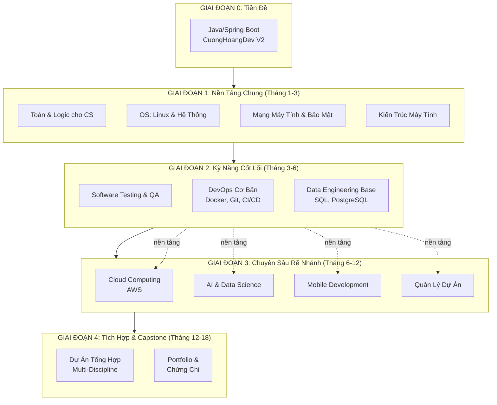

# Lộ Trình Học Toàn Diện: Từ Fullstack Java/Spring Boot Developer đến Senior Engineer (12+ Tháng)

> **Đối tượng:** Developer đã hoàn thành Java Core và dự án Fullstack (Java + Spring Boot + Next.js - CuongHoangDev V2)
> **Thời gian ước tính:** 12-18 tháng (học song song với công việc)
> **Nguyên tắc:** Thực hành > Lý thuyết (tỷ lệ 70:30)

---

## Sơ Đồ Tổng Quan Các Giai Đoạn



### Logic Sắp Xếp Giai Đoạn

| Giai đoạn | Lý do xếp trước |
|---|---|
| **Giai đoạn 1** | Không phụ thuộc gì, làm nền tảng cho tất cả |
| **Giai đoạn 2** | Cần OS + Networking từ Giai đoạn 1; áp dụng ngay vào workflow hiện tại |
| **Giai đoạn 3** | Cần DevOps + Data base từ Giai đoạn 2; mỗi track có thể học độc lập |
| **Giai đoạn 4** | Cần kiến thức từ ít nhất 2 track ở Giai đoạn 3 |

---

## GIAI ĐOẠN 1: Nền Tảng Chung (Tháng 1 - 3)

> **Mục tiêu:** Xây dựng tư duy hệ thống, hiểu cách máy tính và mạng hoạt động ở mức nền tảng. Giai đoạn này "khó nuốt" nhưng giúp bạn debug sâu, thiết kế hệ thống tốt hơn, và trở nên tự tin khi debug production issues.

### 1.1. Toán & Logic cho Khoa Học Máy Tính

> **Mức độ ưu tiên:** Cao — nền tảng cho mọi thứ. AI/Data Science cần rất nhiều toán.

#### 1.1.1. Discrete Mathematics (Toán Rời Rạc)

**Mục tiêu:** Hiểu logic toán học nền tảng, cần cho thuật toán, cơ sở dữ liệu, và AI.

**Kiến thức lý thuyết cần nắm:**
- Logic mệnh đề, logic vị từ (Propositional & Predicate Logic)
- Tập hợp, quan hệ, ánh xạ (Sets, Relations, Functions)
- Đồ thị (Graphs) — đỉnh, cạnh, đường đi, chu trình, cây
- Quy nạp toán học (Mathematical Induction)
- Số nguyên, đồng dư, ước chung lớn nhất (Number Theory)
- Tổ hợp (Counting, Permutations, Combinations)
- Quan hệ đệ quy (Recurrence Relations)

**Kỹ năng thực hành:**
- Biểu diễn đồ thị trong code Java/Python
- Viết chứng minh bằng quy nạp
- Áp dụng logic vào thiết kế thuật toán

**Bài tập & Dự án:**
- Xây dựng thuật toán DFS/BFS trên đồ thị (Java)
- Viết chương trình giải Sudoku bằng Backtracking
- Mô phỏng thuật toán Dijkstra cho tìm đường ngắn nhất
- LeetCode: Problems thuộc category "Graph", "Math"

**Tài liệu:**
- **Sách:** *Discrete Mathematics and Its Applications* — Kenneth Rosen (sách gốc tiếng Anh, có bản PDF)
- **Khóa học:** MIT OpenCourseWare 6.042J "Mathematics for Computer Science"
- **Thực hành:** [Brilliant.org](https://brilliant.org) — courses: Logic, Set Theory, Graph Theory
- **YouTube:** 3Blue1Brown playlist "Graph Theory"

**Công cụ:** Python (sympy), Java (JGraphT library), LaTeX (viết công thức toán)

#### 1.1.2. Linear Algebra (Đại Số Tuyến Tính)

**Mục tiêu:** Nắm vững vector, ma trận — nền tảng cho Machine Learning và Computer Graphics.

**Kiến thức lý thuyết cần nắm:**
- Vector, phép toán vector (cộng, nhân vô hướng, tích vô hướng, tích có hướng)
- Ma trận, phép toán ma trận (nhân, nghịch đảo, định thức)
- Hệ phương trình tuyến tính, không gian vector
- Eigenvalues và Eigenvectors
- Ma trận biến đổi (Transformation Matrix)

**Kỹ năng thực hành:**
- Thao tác ma trận với NumPy trong Python
- Hiểu cách ma trận dùng trong ML: linear regression, neural networks
- Visualize vectors và transformations

**Bài tập & Dự án:**
- Xây dựng thuật toán PageRank (Google) bằng ma trận
- Viết chương trình xoay hình 2D bằng ma trận biến đổi
- LeetCode problems về matrix manipulation

**Tài liệu:**
- **Sách:** *Essence of Linear Algebra* (3Blue1Brown) — playlist video miễn phí trên YouTube
- **Sách:** *Linear Algebra Done Right* — Sheldon Axler
- **Khóa học:** Khan Academy Linear Algebra, MIT 18.06
- **Thực hành:** [Wolfram Alpha](https://www.wolframalpha.com) (visualize ma trận)

**Công cụ:** NumPy, Wolfram Alpha, GeoGebra

#### 1.1.3. Probability & Statistics (Xác Suất & Thống Kê)

**Mục tiêu:** Phân tích dữ liệu, hiểu ML algorithms, đánh giá A/B test.

**Kiến thức lý thuyết cần nắm:**
- Xác suất cơ bản, xác suất có điều kiện, Bayes' Theorem
- Phân phối xác suất (Normal, Binomial, Poisson)
- Expected value, variance, standard deviation
- Statistical inference, confidence intervals
- Hypothesis testing (t-test, chi-square)
- Correlation và regression
- Central Limit Theorem

**Kỹ năng thực hành:**
- Tính xác suất bằng Python (scipy, statistics)
- Phân tích dữ liệu với Pandas, visualize với Matplotlib/Seaborn
- Hiểu và giải thích kết quả A/B testing

**Bài tập & Dự án:**
- Phân tích dataset Titanic (Kaggle) — basic EDA
- Xây dựng hệ thống A/B testing simulation
- Tính toán probability distributions từ real-world data
- Làm Kaggle playground: Titanic, House Prices

**Tài liệu:**
- **Sách:** *Think Stats* — Allen Downey (free PDF, Python-based)
- **Sách:** *Practical Statistics for Data Scientists* — Peter Bruce
- **Khóa học:** Khan Academy Statistics & Probability, Coursera "Statistics with R"
- **Thực hành:** Kaggle, Google Colab

**Công cụ:** Python (pandas, numpy, scipy, matplotlib, seaborn), R (tùy chọn)

#### 1.1.4. Algorithm Thinking & Problem Solving

**Mục tiêu:** Rèn luyện tư duy giải bài toán, chuẩn bị phỏng vấn kỹ thuật.

**Kiến thức lý thuyết cần nắm:**
- Độ phức tạp thuật toán (Big O, Big Theta, Big Omega)
- Các cấu trúc dữ liệu: Array, Linked List, Stack, Queue, HashMap, Tree, Heap, Graph, Trie
- Thuật toán sắp xếp: QuickSort, MergeSort, HeapSort
- Thuật toán tìm kiếm: Binary Search, BFS, DFS
- Thuật toán tham lam (Greedy), Quy hoạch động (Dynamic Programming)
- Two pointers, Sliding window, Divide and conquer
- Thuật toán đồ thị: Dijkstra, Bellman-Ford, Floyd-Warshall

**Kỹ năng thực hành:**
- Giải 2-3 bài LeetCode mỗi tuần (bắt đầu từ Easy, dần lên Medium)
- Tự implement các cấu trúc dữ liệu từ đầu

**Bài tập & Dự án:**
- Implement đầy đủ 10+ cấu trúc dữ liệu trong Java
- LeetCode: 200+ problems (tập trung Easy & Medium)
- Xây dựng spell checker bằng Trie + Edit Distance
- Xây dựng routing algorithm đơn giản cho một ứng dụng

**Tài liệu:**
- **Sách:** *Cracking the Coding Interview* — Gayle Laakmann McDowell
- **Sách:** *Algorithms* — Robert Sedgewick (Java)
- **Nền tảng:** LeetCode, HackerRank, Codeforces, AtCoder
- **Khóa học:** Udemy "Java Algorithms and Data Structures" by Luis Santos

**Công cụ:** LeetCode (account + subscription), IntelliJ IDEA, VS Code, Python

---

### 1.2. Hệ Điều Hành & Linux

> **Mức độ ưu tiên:** Cao — bạn sẽ dùng Linux hàng ngày khi làm DevOps, Cloud, Data Engineering.

#### 1.2.1. Linux Fundamentals

**Mục tiêu:** Sử dụng Linux thành thạo như second nature.

**Kiến thức lý thuyết cần nắm:**
- Linux distributions (Ubuntu, Debian, CentOS, Alpine)
- Filesystem Hierarchy Standard (/etc, /var, /home, /usr, /proc)
- Process management: ps, top, htop, pgrep, kill, signals
- Memory management: free, vmstat, swappiness
- Disk management: df, du, lsblk, fdisk, mount
- User & permission management: chmod, chown, sudo, /etc/passwd, /etc/shadow
- Package management: apt, yum, dnf, pacman
- Systemd: services, units, journalctl, systemctl
- Boot process: BIOS/UEFI → GRUB → Kernel → Init

**Kỹ năng thực hành:**
- Master command line: grep, awk, sed, find, xargs, sort, uniq, cut, tr
- Vi/Vim hoặc Nano editor (Vim recommended)
- SSH key management, remote server access
- Cron jobs và at command
- Pipe và redirection (|, >, <, 2>&1)
- Environment variables và shell profiles (.bashrc, .zshrc)

**Bài tập & Dự án:**
- Setup VPS (DigitalOcean/AWS EC2) và cài đặt LAMP/LEMP stack
- Viết script automation bash: backup database, log rotation
- Xây dựng monitoring dashboard đơn giản với shell scripts
- Tạo dotfiles (`.bashrc`, `.vimrc`, `.gitconfig`) và sync qua GitHub

**Tài liệu:**
- **Sách:** *The Linux Command Line* — William Shotts (free PDF)
- **Sách:** *Linux Basics for Hackers* — OccupyTheWeb (thực hành bảo mật)
- **Website:** [linuxcommand.org](https://linuxcommand.org), [explainshell.com](https://explainshell.com)
- **Thực hành:** [OverTheWire Bandit](https://overthewire.org/wargames/bandit/) (game học Linux)
- **Thực hành:** [KodeKloud](https://kodekloud.com) labs

**Công cụ:** Ubuntu/Debian (VM hoặc WSL2), Vim, tmux, htop, nethogs, iotop, Cron

#### 1.2.2. Linux Advanced

**Mục tiêu:** Hiểu sâu cách OS hoạt động để debug production issues.

**Kiến thức lý thuyết cần nắm:**
- Process scheduling: scheduler, context switching, nice, cgroups
- Memory management: virtual memory, paging, swapping, OOM killer
- I/O subsystem: block devices, filesystems (ext4, xfs, btrfs), LVM
- Networking: TCP/IP stack trong kernel, iptables/nftables, routing
- Kernel modules: loading, unloading, writing basic module
- Namespaces và cgroups (nền tảng của Docker/Kubernetes)
- System performance profiling: perf, strace, ltrace, eBPF basics
- Logging: syslog, journald, /var/log structure

**Kỹ năng thực hành:**
- Debug performance issues: high CPU, memory leak, disk I/O
- Configure firewall với iptables hoặc ufw
- Setup và monitor systemd services
- Sử dụng strace để trace system calls

**Bài tập & Dự án:**
- Debug một "memory leak" simulation trong Java app
- Tạo systemd service cho Spring Boot application
- Xây dựng log aggregation system đơn giản với rsyslog + Elasticsearch

**Tài liệu:**
- **Sách:** *Operating Systems: Three Easy Pieces* — Remzi Arpaci-Dusseau (free online)
- **Sách:** *Linux Kernel Development* — Robert Love
- **Website:** [lwn.net](https://lwn.net) (kernel news)

**Công cụ:** strace, ltrace, perf, htop, iotop, iftop, ss, netstat, vmstat, dstat

---

### 1.3. Mạng Máy Tính & Bảo Mật

> **Mức độ ưu tiên:** Cao — mọi backend developer cần hiểu mạng để thiết kế API, debug connection issues, và deploy cloud.

#### 1.3.1. Networking Fundamentals

**Mục tiêu:** Hiểu cách Internet hoạt động từ DNS resolution đến HTTP response.

**Kiến thức lý thuyết cần nắm:**
- OSI 7 Layers: Physical → Data Link → Network → Transport → Session → Presentation → Application
- TCP vs UDP: 3-way handshake, 4-way termination, flow control, congestion control
- IP Addressing: IPv4, IPv6, subnetting (CIDR), NAT, private vs public IPs
- DNS: How DNS works, A record, AAAA, CNAME, MX, TXT, DNS propagation, DNS caching
- HTTP/HTTPS: Request-Response model, HTTP methods, status codes, headers, cookies, sessions
- HTTP/2 và HTTP/3 (QUIC) basics
- Load balancing: L4 vs L7 load balancer
- CDN và Reverse Proxy (Nginx)
- DHCP, ARP, ICMP
- Socket programming basics (Java: Socket, ServerSocket)

**Kỹ năng thực hành:**
- Sử dụng curl, wget, ping, traceroute, nslookup, dig
- Phân tích HTTP requests/responses với browser DevTools
- Capture packets với Wireshark (basic)
- Test API endpoints với Postman/HTTPie
- Đọc và debug network traffic logs

**Bài tập & Dự án:**
- Viết HTTP server đơn giản bằng Java (ServerSocket)
- Xây dựng URL shortener (tương tự bit.ly) — hiểu DNS, redirect
- Tạo reverse proxy đơn giản với Nginx
- Viết script phân tích log để detect suspicious IPs

**Tài liệu:**
- **Sách:** *Computer Networking: A Top-Down Approach* — Kurose & Ross
- **Sách:** *TCP/IP Illustrated* — Richard Stevens (set 3 volumes)
- **Khóa học:** Coursera "Computer Communications" (University of Colorado)
- **Thực hành:** [Cisco Packet Tracer](https://www.netacad.com/courses/packet-tracer) (mô phỏng mạng)
- **Website:** [howdns.works](https://howdns.works) (DNS animated), [http3.is](http://http3.is)

**Công cụ:** Wireshark, tcpdump, Postman, curl, HTTPie, ngrok, Wireshark

#### 1.3.2. Cybersecurity & Secure Coding

**Mục tiêu:** Hiểu các lỗ hổng bảo mật phổ biến, viết code an toàn, bảo vệ ứng dụng.

**Kiến thức lý thuyết cần nắm:**
- OWASP Top 10 (2021): Injection, Broken Auth, Sensitive Data Exposure, XXE, Broken Access Control, Security Misconfiguration, XSS, Insecure Deserialization, Using Components with Known Vulnerabilities, Insufficient Logging
- Authentication: Password hashing (bcrypt, Argon2), JWT, OAuth 2.0, MFA/2FA
- Authorization: RBAC, ABAC, permission models
- Cryptography: Symmetric (AES), Asymmetric (RSA, ECC), Hashing (SHA-256), HMAC, TLS/SSL basics
- Input validation, output encoding, parameterized queries
- Security headers: CSP, HSTS, X-Frame-Options, CORS
- Rate limiting, CAPTCHA, honeypots
- Incident response basics: how to handle a security breach
- Secure SDLC practices

**Kỹ năng thực hành:**
- Sử dụng OWASP ZAP hoặc Burp Suite để scan vulnerabilities
- Review code security: checkmarx, sonarqube security rules
- Configure Spring Security đúng cách
- Viết unit tests cho security (e.g., test SQL injection, XSS)

**Bài tập & Dự án:**
- Bảo mật hóa Spring Boot app: add Spring Security, JWT, rate limiting
- Thực hành OWASP Top 10 trên DVWA (Damn Vulnerable Web App)
- Viết secure coding checklist cho team
- Setup fail2ban, ufw firewall trên Linux server
- Tạo Vulnerability Scanner đơn giản bằng Python (check open ports, missing headers)

**Tài liệu:**
- **Sách:** *The Web Application Hacker's Handbook* — Dafydd Stuttard
- **Sách:** *Security Engineering* — Ross Anderson (free online: securitybook.info)
- **Website:** [owasp.org](https://owasp.org) (OWASP Top 10, Cheat Sheets)
- **Thực hành:** [PortSwigger Web Academy](https://portswigger.net/web-security) (miễn phí)
- **Thực hành:** [TryHackMe](https://tryhackme.com) (security labs)
- **Chứng chỉ:** CompTIA Security+, eJPT (eLearnSecurity Junior Penetration Tester)

**Công cụ:** OWASP ZAP, Burp Suite, SonarQube, Spring Security, fail2ban, ufw, modsecurity

---

### 1.4. Kiến Trúc Máy Tính

> **Mức độ ưu tiên:** Trung bình — cần hiểu để optimize performance, debug low-level issues, hiểu Docker/Kubernetes.

**Mục tiêu:** Hiểu cách CPU, memory, storage hoạt động để viết code hiệu quả hơn.

**Kiến thức lý thuyết cần nắm:**
- CPU: registers, ALU, control unit, instruction cycle (fetch-decode-execute), pipelining, branch prediction, caches (L1/L2/L3)
- Memory hierarchy: Registers → L1/L2/L3 Cache → RAM → SSD/HDD
- How memory works: stack vs heap, pointer, garbage collection (JVM GC internals)
- Storage: HDD vs SSD vs NVMe, RAID levels, I/O performance
- Virtualization: hypervisor (Type 1 vs Type 2), VM vs container
- CPU architectures: x86-64, ARM (Apple Silicon)
- Endianness: Big-endian vs Little-endian
- Instruction sets: RISC vs CISC (ARM vs x86)

**Kỹ năng thực hành:**
- Analyze JVM garbage collection logs
- Profile Java application với VisualVM / JProfiler
- Understand CPU cache effects (false sharing, cache line bouncing)
- Benchmark storage I/O performance

**Bài tập & Dự án:**
- Benchmark String concatenation vs StringBuilder vs StringBuffer (hiểu heap/stack)
- Analyze GC logs trong Spring Boot app
- Viết chương trình Java để demonstrate cache locality (array traversal: row-first vs column-first)
- So sánh performance: bare metal vs VM vs Docker container

**Tài liệu:**
- **Sách:** *Computer Organization and Design* — David Patterson & John Hennessy (RISC-V edition)
- **Sách:** *Computer Systems: A Programmer's Perspective* — Bryant & O'Hallaron (CMU textbook)
- **Khóa học:** Nand2Tetris (build computer from scratch — highly recommended)
- **Video:** [ButHowDoItKnow?](https://www.youtube.com/@ButHowDoItKnow) (computer basics)

**Công cụ:** VisualVM, JProfiler, JMH (Java Microbenchmark Harness), `perf` (Linux), Intel VTune

---

## GIAI ĐOẠN 2: Kỹ Năng Cốt Lõi (Tháng 3 - 6)

> **Mục tiêu:** Trang bị những kỹ năng mà mọi professional developer cần, bất kể hướng đi nào. Đây là giai đoạn có thể bắt đầu apply ngay vào công việc hàng ngày.

### 2.1. Software Testing & Quality Assurance

> **Mức độ ưu tiên:** Rất cao — Testing là nền tảng của mọi hướng đi tiếp theo.

#### 2.1.1. Unit Testing & Test-Driven Development (TDD)

**Mục tiêu:** Viết test chất lượng, hiểu TDD workflow, đạt coverage >80%.

**Kiến thức lý thuyết cần nắm:**
- Unit test: Arrange-Act-Assert pattern, test naming conventions
- Test doubles: Mock, Stub, Spy, Fake, Dummy
- TDD cycle: Red → Green → Refactor
- Boundary testing, edge cases, happy path vs sad path
- Code coverage vs test quality
- Test pyramids: Unit → Integration → E2E
- JUnit 5 features: @ParameterizedTest, @Nested, @RepeatedTest, Dynamic Tests
- Mockito: when(), verify(), ArgumentCaptor, @Mock, @InjectMocks
- AssertJ: fluent assertions
- Testing Spring Boot: @SpringBootTest, @WebMvcTest, @DataJpaTest, @TestConfiguration
- Property-based testing (jqwik)

**Kỹ năng thực hành:**
- Viết unit test cho Spring Boot services
- Mock external dependencies (REST clients, databases)
- Test REST controllers với MockMvc
- Write integration tests với TestContainers (PostgreSQL, MongoDB)

**Bài tập & Dự án:**
- Thêm unit tests cho CuongHoangDev V2 (nếu chưa có)
- Practice TDD: implement một feature mới từ test trước
- Xây dựng bộ test cho Data Pipeline (batch processing logic)
- Refactor legacy code có test coverage

**Tài liệu:**
- **Sách:** *Growing Object-Oriented Software, Guided by Tests* — Freeman & Pryce
- **Sách:** *Test Driven Development: By Example* — Kent Beck
- **Khóa học:** Test Automation University (testautomationu.applitools.com) — free
- **Website:** [testing-exhaustive.com](https://testing-exhaustive.com) (testing principles)

**Công cụ:** JUnit 5, Mockito, AssertJ, MockMvc, TestContainers, JaCoCo, Pitest (mutation testing)

#### 2.1.2. Integration Testing & E2E Testing

**Mục tiêu:** Test toàn bộ flow từ database → service → API → UI.

**Kiến thức lý thuyết cần nắm:**
- Integration testing strategies: Big Bang, Top-Down, Bottom-Up, Sandwich
- TestContainers: chạy real databases (Postgres, MySQL, MongoDB, Kafka) trong Docker
- Contract testing: Consumer-Driven Contract Testing (Pact)
- API contract testing với Spring Cloud Contract
- E2E testing: Selenium/WebDriver, Playwright, Cypress
- Performance testing: JMeter, Gatling, k6
- Load testing vs Stress testing vs Soak testing
- Test automation frameworks: BDD (Cucumber), Data-driven testing

**Bài tập & Dự án:**
- Viết integration tests với TestContainers cho Spring Boot APIs
- Setup E2E tests với Playwright cho Next.js frontend
- Tạo load test cho Spring Boot API với k6
- Xây dựng BDD test suite cho authentication flow (Cucumber)

**Tài liệu:**
- **Khóa học:** Test Automation University: Playwright, Cypress courses
- **Sách:** *Software Testing: An ISTQB-BCS Certified Tester's Guide* — Graham et al.
- **Website:** [testcontainers.com](https://testcontainers.com)

**Công cụ:** TestContainers, Selenium, Playwright, Cypress, JMeter, k6, Gatling, Pact, Cucumber

---

### 2.2. DevOps Cơ Bản

> **Mức độ ưu tiên:** Cao — DevOps là skill rất giá trị cho mọi developer, kết nối code với production.

#### 2.2.1. Git & Version Control Nâng Cao

**Mục tiêu:** Master Git beyond `add/commit/push`.

**Kiến thức lý thuyết cần nắm:**
- Git internals: objects (blob, tree, commit), refs, packfiles, index
- Branching strategies: Git Flow, Trunk-based Development, GitHub Flow
- Rebasing vs Merging (when to use each)
- Interactive rebase: squash, fixup, reorder, split commits
- Stashing, cherry-picking, revert, reset
- Git hooks: pre-commit, pre-push, commit-msg
- Git bisect: debug regression
- Submodules vs Subtrees
- .gitattributes, .gitignore best practices
- Monorepo vs Polyrepo

**Kỹ năng thực hành:**
- Viết custom git hooks bằng shell scripts
- Quản lý merge conflicts hiệu quả
- Sử dụng git bisect để find regression
- Contribution workflow trên GitHub/GitLab

**Bài tập & Dự án:**
- Migrate một project từ SVN sang Git
- Setup Git hooks cho auto-format + lint trước commit
- Xây dựng git workflow cho team 5-10 người

**Công cụ:** Git, GitHub CLI, GitLab, Bitbucket, GitKraken (GUI visualization)

#### 2.2.2. Docker & Containerization

**Mục tiêu:** Đóng gói ứng dụng thành container, hiểu cách Docker hoạt động.

**Kiến thức lý thuyết cần nắm:**
- Container vs VM: cấu trúc, tài nguyên, use cases
- Docker architecture: Docker daemon, client, registry, images, containers, volumes, networks
- Dockerfile: FROM, RUN, COPY, ADD, WORKDIR, ENV, EXPOSE, CMD, ENTRYPOINT, layers caching
- Multi-stage builds (Java: Maven/Gradle multi-stage)
- Docker networking: bridge, host, overlay, none; Docker Compose networking
- Docker volumes: bind mounts, named volumes, tmpfs
- Image optimization: size reduction, layer caching, distroless images
- Docker Compose: define multi-container applications, depends_on, healthcheck, environment
- Docker registry: Docker Hub, AWS ECR, GitHub Container Registry
- Container security: non-root user, scanning vulnerabilities (Trivy, Snyk), secrets management

**Kỹ năng thực hành:**
- Viết production-grade Dockerfile cho Spring Boot app
- Multi-stage build để minimize image size
- Docker Compose cho local development (app + PostgreSQL + Redis)
- Debug running containers: docker exec, docker logs, docker stats
- Optimize Dockerfile build time với layer caching

**Bài tập & Dự án:**
- Dockerize hoàn chỉnh CuongHoangDev V2 (backend + frontend + database)
- Setup local dev environment với Docker Compose
- Viết CI pipeline build + push Docker image (GitHub Actions)
- Tạo "production-like" environment với Docker Compose cho staging

**Tài liệu:**
- **Sách:** *Docker Deep Dive* — Nigel Poulton (2024 edition)
- **Sách:** *Container Security* — Liz Rice
- **Khóa học:** Docker Official Tutorials, KodeKloud Docker course
- **Website:** [docker-curriculum.com](https://docker-curriculum.com), [awesome-docker](https://github.com/veggiemonk/awesome-docker)

**Công cụ:** Docker Desktop, Docker Compose, Dive (image layer analysis), Trivy (security scanning), hadolint (Dockerfile linting)

#### 2.2.3. CI/CD (Continuous Integration & Deployment)

**Mục tiêu:** Tự động hóa build → test → deploy pipeline.

**Kiến thức lý thuyết cần nắm:**
- CI/CD concepts: pipeline stages (build → test → scan → deploy)
- GitHub Actions: workflows, jobs, steps, runners, artifacts
- GitLab CI/CD: `.gitlab-ci.yml`, runners, artifacts
- Jenkins: Jenkinsfile, Groovy DSL, agents, plugins
- Deployment strategies: Blue-Green, Canary, Rolling, Feature Flags
- Environment management: dev → staging → production
- Secret management: GitHub Secrets, Vault, AWS Secrets Manager
- Semantic versioning, changelog generation
- Artifact management: versioning, signing, storage

**Kỹ năng thực hành:**
- Viết GitHub Actions workflow cho Spring Boot + Next.js app
- Setup automated testing + code coverage reporting
- Configure deployment to cloud (AWS ECS, Beanstalk)
- Implement feature flags với LaunchDarkly hoặc Unleash

**Bài tập & Dự án:**
- Xây dựng CI/CD pipeline cho CuongHoangDev V2 (GitHub Actions)
- Setup automated database migration trong pipeline
- Implement blue-green deployment trên AWS
- Tạo multi-environment pipeline (dev, staging, prod) với promotion gates

**Tài liệu:**
- **Sách:** *Learning CI/CD* — Ethan Gifford
- **Khóa học:** GitHub Actions official learning path
- **Website:** [actions.github.com](https://actions.github.com), [pipelines.dev](https://pipelines.dev)

**Công cụ:** GitHub Actions, GitLab CI, Jenkins, ArgoCD (GitOps), Flux, Gradle/Maven (release plugin)

---

### 2.3. Data Engineering Base

> **Mức độ ưu tiên:** Cao — mọi backend developer cần SQL và database. Đây là cơ sở cho Data Engineering track ở Giai đoạn 3.

#### 2.3.1. SQL & Relational Databases Nâng Cao

**Mục tiêu:** Từ viết query cơ bản → tối ưu hóa, thiết kế schema, hiểu internals.

**Kiến thức lý thuyết cần nắm:**
- Query optimization: EXPLAIN, EXPLAIN ANALYZE, query execution plans
- Indexing: B-tree, Hash, GiST, GIN; composite indexes; covering indexes
- Database normalization: 1NF, 2NF, 3NF, BCNF; when to denormalize
- Transaction management: ACID, isolation levels (Read Committed, Repeatable Read, Serializable)
- Locking: optimistic vs pessimistic, deadlock detection và prevention
- Stored procedures, triggers, functions (PL/pgSQL, MySQL)
- Window functions: ROW_NUMBER, RANK, LAG, LEAD, PARTITION BY
- Common Table Expressions (CTE), recursive CTEs
- Database views: materialized vs non-materialized
- Full-text search trong PostgreSQL

**Kỹ năng thực hành:**
- Analyze query plans, identify bottlenecks
- Design schema cho complex domain (e-commerce, social network)
- Write complex queries: multi-join, window functions, recursive CTEs
- Benchmark query performance trước và sau khi thêm index

**Bài tập & Dự án:**
- Tối ưu hóa 10 slow queries trong Spring Boot app (dùng HikariCP logs)
- Xây dựng schema cho hệ thống e-commerce (users, orders, products, inventory, payments)
- Implement data warehouse star schema đơn giản
- LeetCode SQL: 50+ problems (difficulty Medium-Hard)

**Tài liệu:**
- **Sách:** *SQL Performance Explained* — Winand (miễn phí online)
- **Sách:** *The Art of PostgreSQL* — Fontanka
- **Website:** [sql-ex.ru](https://www.sql-ex.ru), [postgresqltutorial.com](https://www.postgresqltutorial.com)
- **Thực hành:** LeetCode SQL (50 problems), Hackerrank SQL

**Công cụ:** PostgreSQL (Docker), pgAdmin, DBeaver, `psql`, `EXPLAIN ANALYZE`

#### 2.3.2. Database Systems Khác (NoSQL & Polyglot Persistence)

**Mục tiêu:** Hiểu khi nào dùng loại database nào, biết cách tích hợp.

**Kiến thức lý thuyết cần nắm:**
- **PostgreSQL advanced:** Partitioning, Replication (streaming, logical), Sharding (Citus), Full-text search
- **MongoDB:** Document model, collections, aggregation pipeline, indexing, sharding
- **Redis:** Data structures (String, Hash, List, Set, Sorted Set), persistence, pub/sub, caching patterns
- **Elasticsearch:** Inverted index, full-text search, ELK stack
- Polyglot persistence: khi nào dùng RDBMS vs NoSQL
- CAP theorem: Consistency vs Availability vs Partition tolerance
- Event sourcing, CQRS patterns

**Kỹ năng thực hành:**
- Design document schema trong MongoDB
- Sử dụng Redis cho caching và session management trong Spring Boot
- Viết aggregation pipeline trong MongoDB
- Setup Elasticsearch index và search

**Bài tập & Dự án:**
- Thêm Redis caching vào Spring Boot API (cache hot queries)
- Migrate một phần của CuongHoangDev sang MongoDB (blog posts, comments)
- Xây dựng search engine với Elasticsearch cho sản phẩm
- Implement event-driven architecture đơn giản với Kafka

**Tài liệu:**
- **Sách:** *Seven Databases in Seven Weeks* — Eric Redmond
- **Sách:** *Redis in Action* — Josiah Carlson (free PDF)
- **Khóa học:** MongoDB University (miễn phí)

**Công cụ:** MongoDB, Redis, Elasticsearch, Cassandra (optional), DBeaver, Redis Commander

---

## GIAI ĐOẠN 3: Chuyên Sâu Rẽ Nhánh (Tháng 6 - 12)

> **Mục tiêu:** Chọn ít nhất 1-2 hướng chuyên sâu. Mỗi track có thể học song song (3-4 tiếng/tuần mỗi track). Ưu tiên: Cloud (AWS) + AI là hai hướng có nhu cầu tuyển dụng cao nhất hiện tại.

---

### Track A: Cloud Computing (AWS) — Ưu tiên CAO NHẤT

> **Lý do chọn:** AWS là cloud provider phổ biến nhất, skill cloud là yêu cầu gần như bắt buộc cho mọi backend developer hiện đại.

#### A.1. AWS Fundamentals

**Mục tiêu:** Hiểu tổng quan các services, deploy Spring Boot app lên AWS.

**Kiến thức lý thuyết cần nắm:**
- AWS Global Infrastructure: Regions, Availability Zones, Edge Locations
- IAM: Users, Groups, Roles, Policies (least privilege principle)
- Compute: EC2 (instances, AMIs, security groups), Lambda, ECS, EKS, Lightsail
- Networking: VPC (CIDR, subnets, route tables, IGW, NAT Gateway, Bastion Host), Route 53, CloudFront, API Gateway
- Storage: S3 (buckets, lifecycle policies, versioning, presigned URLs), EBS, EFS, FSx
- Database: RDS (PostgreSQL, MySQL), Aurora (serverless), DynamoDB, ElastiCache, DocumentDB
- Messaging: SQS (queue), SNS (pub/sub), EventBridge
- Security: WAF, Shield, KMS, Secrets Manager, Security Hub
- Monitoring: CloudWatch (logs, metrics, alarms), X-Ray, CloudTrail
- AWS Well-Architected Framework: 6 pillars

**Kỹ năng thực hành:**
- Navigate AWS Console thành thạo
- Sử dụng AWS CLI
- Deploy Spring Boot app lên EC2 (với Docker)
- Deploy Spring Boot app lên ECS (Docker container)
- Thiết lập RDS PostgreSQL và kết nối từ app
- Setup CI/CD deployment lên AWS (CodePipeline + CodeDeploy)

**Bài tập & Dự án:**
- Deploy CuongHoangDev V2 lên AWS: ECS Fargate + RDS PostgreSQL + S3 + CloudFront
- Xây dựng serverless REST API với Lambda + API Gateway + DynamoDB
- Tạo Infrastructure as Code (Terraform) cho toàn bộ hệ thống trên
- Setup auto-scaling cho Spring Boot service

**Tài liệu:**
- **Khóa học:** AWS Cloud Practitioner Essentials (free, AWS official)
- **Khóa học:** Stephane Maarek's Udemy course "AWS Certified Developer Associate" (DVA-C02)
- **Chứng chỉ:** AWS Certified Developer Associate (DVA-C02) — mục tiêu đạt sau khi học xong
- **Thực hành:** [AWS Free Tier](https://aws.amazon.com/free/) (12 tháng free)
- **Thực hành:** [Qwiklabs](https://www.qwiklabs.com) (hands-on labs)
- **Sách:** *Amazon Web Services in Action* — Wittig & Wittig

**Công cụ:** AWS Console, AWS CLI v2, Terraform, AWS CDK, SAM CLI, LocalStack (local testing)

#### A.2. AWS Chuyên Sâu

**Mục tiêu:** Pass AWS Solutions Architect Associate (hoặc Developer Associate), hiểu sâu architecture patterns.

**Kiến thức lý thuyết cần nắm:**
- Design patterns: Microservices, Event-driven, Serverless, CQRS
- Caching strategies: ElastiCache (Redis/Memcached), CloudFront caching
- Database deep dive: Aurora, DynamoDB (single-table design), RDS read replicas, DMS
- Security deep dive: IAM policies (JSON), SCPs, Resource-based policies, Service Control Policies
- Networking deep dive: VPC peering, Transit Gateway, PrivateLink, Route 53 routing policies
- Cost optimization: Reserved Instances, Savings Plans, Spot Instances, Cost Explorer
- High availability: Multi-AZ deployments, failover, disaster recovery (DR) strategies
- Serverless patterns: Lambda + Step Functions, EventBridge, AppSync
- Container orchestration: ECS vs EKS, Fargate, ECR

**Bài tập & Dự án:**
- Xây dựng microservices architecture trên AWS (Spring Boot microservices + API Gateway)
- Implement event-driven architecture với EventBridge + Lambda
- Tạo Data Lake đơn giản trên S3 + Glue + Athena
- Xây dựng CI/CD pipeline hoàn chỉnh: CodeCommit → CodeBuild → CodeDeploy → ECS

**Chứng chỉ đề xuất:**
- AWS Certified Developer Associate (DVA-C02) — gợi ý học trước
- AWS Certified Solutions Architect Associate (SAA-C05) — kiến trúc hệ thống

---

### Track B: Data Engineering — Ưu tiên CAO

> **Lý do chọn:** Kết hợp tốt với Java/Spring Boot. Có thể xây dựng Data Pipeline làm side project.

#### B.1. Data Pipeline & ETL

**Mục tiêu:** Xây dựng data pipelines xử lý batch và streaming data.

**Kiến thức lý thuyết cần nắm:**
- ETL vs ELT: Extract, Transform, Load patterns
- Batch processing: Apache Spark (Spark SQL, DataFrames, RDDs), scheduling (Airflow, Dagster)
- Stream processing: Apache Kafka, Apache Flink, Spark Structured Streaming
- Data modeling: Star schema, Snowflake schema, Data Vault
- Data quality: validation, deduplication, handling nulls
- Data versioning: DVC (Data Version Control)
- Data cataloging: Apache Atlas, DataHub
- Workflow orchestration: Apache Airflow, Prefect, Dagster

**Kỹ năng thực hành:**
- Viết Spark jobs bằng PySpark hoặc Scala (hoặc Spark Java API)
- Thiết kế và implement data pipeline với Airflow
- Xử lý real-time data với Kafka + Spark Streaming
- Monitor pipeline health, alerting

**Bài tập & Dự án:**
- Xây dựng Data Pipeline: PostgreSQL → Apache Airflow → Apache Spark → Data Warehouse (Redshift hoặc BigQuery)
- Tạo streaming pipeline: Kafka → Flink → Elasticsearch → Dashboard
- ETL cho dataset e-commerce: raw data → cleaned → aggregated → analytics-ready
- Xây dựng Data Lake architecture (Bronze-Silver-Gold) với dbt + Snowflake

**Tài liệu:**
- **Sách:** *Fundamentals of Data Engineering* — Joe Reis & Matt Housley
- **Sách:** *Data Engineering with Python* — Paul Crickard
- **Khóa học:** Data Engineering with Google Cloud (Coursera), Databricks Academy
- **Website:** [dataengineeringweekly.com](https://www.dataengineeringweekly.com)

**Công cụ:** Apache Spark (PySpark), Apache Airflow, Prefect, Apache Kafka, dbt, Snowflake/BigQuery, S3, PostgreSQL, Docker

#### B.2. Big Data Fundamentals

**Mục tiêu:** Hiểu ecosystem Big Data và biết chọn đúng tool cho đúng bài toán.

**Kiến thức lý thuyết cần nắm:**
- Hadoop ecosystem: HDFS, MapReduce, YARN
- Data warehouses: Snowflake, BigQuery, Redshift, Databricks
- Data lakes: architecture (Delta Lake, Iceberg), schema-on-read vs schema-on-write
- Data transformation: dbt (data build tool)
- BI tools: Tableau, Power BI, Metabase, Superset
- Machine Learning data pipelines: feature stores (Feast), training pipelines

**Bài tập & Dự án:**
- Phân tích dataset lớn (1GB+) với PySpark
- Xây dựng analytics dashboard với Metabase/Superset
- Tạo data pipeline với dbt + Snowflake (dùng free trial)

**Tài liệu:**
- **Sách:** *Designing Data-Intensive Applications* — Martin Kleppmann (BẮT BUỘC đọc)
- **Sách:** *The Data Warehouse Toolkit* — Ralph Kimball

---

### Track C: AI & Data Science — Ưu tiên CAO

> **Lý do chọn:** AI là xu hướng lớn nhất hiện tại. Prompt Engineering và LLM integration là skill có thể apply ngay trong tuần đầu tiên.

#### C.1. Python cho Data Science & AI

**Mục tiêu:** Thành thạo Python ecosystem cho data work (không cần giỏi Java, chỉ cần đủ để gọi Python từ Spring Boot nếu cần).

**Kiến thức cần nắm:**
- Python: list comprehension, lambda, map/filter/reduce, decorators, context managers
- NumPy: array operations, broadcasting, vectorization
- Pandas: DataFrame operations, groupby, merge, pivot
- Matplotlib & Seaborn: visualization
- Jupyter Notebooks / Google Colab
- Scikit-learn: linear regression, classification, clustering, model evaluation
- TensorFlow hoặc PyTorch basics (1 tensor operation, autograd)

**Bài tập & Dự án:**
- EDA (Exploratory Data Analysis) trên dataset thực tế
- Xây dựng ML model: house price prediction (Kaggle)
- Kaggle playground competitions

**Tài liệu:**
- **Khóa học:** fast.ai "Practical Deep Learning for Coders" (miễn phí)
- **Sách:** *Python for Data Analysis* — Wes McKinney (Pandas creator)
- **Sách:** *Hands-On Machine Learning* — Aurelien Geron
- **Website:** [kaggle.com](https://www.kaggle.com), [colab.research.google.com](https://colab.research.google.com)

**Công cụ:** Python 3.11+, Jupyter, Google Colab, Kaggle, scikit-learn, TensorFlow/PyTorch

#### C.2. Machine Learning Foundations

**Mục tiêu:** Hiểu ML algorithms đủ để apply vào bài toán thực tế.

**Kiến thức lý thuyết cần nắm:**
- Supervised learning: Linear/Logistic Regression, Decision Trees, Random Forests, Gradient Boosting (XGBoost, LightGBM)
- Unsupervised learning: K-Means, DBSCAN, PCA, Hierarchical Clustering
- Model evaluation: cross-validation, ROC/AUC, precision-recall, overfitting/underfitting
- Feature engineering: scaling, encoding, feature selection, dimensionality reduction
- Regularization: L1 (Lasso), L2 (Ridge), dropout
- Ensemble methods: bagging, boosting, stacking
- Model deployment: MLflow, Flask/FastAPI serving, ONNX

**Kỹ năng thực hành:**
- EDA, feature engineering, model training với scikit-learn
- Evaluate models: confusion matrix, ROC curve, hyperparameter tuning
- Deploy ML model as REST API

**Bài tập & Dự án:**
- Customer churn prediction model (telecom dataset)
- Recommendation system đơn giản (collaborative filtering)
- Time series forecasting (sales prediction) với Prophet hoặc ARIMA
- Deploy ML model lên production với FastAPI

#### C.3. Deep Learning & LLMs

**Mục tiêu:** Hiểu cách Neural Networks hoạt động, biết integrate LLM vào ứng dụng.

**Kiến thức lý thuyết cần nắm:**
- Neural networks: perceptron, activation functions, backpropagation, gradient descent
- CNNs: conv layers, pooling, image classification
- RNNs, LSTMs, GRUs: sequence modeling
- Transformers: attention mechanism, BERT, GPT
- Fine-tuning LLMs: LoRA, QLoRA, PEFT
- RAG (Retrieval-Augmented Generation)
- LangChain / LlamaIndex basics
- Prompt Engineering: zero-shot, few-shot, chain-of-thought, system prompts

**Kỹ năng thực hành:**
- Sử dụng Hugging Face Transformers library
- Build RAG chatbot với LangChain + Vector DB (Pinecone/Milvus)
- Fine-tune small LLM với LoRA (QLora)
- Prompt engineering cho code generation, summarization, classification

**Bài tập & Dự án:**
- Xây dựng chatbot tư vấn sản phẩm e-commerce (RAG với product catalog)
- Tạo code review assistant (GitHub Actions integration)
- Xây dựng AI-powered search (semantic search thay vì keyword search)
- Sentiment analysis API với fine-tuned model
- Xây dựng data analysis chatbot (CSV upload → AI phân tích)

**Tài liệu:**
- **Sách:** *Deep Learning with Python* — Francois Chollet (creator of Keras)
- **Sách:** *Hands-On Machine Learning* — Aurelien Geron
- **Khóa học:** fast.ai, Andrew Ng's Machine Learning (Coursera) và Deep Learning Specialization
- **Hugging Face:** [huggingface.co/course](https://huggingface.co/course) (miễn phí)
- **Prompt Engineering:** [promptengineeringguide.com](https://promptengineeringguide.com)

**Công cụ:** Python, PyTorch, Hugging Face Transformers, LangChain, ChromaDB, Weights & Biases, MLflow

---

### Track D: Mobile Development — Ưu tiên TRUNG BÌNH

> **Lý do chọn:** Tốt nếu muốn mở rộng ra mobile. Kotlin/Spring thường được dùng cùng nhau (Kotlin multiplatform).

#### D.1. Android Development (Kotlin)

**Mục tiêu:** Xây dựng Android app hoàn chỉnh, kết nối với Spring Boot backend.

**Kiến thức lý thuyết cần nắm:**
- Kotlin: null safety, extension functions, coroutines, Flow, sealed classes, data classes
- Android Architecture: MVVM, MVI, Clean Architecture layers
- Jetpack Compose: declarative UI, state management, theming
- Jetpack libraries: ViewModel, LiveData, Navigation, Room, Hilt (DI)
- Networking: Retrofit, OkHttp, Kotlin Coroutines
- Local storage: Room Database, DataStore, SharedPreferences
- Background work: WorkManager, Coroutines
- Testing Android: JUnit, Espresso, UI tests

**Kỹ năng thực hành:**
- Xây dựng app với Jetpack Compose
- Consume REST API từ Spring Boot backend
- Local caching với Room
- Navigation, deep linking

**Bài tập & Dự án:**
- Mobile app cho CuongHoangDev (blog reader với notifications)
- Clone ứng dụng Todoist/Notion đơn giản
- Kết nối Android app với Spring Boot backend (thực hành API design)

**Tài liệu:**
- **Sách:** *Kotlin in Action* — Dmitry Jemerov
- **Khóa học:** Jetpack Compose course trên Google Developers
- **Thực hành:** [developer.android.com/codelabs](https://developer.android.com/codelabs)

**Công cụ:** Android Studio, Kotlin, Jetpack Compose, Gradle (Kotlin DSL), Firebase, Postman

#### D.2. iOS Development (Swift/SwiftUI)

**Mục tiêu:** Biết đủ Swift/SwiftUI để build iOS app kết nối Spring Boot backend.

**Kiến thức cần nắm:**
- Swift basics: optionals, protocols, closures, async/await
- SwiftUI: declarative UI, state management (@State, @Binding, @Observable)
- UIKit basics (nếu cần)
- Networking: URLSession, async/await
- Core Data, SwiftData basics
- Combine framework

**Bài tập & Dự án:**
- iOS app cho CuongHoangDev blog reader
- Kết nối với Spring Boot REST API

---

### Track E: Quản Lý Dự Án & Agile — Ưu tiên TRUNG BÌNH

> **Lý do chọn:** Quan trọng nếu muốn chuyển sang vai trò Tech Lead, Engineering Manager.

#### E.1. Project Management cho Developer

**Mục tiêu:** Hiểu cách quản lý sprint, estimate, communicate với stakeholders.

**Kiến thức lý thuyết cần nắm:**
- Agile Manifesto và 12 principles
- Scrum: roles (PO, SM, Dev Team), events (Sprint Planning, Daily, Review, Retrospective), artifacts (Product Backlog, Sprint Backlog, Increment)
- Kanban: WIP limits, flow, cumulative flow diagram
- User story writing: INVEST criteria, acceptance criteria
- Estimation: Story points (Fibonacci), Planning Poker, T-shirt sizes
- Velocity tracking, burndown/burnup charts
- Sprint retrospective formats và continuous improvement
- Jira, Linear, Asana basics
- Technical Debt management

**Kỹ năng thực hành:**
- Run sprint planning meeting
- Break down requirements thành tasks
- Estimate effort với story points
- Conduct retrospective

**Bài tập & Dự án:**
- Quản lý CuongHoangDev V2 bằng Kanban/Scrum (tự làm PO + Dev)
- Tạo sprint board trên Jira/Linear cho personal project
- Viết PRDs (Product Requirement Documents) cho 3 features mới

**Tài liệu:**
- **Sách:** *Scrum and XP from the Trenches* — Henrik Kniberg (ngắn, thực tế, free PDF)
- **Sách:** *The Phoenix Project* — Gene Kim (novel về DevOps/IT)
- **Sách:** *Accelerate* — Forsgren et al. (metrics: DORA)
- **Khóa học:** Atlassian Agile Coach (free)
- **Chứng chỉ:** Scrum.org Professional Scrum Master (PSM I)

**Công cụ:** Jira, Linear, Notion, Asana, Azure DevOps Boards

#### E.2. Technical Leadership

**Mục tiêu:** Chuẩn bị cho vai trò Tech Lead / Engineering Manager.

**Kiến thức cần nắm:**
- System design interviews (thực ra là kỹ năng kỹ thuật)
- Code review best practices
- Technical writing: design docs, ADRs (Architecture Decision Records)
- Stakeholder communication
- Hiring và mentoring junior developers
- Architecture Decision Records (ADRs)
- Cross-team collaboration

**Bài tập & Dự án:**
- Viết ADR cho 3 architectural decisions trong CuongHoangDev
- Mentor một junior developer (có thể là open source contribution)

---

## GIAI ĐOẠN 4: Tích Hợp & Dự Án Tổng Hợp (Tháng 12 - 18)

> **Mục tiêu:** Ghép kiến thức từ nhiều track lại thành dự án thực tế, xây dựng portfolio, và lấy chứng chỉ.

### 4.1. Capstone Projects (Chọn 1-2 làm)

**Dự án 1: Full-Stack AI-Powered E-Commerce Platform**
- Spring Boot backend + Next.js frontend (đã có)
- AI: recommendation engine (ML), chatbot tư vấn sản phẩm (RAG), image search
- Cloud: AWS (ECS, RDS, S3, CloudFront, Lambda)
- Data: Apache Kafka (event streaming), data pipeline (Airflow), analytics (dbt + Snowflake)
- DevOps: Docker, GitHub Actions CI/CD, monitoring (CloudWatch + Grafana)
- Security: Spring Security + JWT, OWASP best practices, WAF
- Testing: Unit + Integration + E2E (Playwright), k6 load testing
- Deploy lên AWS production

**Dự án 2: Real-Time Data Analytics Dashboard**
- Data source: IoT sensors hoặc public APIs
- Data Pipeline: Kafka → Flink → Elasticsearch → Kibana/Grafana
- Backend: Spring Boot API (serve processed data)
- Frontend: Next.js dashboard với real-time updates
- Cloud: AWS MSK (Managed Kafka), AWS OpenSearch, CloudWatch
- Mobile: Android/iOS companion app (Flutter hoặc Kotlin/SwiftUI)
- DevOps: Terraform IaC, GitHub Actions, Docker

**Dự án 3: DevOps Platform (Internal Tool)**
- Self-hosted CI/CD (Jenkins/GitLab CI + ArgoCD)
- Infrastructure as Code (Terraform + Ansible)
- Kubernetes deployment
- Monitoring stack: Prometheus + Grafana + ELK
- Security scanning: Trivy, SonarQube, Dependabot
- Document management: Swagger/OpenAPI, Confluence

### 4.2. Portfolio & Certification

**Portfolio:**
- GitHub profile với README cá nhân hóa
- Các dự án có: README chi tiết, demo link, architecture diagram
- Blog cá nhân (viết về những gì đã học — rất quan trọng để củng cố kiến thức)
- LinkedIn: cập nhật skills, projects, certifications

**Chứng chỉ đề xuất (chọn 2-3):**
| Chứng chỉ | Lĩnh vực | Mức độ | Link |
|---|---|---|---|
| AWS Certified Developer Associate | Cloud | Associate | AWS |
| AWS Certified Solutions Architect | Cloud | Associate | AWS |
| Google Professional Data Engineer | Data Engineering | Professional | Google Cloud |
| Certified Kubernetes Administrator (CKA) | DevOps | Intermediate | CNCF |
| HashiCorp Terraform Associate | DevOps | Foundational | HashiCorp |
| ISTQB Certified Tester | Testing | Foundation | ISTQB |
| Scrum.org PSM I | Agile | Foundation | Scrum.org |
| Microsoft Azure AI Engineer | AI | Associate | Microsoft |

---

## BẢNG TỔNG HỢP THEO LĨNH VỰC

### Toán & Logic

| Chủ đề | Nên biết | Chuyên sâu | Tài liệu | Thực hành |
|---|---|---|---|---|
| Discrete Math | Logic, Sets, Graphs, Induction | Recursion theory, Number theory | Rosen, MIT OCW | LeetCode Graph |
| Linear Algebra | Vectors, Matrices, Transformations | Eigenvalues, SVD | 3Blue1Brown, Axler | NumPy |
| Statistics | Probabilities, Distributions, Hypothesis testing | Bayesian inference, Time series | Think Stats, Khan Academy | Kaggle |
| Algorithms | Big O, Arrays, Trees, Sorting, Searching, DP basics | Graph algorithms, String algorithms, Approximation | CLRS, Sedgewick, LeetCode | 200+ LeetCode |
| Problem Solving | 2-3 approaches per problem | Optimization, Mathematical modeling | CTCI, EPI | LeetCode Hard |

### Hệ Thống & Infrastructure

| Chủ đề | Nên biết | Chuyên sâu | Tài liệu | Thực hành |
|---|---|---|---|---|
| Linux | CLI, scripting, process mgmt, networking basics | Kernel internals, eBPF, performance tuning | Shotts "Linux Command Line" | OverTheWire Bandit |
| Mạng | TCP/IP, HTTP, DNS, SSL/TLS, firewalls | Socket programming, network programming, BGP | Kurose & Ross | Wireshark, Postman |
| Bảo mật | OWASP Top 10, Authentication, Cryptography basics | Pen testing, threat modeling, zero trust | OWASP, Security Engineering | TryHackMe, PortSwigger |
| Kiến trúc máy tính | CPU, Memory, Storage hierarchy, Virtualization | Cache coherence, NUMA, GPU architecture | Patterson & Hennessy | VisualVM, JMH |
| Docker | Dockerfile, Compose, networking, volumes, registries | Kubernetes, security scanning, distroless | Poulton "Docker Deep Dive" | Dockerize CuongHoangDev |
| CI/CD | GitHub Actions, deployment strategies | GitOps, feature flags, artifact mgmt | GitHub Actions learning path | Deploy to cloud |
| Testing | Unit (JUnit5), Integration (TestContainers), E2E (Playwright) | Performance (k6), Contract (Pact), Mutation | Test Automation U | Test CuongHoangDev |

### Data & AI

| Chủ đề | Nên biết | Chuyên sâu | Tài liệu | Thực hành |
|---|---|---|---|---|
| SQL | Queries, Joins, Indexing, Transactions, Aggregations | Query optimization, partitioning, replication | SQL Performance Explained | Optimize slow queries |
| PostgreSQL | CRUD, ACID, backup/restore | Partitioning, Sharding (Citus), Extensions | PostgreSQL docs | E-commerce schema |
| MongoDB | Document model, CRUD, aggregation pipeline | Sharding, replica sets | MongoDB University | Blog schema migration |
| Redis | Caching, pub/sub, basic data structures | Clustering, Lua scripting | Redis in Action | Cache Spring Boot API |
| Data Engineering | ETL/ELT, Batch/Stream, Airflow | Spark, Kafka, Data Lake, dbt | Kleppmann "Designing Data", Reis "Fundamentals of Data Engineering" | Data pipeline project |
| Python DS | NumPy, Pandas, Matplotlib, scikit-learn basics | Deep Learning, MLOps, Feature engineering | Chollet, Geron, fast.ai | Kaggle competitions |
| Machine Learning | Supervised/Unsupervised, model evaluation | Hyperparameter tuning, ensemble, model serving | Andrew Ng Coursera, Geron | Churn prediction, Recommendation |
| AI/LLM | Transformers, Hugging Face, Prompt Engineering, LangChain | Fine-tuning, RAG, Agents, Vector DBs | Hugging Face course, Prompt Engineering Guide | RAG chatbot, AI search |
| Cloud (AWS) | EC2, S3, RDS, Lambda, ECS, VPC, IAM, CloudWatch | EKS, Aurora, Data services, Security | Stephane Maarek's Udemy | Deploy to AWS |

### Development & Process

| Chủ đề | Nên biết | Chuyên sâu | Tài liệu | Thực hành |
|---|---|---|---|---|
| Git | Branching, merging, rebasing, hooks | Git internals, bisect, submodules | Pro Git (free) | Git workflow for team |
| Mobile Android | Kotlin, Compose, MVVM, Jetpack libraries, REST | Firebase, background work, sensors | Kotlin in Action, Jetpack Codelabs | CuongHoangDev mobile app |
| Mobile iOS | Swift, SwiftUI, async/await, networking | Core Data, Combine | Swift official docs | CuongHoangDev iOS app |
| Project Management | Scrum/Kanban, user stories, estimation, Jira | OKRs, roadmap planning, stakeholder mgmt | Kniberg "Scrum from Trenches" | Run sprint for personal project |
| Tech Leadership | Code review, design docs, mentoring | System design, hiring, architecture governance | "Staff Engineer" by Will Larson | Write 3 ADRs |

---

## PHÂN BỔ THỜI GIAN ĐỀ XUẤT (Học song song với công việc)

```
Tuần:   1-----4-----8-----12----16----20----24----28----32----36----40----44----48----52-----
        |GIAI ĐOẠN 1 (Nền tảng)|                   
                                    |GIAI ĐOẠN 2 (Kỹ năng cốt lõi)|              
                                           |GIAI ĐOẠN 3A Cloud AWS|              
                                                      |GIAI ĐOẠN 3B AI|              
                                                              |GIAI ĐOẠN 3C Mobile|              
                                                                        |GIAI ĐOẠN 4|
```

**Mỗi tuần (sau giờ làm):**
- 2-3 giờ: Học lý thuyết + ghi chép
- 2-3 giờ: Thực hành + bài tập
- 1-2 giờ cuối tuần: Dự án cá nhân

**Tuần nghỉ ngơi:** 1 tuần sau mỗi 6-8 tuần học (phòng burnout)

---

## TỔNG KẾT & LỜI KHUYÊN CHỌN HƯỚNG ĐI

### Hướng đi khuyến nghị cho bạn (dựa trên Java/Spring Boot)

Với nền tảng Java + Spring Boot + Next.js, bạn có lợi thế rất lớn ở **Backend**. Thứ tự ưu tiên đề xuất:

#### Hướng 1: Backend Engineer chuyên sâu (Khuyến nghị CAO NHẤT)
**Phù hợp nếu:** Bạn thích viết code, thiết kế API, tối ưu hiệu suất.

```
Trọng tâm: Giai đoạn 2 (Testing, DevOps, SQL) → Giai đoạn 3A (AWS) + Giai đoạn 3B (AI)
Bổ sung: Data Engineering (Track B) để xử lý data-heavy apps
Mục tiêu: AWS Certified Developer Associate + chứng chỉ AI
Dự án: AI-Powered E-Commerce Platform (Dự án 1)
Timeline: 12 tháng
```

**Tại sao:** Kết hợp Java backend với AWS và AI tạo ra hồ sơ "Backend + Cloud + AI" — profile có nhu cầu tuyển dụng rất cao.

#### Hướng 2: Data Engineer / Platform Engineer
**Phù hợp nếu:** Bạn thích làm việc với dữ liệu lớn, xây dựng infrastructure.

```
Trọng tâm: Giai đoạn 2 (SQL nâng cao) → Giai đoạn 3B (Data Engineering) + Giai đoạn 3A (AWS Data services)
Bổ sung: Cloud (AWS) với focus vào data services (Redshift, Glue, Athena)
Mục tiêu: Google Professional Data Engineer hoặc AWS Data Analytics
Dự án: Real-Time Analytics Dashboard (Dự án 2)
Timeline: 14 tháng
```

#### Hướng 3: DevOps / Platform Engineer
**Phù hợp nếu:** Bạn thích automation, infrastructure, CI/CD.

```
Trọng tâm: Giai đoạn 2 (Docker, CI/CD) → Giai đoạn 3A (AWS) + Linux nâng cao → Kubernetes
Bổ sung: Security (Track Networking/Bảo mật) cho DevSecOps
Mục tiêu: CKA (Kubernetes) + AWS DevOps Professional
Dự án: DevOps Platform (Dự án 3)
Timeline: 14 tháng
```

#### Hướng 4: Mobile Developer
**Phù hợp nếu:** Bạn muốn mở rộng ra mobile nhưng không muốn từ bỏ Java skill.

```
Trọng tâm: Kotlin (Android) → Jetpack Compose → KMP (Kotlin Multiplatform) để share code với backend
Bổ sung: Swift/SwiftUI (iOS) nếu cần
Mục tiêu: Deploy app lên Play Store
Dự án: CuongHoangDev mobile companion app
Timeline: 10 tháng
```

### 5 Lời Khuyên Quan Trọng

1. **Không cần học tất cả.** Chọn 1-2 hướng và đi sâu. 1 người giỏi 2 lĩnh vực tốt hơn 1 người biết 10 lĩnh vực ở mức "sơ lược."

2. **Dự án thực tế > Chứng chỉ.** Chứng chỉ chỉ là điều kiện cần để được phỏng vấn. Portfolio + dự án thực tế mới là điều kiện đủ để được nhận.

3. **Viết blog từ tháng đầu tiên.** Ghi lại những gì bạn học mỗi tuần. Vừa củng cố kiến thức, vừa xây dựng thương hiệu cá nhân, vừa giúp người khác.

4. **Connect kiến thức cũ với kiến thức mới liên tục.** Mỗi khi học điều mới, hãy tự hỏi: "Điều này liên quan gì đến Java/Spring Boot của mình?" VD: Học Docker → Dockerize Spring Boot. Học Kafka → Add Kafka vào project. Học AWS → Deploy Spring Boot lên ECS.

5. **Học theo "stack" thay vì học từng topic riêng lẻ.** Thay vì học "Linux" rồi "Docker" rồi "AWS" riêng biệt, hãy học theo use case: "Deploy Spring Boot app lên AWS bằng Docker qua CI/CD." Cách này vừa có context, vừa apply được ngay.

### Bước Đầu Tiên Ngay Sau Khi Đọc Lộ Trình Này

1. Setup AWS Free Tier account (miễn phí, 12 tháng)
2. Dockerize Spring Boot app (CuongHoangDev) ngay trong tuần này
3. Deploy lên AWS EC2/ECS (thử nghiệm, không cần production)
4. Thêm unit tests cho codebase hiện tại
5. Mở tài khoản LeetCode, bắt đầu tuần 1 với 3 bài Easy

**Bắt đầu ngay — không cần hoàn thành toàn bộ Giai đoạn 1 trước khi bắt đầu Giai đoạn 2. Học song song, ưu tiên những gì có thể apply ngay.**

---

*Lộ trình này được thiết kế bởi AI Mentor — cập nhật theo xu hướng công nghệ 2024-2026*
