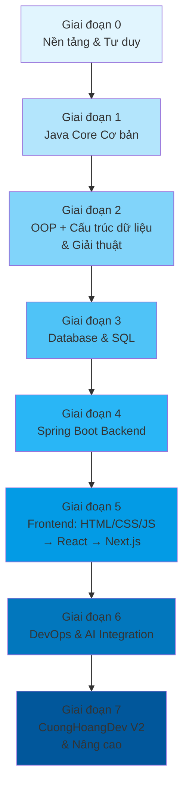

# Lộ trình Học tập: Từ Con Số 0 đến CuongHoangDev V2

## Tổng quan lộ trình

- **Tổng thời gian:** ~14-18 tháng (nếu học 20-25h/tuần)
- **Điều kiện:** Người hoàn toàn mới, học chậm mà chắc
- **Đích đến cuối cùng:** Xây dựng thành công CuongHoangDev V2 theo blueprint FPT Software

### Sơ đồ các giai đoạn



---

## GIAI ĐOẠN 0: NỀN TẢNG & TƯ DUY LẬP TRÌNH (2-3 tuần)

### Mục tiêu
Làm quen với cách máy tính hoạt động, hiểu "code là gì", cài đặt môi trường, viết chương trình đầu tiên.

### Chủ đề cần học

#### 1. Máy tính hoạt động như thế nào? (1 tuần)
- Máy tính gồm những gì? (CPU, RAM, ổ cứng, GPU)
- Phần mềm vs Phần cứng - ai điều khiển ai?
- Chương trình (code) là gì? Tại sao máy tính cần code?
- Ngôn ngữ lập trình là gì? Tại sao có nhiều ngôn ngữ?
- Trình biên dịch (Compiler) vs Trình thông dịch (Interpreter) - Java dùng cái nào?
- Java hoạt động thế nào: Source Code → Compiler → Bytecode → JVM → Machine Code

**Tài liệu:**
- Video: "How Computers Work" (Khan Academy hoặc Crash Course Computer Science tập 1-5)
- Sách: "How Computers Really Work" (miễn phí - No Starch Press)
- Đọc: [How Java Works - GeeksforGeeks](https://www.geeksforgeeks.org/java/how-java-works/)

**Bài tập thực hành:**
- [ ] Tự lắp ráp/hiểu cấu hình một máy tính (dù là lý thuyết)
- [ ] Cài đặt IntelliJ IDEA Community (miễn phí) và Java 17/21
- [ ] Viết chương trình đầu tiên: `System.out.println("Xin chao, toi la [ten]!");`
- [ ] Tự giải thích được: code chạy từ trên xuống dưới, dòng nào chạy trước?

#### 2. Giới thiệu Java & Môi trường phát triển (1 tuần)
- Cài đặt Java JDK 17/21 (LTS - Long Term Support)
- Cài đặt IntelliJ IDEA Community Edition
- Cấu trúc một dự án Java (src, package, class)
- Cách chạy chương trình Java qua terminal và IntelliJ
- Các khái niệm cơ bản: biến (variable), kiểu dữ liệu (data type), toán tử (operator)

**Tài liệu:**
- Video: [Java Programming for Beginners - Bro Code (YouTube)](https://www.youtube.com/watch?v=xn7Bp_pKeQk)
- Tài liệu chính thức: [Java Official Tutorial](https://docs.oracle.com/javase/tutorial/)
- Đọc kèm: [W3Schools Java](https://www.w3schools.com/java/)

**Bài tập thực hành:**
- [ ] Tạo project Java trong IntelliJ, chạy thành công
- [ ] Viết chương trình tính tổng 2 số nguyên
- [ ] Viết chương trình tính diện tích hình tròn (dùng `Scanner` để nhập bán kính)
- [ ] Làm 10 bài tập cơ bản trên [HackerRank Java](https://www.hackerrank.com/domains/java)

**Mini Project:** Chương trình máy tính bỏ túi đơn giản (cộng, trừ, nhân, chia, tính lũy thừa)

**Checkpoint Giai đoạn 0:**
- [ ] Giải thích được Java chạy trên JVM, không phải trực tiếp trên máy
- [ ] Tự tạo project Java, viết và chạy được chương trình trong IntelliJ
- [ ] Hiểu được khái niệm biến, kiểu dữ liệu, input/output cơ bản

---

## GIAI ĐOẠN 1: JAVA CORE CƠ BẢN (8-10 tuần)

### Mục tiêu
Nắm vững toàn bộ kiến thức nền tảng Java: biến, kiểu dữ liệu, vòng lặp, điều kiện, mảng, method, String, exception. Đây là giai đoạn quan trọng nhất vì Java là ngôn ngữ chính của dự án CuongHoangDev V2.

### Thứ tự học và chi tiết từng chủ đề

#### 1. Biến, Kiểu dữ liệu & Toán tử (1 tuần)
**Kiến thức quan trọng:**
- 8 kiểu dữ liệu nguyên thủy (primitive): `byte`, `short`, `int`, `long`, `float`, `double`, `boolean`, `char`
- Kiểu tham chiếu (reference): String, Array, Object
- Khác biệt giữa primitive và reference (trong Java, `int` lưu giá trị, `String` lưu địa chỉ bộ nhớ)
- Ép kiểu (casting): widening (tự động) vs narrowing (thủ công)
- Toán tử: số học, quan hệ, logic, bitwise, ternary
- Hằng số với `final`

**Bài tập thực hành:**
- [ ] Viết chương trình đổi độ C sang độ F và ngược lại
- [ ] Tính chu vi, diện tích các hình (tròn, chữ nhật, tam giác)
- [ ] Bài tập trên Exercism.io - track Java: "Lasagna", "Banks Account" (easy)
- Platform: [HackerRank - Java Introduction](https://www.hackerrank.com/domains/java/java-introduction)

#### 2. Cấu trúc điều khiển - Vòng lặp & Điều kiện (1.5 tuần)
**Kiến thức quan trọng:**
- `if-else`, `if-else if-else`, nested if
- `switch` (traditional + switch expression Java 14+)
- Vòng lặp: `for`, `enhanced for` (for-each), `while`, `do-while`
- `break` và `continue` - hiểu khi nào dùng
- Nested loops - vòng lặp lồng nhau

**Bài tập thực hành:**
- [ ] Viết chương trình kiểm tra năm nhuận
- [ ] Bảng cửu chương (từ 1 đến 9)
- [ ] Đếm số nguyên tố trong khoảng 1-100
- [ ] Dãy Fibonacci (10 số đầu tiên)
- [ ] Game đoán số (máy sinh số ngẫu nhiên 1-100, người đoán)
- Platform: [Codewars Kata 8kyu-7kyu Java](https://www.codewars.com/)

#### 3. Mảng (Array) & Collections cơ bản (1.5 tuần)
**Kiến thức quan trọng:**
- Mảng 1 chiều: khai báo, khởi tạo, duyệt mảng
- Mảng 2 chiều: ma trận
- ArrayList: dynamic array (kích thước thay đổi được)
- Sự khác nhau giữa mảng cố định và ArrayList
- HashMap: lưu trữ dạng key-value
- HashSet: lưu trữ tập hợp không trùng lặp

**Bài tập thực hành:**
- [ ] Tìm số lớn nhất, nhỏ nhất trong mảng
- [ ] Sắp xếp mảng (Bubble Sort, Selection Sort)
- [ ] Đếm tần suất xuất hiện của mỗi từ trong một câu (dùng HashMap)
- [ ] Xóa phần tử trùng lặp trong ArrayList
- Platform: [LeetCode Easy - Array problems](https://leetcode.com/problemset/all/?difficulty=Easy)

#### 4. Method (Hàm) & Scope (Phạm vi biến) (1 tuần)
**Kiến thức quan trọng:**
- Khai báo và gọi method
- Parameter vs Argument - truyền tham trị (pass by value) trong Java
- Return type, void method
- Method overloading (nạp chồng method)
- Recursion (đệ quy): factorial, fibonacci, tính tổng

**Bài tập thực hành:**
- [ ] Viết method tính giai thừa (dùng cả vòng lặp và đệ quy)
- [ ] Viết method kiểm tra số nguyên tố
- [ ] Tính dãy Fibonacci bằng đệ quy và memoization
- [ ] Xây dựng các method xử lý mảng: tìm max, min, tính trung bình

#### 5. String & Xử lý văn bản (1 tuần)
**Kiến thức quan trọng:**
- String là immutable (không thể thay đổi sau khi tạo) - HIỂU SÂU điều này
- String Pool - tại sao so sánh String nên dùng `.equals()` chứ không dùng `==`
- Các method quan trọng: `length()`, `charAt()`, `substring()`, `indexOf()`, `contains()`, `split()`, `trim()`, `replace()`
- StringBuilder (mutable, hiệu suất tốt hơn khi nối nhiều chuỗi)
- StringBuffer (thread-safe, dùng trong đa luồng)

**Bài tập thực hành:**
- [ ] Đếm số từ trong một chuỗi
- [ ] Đảo ngược chuỗi (dùng StringBuilder)
- [ ] Kiểm tra chuỗi đối xứng (palindrome)
- [ ] Tách họ và tên từ chuỗi "Nguyen Van A"
- [ ] Mã hóa Caesar Cipher đơn giản

#### 6. Xử lý ngoại lệ (Exception Handling) (0.5 tuần)
**Kiến thức quan trọng:**
- Checked vs Unchecked Exception (bắt buộc vs không bắt buộc xử lý)
- `try-catch-finally` - luôn hiểu luồng thực thi
- `throw` vs `throws` - ném exception vs khai báo exception
- Tạo custom exception (đặc biệt quan trọng cho Spring Boot sau này)
- Best practice: không bắt quá rộng, không nuốt exception

**Bài tập thực hành:**
- [ ] Viết chương trình chia hai số, xử lý lỗi chia cho 0
- [ ] Viết method đọc file, xử lý FileNotFoundException
- [ ] Tạo custom exception `InvalidAgeException`

**Mini Project Giai đoạn 1:** Quản lý danh sách sinh viên (CRUD - Create, Read, Update, Delete) sử dụng ArrayList/HashMap trong console. Cho phép thêm sinh viên, hiển thị danh sách, tìm kiếm, xóa.

**Checkpoint Giai đoạn 1:**
- [ ] Giải thích được pass-by-value trong Java (khi truyền int vào method, giá trị gốc không đổi)
- [ ] Tự viết được sắp xếp mảng (bất kỳ thuật toán nào)
- [ ] Giải thích được String immutability và String Pool
- [ ] Làm được 30+ bài tập trên HackerRank/LeetCode Easy

---

## GIAI ĐOẠN 2: LẬP TRÌNH HƯỚNG ĐỐI TƯỢNG (OOP) + CẤU TRÚC DỮ LIỆU & GIẢI THUẬT (DSA) (12-16 tuần)

Đây là giai đoạn nặng nhất về lý thuyết nhưng cực kỳ quan trọng. OOP là nền tảng của Spring Boot. DSA là nền tảng của mọi kỹ sư phần mềm giỏi.

### PHẦN A: OOP - Lập trình hướng đối tượng (6-8 tuần)

#### 1. Class, Object, Attribute, Method (1.5 tuần)
**Kiến thức quan trọng:**
- Class là "bản thiết kế", Object là "sản phẩm từ bản thiết kế"
- Constructor: default, parameterized, copy constructor
- `this` keyword - tham chiếu đến object hiện tại
- Instance variable vs Local variable
- `static` variable và method - chia sẻ giữa tất cả object

**Bài tập thực hành:**
- [ ] Tạo class `HinhChuNhat` với width, height, các method tính diện tích, chu vi
- [ ] Tạo class `SinhVien` với các thuộc tính: mã, tên, điểm, và method xếp loại
- [ ] Tạo class `Account` (tài khoản ngân hàng) với method gửi tiền, rút tiền, kiểm tra số dư

#### 2. Encapsulation (Đóng gói) (1 tuần)
**Kiến thức quan trọng:**
- Private fields + Public getters/setters - bảo vệ dữ liệu
- Tại sao không để public? (validate dữ liệu trước khi gán)
- Builder Pattern (sẽ dùng nhiều trong Spring Boot với Lombok)
- Immutability object - tạo class không thể thay đổi sau khi khởi tạo

**Bài tập thực hành:**
- [ ] Refactor class SinhVien: để tất cả field là private, viết getter/setter
- [ ] Trong setter điểm, validate: điểm phải từ 0-10, không âm
- [ ] Tạo class `Product` immutable (dùng constructor với final fields)

#### 3. Inheritance (Kế thừa) (1.5 tuần)
**Kiến thức quan trọng:**
- `extends` keyword - class con kế thừa class cha
- `super()` - gọi constructor của class cha
- Override method (ghi đè) với `@Override`
- `protected` access modifier - truy cập trong package và class con
- Mối quan hệ IS-A (kế thừa) vs HAS-A (composition) - biết khi nào dùng cái nào
- Single Inheritance trong Java (class chỉ kế thừa một class cha)

**Bài tập thực hành:**
- [ ] Tạo class `NhanVien` (cha), class `NhanVienFullTime` và `NhanVienPartTime` (con)
- [ ] Override method tính lương cho mỗi loại nhân viên
- [ ] Tạo hệ thống class `Hinh` (cha) → `HinhTron`, `HinhChuNhat`, `HinhVuong` (con)

#### 4. Polymorphism (Đa hình) (1.5 tuần)
**Kiến thức quan trọng:**
- Compile-time polymorphism: method overloading
- Runtime polymorphism: method overriding + upcasting/downcasting
- Abstract class vs Interface - biết khi nào dùng cái nào
- Interface đa kế thừa (một class implements nhiều interface)
- Functional Interface + Lambda Expression (Java 8+) - sẽ dùng nhiều trong Spring
- Ví dụ thực tế: `List<String> list = new ArrayList<>()` - đa hình qua interface

**Bài tập thực hành:**
- [ ] Thiết kế interface `PaymentMethod` với các implementation: `CreditCard`, `PayPal`, `Cash`
- [ ] Tạo class `Shape` abstract, implement các class con `Circle`, `Rectangle`
- [ ] Viết method nhận vào `List<Shape>` và gọi `draw()` đa hình

#### 5. Abstraction (Trừu tượng) (1 tuần)
**Kiến thức quan trọng:**
- Abstract class: có method abstract (không có body) và method concrete
- Interface: 100% abstract (trước Java 8), nhưng giờ có default, static method
- Sự khác nhau: abstract class có constructor, variable; interface thì không (trừ Java 8+ default)
- Ví dụ trong Spring Boot: `JpaRepository<T, ID>` là interface, `CrudRepository`, `PagingAndSortingRepository`
- Đây là nền tảng của Spring Data JPA

**Bài tập thực hành:**
- [ ] Thiết kế abstract class `Animal` với method abstract `sound()`, concrete method `eat()`
- [ ] Tạo interface `DAO<T>` với các method `save()`, `findById()`, `findAll()`, `delete()`
- [ ] Implement interface DAO cho class `User` và `Product`

#### 6. SOLID Principles (1 tuần)
**Kiến thức quan trọng:**
- **S**ingle Responsibility: mỗi class chỉ làm một việc
- **O**pen/Closed: mở rộng được, không sửa đổi code cũ
- **L**iskov Substitution: class con có thể thay thế class cha
- **I**nterface Segregation: nhiều interface nhỏ, chuyên biệt, thay vì một interface lớn
- **D**ependency Inversion: phụ thuộc vào abstraction, không phụ thuộc vào concrete class
- Đây là tiêu chuẩn trong kiến trúc Spring Boot

**Bài tập thực hành:**
- [ ] Phân tích một class vi phạm SRP và refactor lại
- [ ] Viết lại Mini Project Giai đoạn 1 theo đúng OOP: có class `Student`, `StudentManager`, `Validator`
- [ ] Vẽ sơ đồ class (UML) cho hệ thống quản lý thư viện

### PHẦN B: DSA - Cấu trúc dữ liệu & Giải thuật (6-8 tuần)

#### Thứ tự học DSA

**1. Big O Notation & Phân tích độ phức tạp (1 tuần)**
- Hiểu O(1), O(log n), O(n), O(n log n), O(n²), O(2ⁿ)
- Đánh giá độ phức tạp của thuật toán
- Tại sao Big O quan trọng: đo lường hiệu suất khi dữ liệu lớn
**Tài liệu:** [Big O Notation - Crash Course (YouTube)](https://www.youtube.com/watch?v=itVHlGq4W6E)

**2. Arrays & Strings nâng cao (1 tuần)**
- Two-pointer technique
- Sliding window
**Platform:** [NeetCode](https://neetcode.io/) - Array problems

**3. Linked Lists (1.5 tuần)**
- Singly Linked List: cài đặt, thêm, xóa, đảo ngược
- Doubly Linked List
- Common problems: detect cycle, find middle, merge two sorted lists
**Platform:** LeetCode - Linked List Easy/Medium

**4. Stacks & Queues (1 tuần)**
- Stack: cài đặt bằng array/linked list
- Queue: cài đặt bằng array/linked list, Circular Queue
- Ứng dụng: Balanced parentheses, BFS (Breadth-First Search)
**Platform:** LeetCode Stack/Queue problems

**5. Hash Tables (1 tuần)**
- HashMap, HashSet internals
- Collision resolution (chaining, open addressing)
- Ứng dụng: đếm tần suất, anagram, subarray sum
**Platform:** LeetCode Hash Table Easy

**6. Trees & Binary Search Trees (1.5 tuần)**
- Binary Tree: inorder, preorder, postorder traversal (DFS)
- BST: insert, search, delete
- Binary Heap (Min-heap, Max-heap) - ứng dụng trong priority queue
- Trie (prefix tree) - dùng trong autocomplete
**Platform:** LeetCode Tree problems

**7. Graphs (1.5 tuần)**
- Biểu diễn đồ thị: Adjacency List, Adjacency Matrix
- DFS & BFS traversal
- Topological Sort, Shortest Path (Dijkstra)
- Union-Find (Disjoint Set) - dùng trong các bài toán connected components
**Platform:** LeetCode Graph problems

**8. Sorting & Searching (1 tuần)**
- Sorting: Bubble, Selection, Insertion, Merge Sort, Quick Sort, Heap Sort
- So sánh: stability, time complexity, space complexity
- Binary Search: tìm kiếm nhị phân trong mảng đã sắp xếp
- Two pointers + Binary Search trong thực tế

**Mini Project Giai đoạn 2:** Xây dựng ứng dụng Quản lý sinh viên với giao diện menu console, lưu dữ liệu vào file (JSON), áp dụng đầy đủ OOP (Student, Course, GradeManager, FileManager). Đồng thời viết test case cho các thuật toán sắp xếp và tìm kiếm.

**Checkpoint Giai đoạn 2:**
- [ ] Giải thích được 4 tính chất OOP bằng ví dụ thực tế
- [ ] Giải thích và cài đặt được: Merge Sort, Quick Sort, Binary Search, DFS, BFS
- [ ] Làm được 50+ bài LeetCode (Easy + một số Medium)
- [ ] Vẽ được sơ đồ UML cho hệ thống phức tạp (dùng draw.io)

---

## GIAI ĐOẠN 3: DATABASE & SQL (4-6 tuần)

### Mục tiêu
Nắm vững SQL, thiết kế Cơ sở dữ liệu quan hệ, sử dụng thành thạo PostgreSQL - công nghệ database chính của CuongHoangDev V2.

### Chủ đề cần học

#### 1. SQL cơ bản (1.5 tuần)
**Kiến thức quan trọng:**
- `SELECT`, `WHERE`, `ORDER BY`, `LIMIT`
- Các toán tử: `AND`, `OR`, `NOT`, `IN`, `BETWEEN`, `LIKE`, `ILIKE`
- `DISTINCT`, `AS` (alias)
- Hàm tổng hợp: `COUNT`, `SUM`, `AVG`, `MIN`, `MAX`
- `GROUP BY` và `HAVING` (lọc sau khi group)
- Null handling: `IS NULL`, `IS NOT NULL`, `COALESCE`, `NULLIF`

**Tài liệu:**
- [SQLBolt](https://sqlbolt.com/) - bài tập tương tác miễn phí
- [PostgreSQL Tutorial](https://www.postgresql.org/docs/current/tutorial-start.html)
- Video: [SQL for Beginners - Tech World with Nana (YouTube)](https://www.youtube.com/watch?v=qw--jUKu8I8)

**Bài tập thực hành:**
- [ ] Tạo database `ecommerce_db`, viết script tạo bảng `users`, `products`, `orders`
- [ ] Viết 20 câu truy vấn: lọc, sắp xếp, đếm, nhóm
- Platform: [SQLZoo](https://sqlzoo.net/), [LeetCode Database Easy](https://leetcode.com/problemset/database/)

#### 2. SQL nâng cao & JOIN (1.5 tuần)
**Kiến thức quan trọng:**
- `JOIN`: `INNER JOIN`, `LEFT JOIN`, `RIGHT JOIN`, `FULL OUTER JOIN`, `CROSS JOIN`
- `UNION`, `INTERSECT`, `EXCEPT`
- Subquery (truy vấn con): correlated vs non-correlated
- `EXISTS`, `CASE WHEN` (điều kiện trong SELECT)
- Window Functions: `ROW_NUMBER()`, `RANK()`, `DENSE_RANK()`, `LAG()`, `LEAD()` - RẤT QUAN TRỌNG
- Common Table Expression (CTE) với `WITH` - giúp code SQL dễ đọc

**Bài tập thực hành:**
- [ ] Viết truy vấn: "Lấy top 5 sản phẩm bán chạy nhất mỗi tháng trong năm 2024"
- [ ] Viết truy vấn: "Tính doanh thu theo từng khách hàng, kèm ранг của họ"
- [ ] Chuẩn hóa database `ecommerce_db` đến 3NF
- Platform: [HackerRank SQL](https://www.hackerrank.com/domains/sql), LeetCode Database Medium

#### 3. Thiết kế Database (1.5 tuần)
**Kiến thức quan trọng:**
- Mô hình thực thể-liên kết (ER Diagram)
- Quy tắc chuẩn hóa: 1NF, 2NF, 3NF, BCNF - BIẾT ÁP DỤNG
- Khóa chính (Primary Key), Khóa ngoại (Foreign Key)
- Mối quan hệ: 1-1, 1-N, N-N (và cách xử lý N-N bằng bảng trung gian)
- Indexing: B-Tree index, Composite index, Index strategy - HIỂU SÂU
- Trigger, View, Materialized View

**Bài tập thực hành:**
- [ ] Thiết kế ERD cho hệ thống thư viện (sách, thành viên, mượn trả)
- [ ] Thiết kế ERD cho CuongHoangDev V2 (users, blog_posts, projects, products, orders, skills)
- [ ] Tạo index cho các cột thường xuyên truy vấn, đo lường hiệu suất với `EXPLAIN ANALYZE`

**Mini Project Giai đoạn 3:**
Thiết kế và cài đặt database hoàn chỉnh cho CuongHoangDev V2 trên PostgreSQL:
- Viết script SQL tạo tất cả bảng: users, roles, permissions, blog_posts, categories, projects, products, orders, order_items, skills, ai_embeddings
- Tạo migration scripts với cấu trúc sạch
- Viết 30 câu SQL query phục vụ các chức năng của dự án
- Sử dụng `pgvector` extension để chuẩn bị cho AI (tạo bảng `document_embeddings`)

**Checkpoint Giai đoạn 3:**
- [ ] Viết được truy vấn JOIN phức tạp (3 bảng trở lên) không cần google
- [ ] Thiết kế database cho ứng dụng thực tế ở mức 3NF
- [ ] Giải thích được index hoạt động như thế nào, khi nào dùng, khi nào không
- [ ] Dùng được `EXPLAIN ANALYZE` để tối ưu truy vấn chậm

---

## GIAI ĐOẠN 4: SPRING BOOT BACKEND (10-14 tuần)

### Mục tiêu
Xây dựng Backend hoàn chỉnh với Spring Boot 3.x. Đây là phần nặng nhất của dự án CuongHoangDev V2. Tech stack chính: Java 17/21, Spring Boot 3.x, Spring Security 6, Spring Data JPA, REST API.

### Thứ tự học chi tiết

#### 1. Giới thiệu Spring Boot & Cấu trúc project (1 tuần)
**Kiến thức quan trọng:**
- Spring Boot là gì? Khác gì so với Spring Framework thuần?
- Spring Initializr: cách tạo project nhanh với dependency
- Cấu trúc thư mục Maven/Gradle: `src/main/java`, `src/main/resources`, `pom.xml`
- @SpringBootApplication, @ComponentScan
- @Bean, @Configuration - hiểu Spring IoC Container
- Dependency Injection (DI): Constructor Injection vs Setter Injection vs Field Injection - ƯU TIÊN Constructor Injection

**Tài liệu:**
- [Spring Boot Official Guide](https://spring.io/guides/gs/spring-boot/)
- [Baeldung Spring Boot Tutorial](https://www.baeldung.com/spring-boot)
- Video: [Spring Boot for Beginners - Amigoscode (YouTube)](https://www.youtube.com/watch?v=sf-DpnCFeoM)

**Bài tập thực hành:**
- [ ] Tạo Spring Boot project với IntelliJ, chạy thành công
- [ ] Viết API `/hello` trả về JSON `{"message": "Hello!"}`
- [ ] Tự cấu hình application.yml với server port, application name

#### 2. REST API & Controller (2 tuần)
**Kiến thức quan trọng:**
- REST principles: Resource, URI, HTTP methods (GET, POST, PUT, DELETE, PATCH)
- @RestController, @RequestMapping, @GetMapping, @PostMapping...
- @PathVariable, @RequestParam, @RequestBody
- ResponseEntity<T> - kiểm soát HTTP status code
- Validation với @Valid, @NotNull, @NotBlank, @Email, @Min, @Max, @Size, @Pattern
- @ExceptionHandler cho xử lý lỗi cục bộ, @ControllerAdvice cho toàn cục
- HTTP Status Codes: 200, 201, 400, 401, 403, 404, 500 - DÙNG ĐÚNG

**Bài tập thực hành:**
- [ ] Xây dựng CRUD API hoàn chỉnh cho `Product`: GET all, GET by id, POST create, PUT update, DELETE delete
- [ ] Validate dữ liệu đầu vào: product name không trống, price > 0
- [ ] Trả về đúng HTTP status code cho mỗi trường hợp
- [ ] Xử lý exception: ResourceNotFoundException, BadRequestException

**Platform:** [RESTful API Naming Conventions](https://restfulapi.net/resource-naming/), thực hành với Postman

#### 3. Spring Data JPA & Hibernate (2.5 tuần)
**Kiến thức quan trọng:**
- ORM là gì? Tại sao cần? (Map object ↔ database table)
- JPA (Java Persistence API) vs Hibernate (implementation)
- Entity, @Table, @Column, @Id, @GeneratedValue
- @Enumerated, @Temporal, @Lob cho kiểu dữ liệu đặc biệt
- Repository: JpaRepository, CrudRepository, PagingAndSortingRepository
- Query Methods: method naming convention (`findByName`, `findByEmailAndPassword`)
- @Query: JPQL và Native Query
- @Transactional: hiểu khi nào cần, không có thì sao?
- Lazy vs Eager loading - NGUYÊN NHÂN CHÍNH của N+1 problem
- Entity Lifecycle: transient, managed, detached, removed
- @PrePersist, @PreUpdate, @CreatedDate, @LastModifiedDate

**Bài tập thực hành:**
- [ ] Tạo Entity User, Product, Category với đầy đủ mapping
- [ ] Xây dựng Repository layer cho hệ thống blog (Post, Comment, Tag)
- [ ] Giải quyết N+1 problem bằng `@EntityGraph` hoặc `JOIN FETCH`
- [ ] Phân trang với `Pageable` và `Page<T>`

#### 4. Spring Security 6 & JWT Authentication (2.5 tuần)
**Kiến thức quan trọng:**
- Authentication (Xác thực) vs Authorization (Phân quyền)
- Security Filter Chain trong Spring Security 6 (thay thế WebSecurityConfigurerAdapter)
- Stateless vs Stateful session - JWT là Stateless
- BCryptPasswordEncoder: băm mật khẩu, salt - KHÔNG BAO GIỜ LƯU PASSWORD DẠNG PLAIN TEXT
- JWT (JSON Web Token): cấu trúc (Header, Payload, Signature), cách hoạt động
- Access Token vs Refresh Token - biết cách implement cả hai
- @PreAuthorize, @Secured, @RolesAllowed cho phân quyền
- CORS configuration - bắt buộc khi Frontend gọi Backend

**Bài tập thực hành:**
- [ ] Cấu hình Security Filter Chain stateless, cho phép /api/auth/** công khai
- [ ] Implement Register: mã hóa password bằng BCrypt, lưu vào DB
- [ ] Implement Login: kiểm tra password, sinh JWT token
- [ ] Tạo Security Filter gắn JWT token vào SecurityContext
- [ ] Bảo vệ các endpoint: chỉ user đã login mới truy cập /api/users/**
- [ ] Implement Refresh Token mechanism

#### 5. Spring Data JPA Relationships (1.5 tuần)
**Kiến thức quan trọng:**
- @OneToOne: User ↔ UserProfile
- @OneToMany / @ManyToOne: Category → Posts
- @ManyToMany: Post ↔ Tag (qua bảng trung gian)
- @JoinColumn, @JoinTable
- CascadeType: ALL, PERSIST, REMOVE... - hiểu khi nào dùng cascade nào
- Orphan removal
- FetchType: LAZY (mặc định cho @ManyToMany, @OneToMany) vs EAGER (@OneToOne, @ManyToOne)

**Bài tập thực hành:**
- [ ] Thiết kế entities cho CuongHoangDev V2: User → BlogPost → Category, User → Project → Technology
- [ ] Implement cascade persist: khi xóa User thì xóa hết posts của user đó
- [ ] Phân trang và sắp xếp cho list posts

#### 6. Service Layer & Business Logic (1.5 tuần)
**Kiến thức quan trọng:**
- @Service annotation - business logic layer
- DTO (Data Transfer Object) - TÁCH BIỆT Entity khỏi API response
- Mapper: MapStruct hoặc ModelMapper - tự động map Entity ↔ DTO
- Transaction management với @Transactional
- @Async: xử lý bất đồng bộ
- Logging với SLF4J + Logback

**Bài tập thực hành:**
- [ ] Xây dựng Service layer đầy đủ cho Blog module (BlogPostService, CategoryService)
- [ ] Implement Mapper với MapStruct cho User ↔ UserResponse, UserRequest
- [ ] Refactor tất cả API dùng DTO thay vì trả trực tiếp Entity

#### 7. Các chủ đề nâng cao Spring Boot (2 tuần)
**Kiến thức quan trọng:**
- **File Upload/Download**: MultipartFile, lưu trữ Cloudinary (phục vụ cho ảnh portfolio)
- **Email Service**: JavaMailSender, gửi email xác thựn, reset password
- **WebSocket**: Real-time notification (chat bubble AI)
- **Scheduling**: @Scheduled - cleanup tasks, report generation
- **Testing**: @SpringBootTest, @WebMvcTest, @DataJpaTest, MockMvc
- **Flyway**: Database migration (sẽ dùng trong CuongHoangDev V2)

**Bài tập thực hành:**
- [ ] Implement upload ảnh sản phẩm, lưu metadata vào DB
- [ ] Viết unit test cho Service layer (dùng Mockito + JUnit 5)
- [ ] Viết integration test cho Controller (dùng @WebMvcTest)
- [ ] Cấu hình Flyway migration scripts cho database schema

**Mini Project Giai đoạn 4:** Xây dựng **hoàn chỉnh** Backend API cho CuongHoangDev V2 - Sprint 1 & Sprint 2 trong blueprint:
- Authentication: Register, Login, JWT, OAuth2 (Google/GitHub)
- User Profile Management
- Blog/Portfolio Management CRUD
- Project Management CRUD
- Redis Cache (cache blog posts)
- AI Chatbot RAG endpoints (upload document → embed → store in pgvector → query)
- Tài liệu hóa API với Swagger/OpenAPI

**Checkpoint Giai đoạn 4:**
- [ ] Tự xây dựng được REST API hoàn chỉnh cho 1 module (CRUD + Auth + Pagination + Validation)
- [ ] Giải thích được cách JWT hoạt động, từ lúc login đến khi gọi API
- [ ] Giải thích được N+1 problem và cách giải quyết
- [ ] Viết được Unit Test cho Service layer với độ phủ ≥ 80%
- [ ] Có thể deploy Spring Boot app lên server (dù là local VPS)

---

## GIAI ĐOẠN 5: FRONTEND DEVELOPMENT (8-12 tuần)

### Mục tiêu
Xây dựng giao diện người dùng với Next.js 14 + TypeScript. Bắt đầu từ HTML/CSS/JS cơ bản, qua React, rồi đến Next.js. Tech stack: Next.js 14 (App Router), TypeScript, Tailwind CSS, Zustand, Axios.

### Thứ tự học chi tiết

#### 1. HTML & CSS cơ bản (2 tuần)
**Kiến thức quan trọng:**
- HTML5 semantic tags: `<header>`, `<nav>`, `<main>`, `<article>`, `<section>`, `<footer>`
- Tại sao semantic HTML quan trọng? (SEO, accessibility)
- CSS Selector: element, class, id, attribute, pseudo-class, pseudo-element
- Box Model: content, padding, border, margin
- Flexbox và CSS Grid - HAI CÔNG CỤ BỐ CỤC QUAN TRỌNG NHẤT
- Responsive Design: Media Queries, Mobile-first approach
- CSS Variables (Custom Properties) - nền tảng của Tailwind
- Positioning: static, relative, absolute, fixed, sticky

**Tài liệu:**
- [freeCodeCamp - Responsive Web Design](https://www.freecodecamp.org/learn/2022/responsive-web-design/) - MIỄN PHÍ, có certificate
- [CSS Tricks - Flexbox Guide](https://css-tricks.com/snippets/css/a-guide-to-flexbox/)
- [CSS Tricks - Grid Guide](https://css-tricks.com/snippets/css/complete-guide-grid/)
- Game: [Flexbox Froggy](https://flexboxfroggy.com/), [Grid Garden](https://cssgridgarden.com/)

**Bài tập thực hành:**
- [ ] Clone trang chủ Google (chỉ giao diện, HTML/CSS thuần)
- [ ] Xây dựng layout: Header (logo + nav), Sidebar, Main Content, Footer sử dụng Flexbox
- [ ] Xây dựng grid gallery ảnh responsive (3 cột desktop, 2 tablet, 1 mobile)
- [ ] Tạo card component cho sản phẩm thương mại điện tử (hình ảnh, tên, giá, nút mua)

#### 2. JavaScript cho Frontend (2.5 tuần)
**Kiến thức quan trọng:**
- DOM Manipulation: `querySelector`, `getElementById`, tạo/sửa/xóa element
- Event Handling: click, submit, change, keypress, event bubbling
- ES6+: `let/const`, arrow function, template literal, spread/rest operator, destructuring, modules
- `fetch()` API: gọi REST API từ JavaScript, async/await
- Promises: `.then()/.catch()`, async/await
- `localStorage` và `sessionStorage`: lưu trữ phía client
- Error handling trong async code

**Bài tập thực hành:**
- [ ] Xây dựng To-Do List (thêm, sửa, xóa, lưu vào localStorage)
- [ ] Gọi API (dùng JSONPlaceholder hoặc reqres.in) hiển thị danh sách users
- [ ] Xây dựng form validation (email, password strength, confirm password)
- [ ] Tạo accordion/tab component không dùng thư viện
- Platform: [JavaScript30](https://javascript30.com/) - 30 project nhỏ trong 30 ngày

#### 3. React Fundamentals (3 tuần)
**Kiến thức quan trọng:**
- React là gì? Component-based architecture
- JSX: viết HTML trong JavaScript
- Props vs State - HIỂU SÂU sự khác biệt
- useState, useEffect, useRef, useCallback, useMemo
- Conditional rendering: ternary, && operator, early return
- Lists rendering với `.map()` và `key` prop - TẠI SAO CẦN KEY?
- Component composition: children prop, slot pattern
- Custom Hooks: tái sử dụng logic - "khi nào thấy code lặp lại 2 lần, hãy viết hook"

**Tài liệu:**
- [React Official Tutorial](https://react.dev/learn) - TÀI LIỆU CHÍNH THỨC, rất tốt
- [Dave Gray React Course (YouTube)](https://www.youtube.com/watch?v=RVzhf_r7A2Y)
- [React by Example - Baeldung](https://www.baeldung.com/react-tutorial)

**Bài tập thực hành:**
- [ ] Xây dựng lại To-Do List với React
- [ ] Xây dựng Weather App: nhập tên thành phố, gọi API OpenWeatherMap, hiển thị thời tiết
- [ ] Tạo component Library: Button, Input, Card, Modal, Dropdown
- [ ] Fetch và hiển thị danh sách blog posts từ mock API

#### 4. Next.js 14 & TypeScript (2.5 tuần)
**Kiến thức quan trọng:**
- Next.js App Router vs Pages Router - App Router là tương lai
- Server Components vs Client Components - HIỂU KHI NÀO DÙNG CÁI NÀO
- `use client` directive cho client-side interactivity
- Dynamic Routes: `[id]`, `[slug]`
- Server Actions: form action phía server
- Route Handler: `app/api/route.ts`
- Metadata API: SEO optimization
- Image optimization với `next/image`
- TypeScript: interface vs type, generic, union, optional
- Zod: runtime validation cho TypeScript

**Tài liệu:**
- [Next.js 14 Documentation](https://nextjs.org/docs)
- [TypeScript Handbook](https://www.typescriptlang.org/docs/handbook/intro.html)
- Video: [Next.js 14 Full Course (YouTube)](https://www.youtube.com/watch?v=mQS Orion-Ni4)

**Bài tập thực hành:**
- [ ] Tạo blog cá nhân với Next.js App Router: homepage, blog list, blog detail
- [ ] Viết TypeScript interface cho User, Post, Product
- [ ] Implement search với URL params và Server Component
- [ ] Setup Tailwind CSS với design system tokens (colors, fonts, spacing)

**Mini Project Giai đoạn 5:** Xây dựng **hoàn chỉnh Frontend** theo CuongHoangDev V2 Sprint 3 & 4:
- Homepage với Framer Motion animations (typing effect, skill bars)
- Authentication pages: Login, Register (với React Hook Form + Zod)
- Portfolio page với filter động theo technology
- Shop page với product listing, filters, product detail
- Giỏ hàng với Zustand + localStorage persistence
- AI Chat bubble UI (giao diện chatbot)
- Admin Dashboard: sidebar, stats charts (Recharts), CMS cho blog
- TanStack Table cho danh sách dữ liệu admin

**Checkpoint Giai đoạn 5:**
- [ ] Tự xây dựng được blog cá nhân với Next.js 14 (App Router)
- [ ] Giải thích được khi nào dùng Server Component, khi nào dùng Client Component
- [ ] Viết được TypeScript interface cho bất kỳ data model nào
- [ ] Sử dụng thành thạo Tailwind CSS cho responsive layout

---

## GIAI ĐOẠN 6: DEVOPS & AI INTEGRATION (6-8 tuần)

### Mục tiêu
Đóng gói và triển khai ứng dụng với Docker, tự động hóa CI/CD, tích hợp AI chatbot RAG.

### Chủ đề cần học

#### 1. Git & GitHub chuyên sâu (1.5 tuần)
**Kiến thức quan trọng:**
- Branching strategy: Git Flow, Trunk-based development
- Git rebase vs merge - hiểu sâu sự khác biệt
- Git stash, cherry-pick
- GitHub Pull Request workflow: review, comment, approve, merge
- GitHub Actions cơ bản: workflow syntax, triggers, jobs, steps
- .gitignore, README.md

**Bài tập thực hành:**
- [ ] Thiết lập Git Flow cho dự án cá nhân
- [ ] Viết GitHub Actions workflow: test + build tự động khi push
- [ ] Resolve git conflicts (dùng rebase)

#### 2. Docker & Containerization (2 tuần)
**Kiến thức quan trọng:**
- Container vs VM - tại sao Docker nhẹ hơn
- Image vs Container - Image là blueprint
- Dockerfile: cấu trúc, các instruction (FROM, COPY, RUN, CMD, EXPOSE, WORKDIR)
- Multi-stage build - giảm kích thước image (đặc biệt quan trọng cho Java JAR lớn)
- Docker Compose: điều phối multi-container (Backend + PostgreSQL + Redis + Frontend)
- Docker networking: bridge network, container-to-container communication
- Volume: persistent data (database, uploaded files)
- Security: non-root user, minimal base image, `.dockerignore`

**Bài tập thực hành:**
- [ ] Viết Dockerfile cho Spring Boot app (multi-stage build như blueprint)
- [ ] Viết Dockerfile cho Next.js app
- [ ] Viết docker-compose.yml cho toàn bộ hệ thống CuongHoangDev V2 (4 containers)
- [ ] Push image lên Docker Hub

#### 3. CI/CD Pipeline với GitHub Actions (1.5 tuần)
**Kiến thức quan trọng:**
- Pipeline stages: Build → Test → Security Scan → Push Image → Deploy
- Environment variables, secrets management
- Self-hosted runner vs GitHub-hosted runner
- Caching: Maven, npm cache trong CI

**Bài tập thực hành:**
- [ ] Viết `.github/workflows/deploy.yml` cho CuongHoangDev V2 như blueprint
- [ ] Tự động chạy test trước khi build
- [ ] Tự động deploy lên VPS khi merge vào main branch

#### 4. Linux cơ bản & Server Administration (1 tuần)
**Kiến thức quan trọng:**
- Common commands: ls, cd, cp, mv, rm, mkdir, chmod, chown, grep, curl, wget, tar, ssh, scp
- Process management: ps, top, kill, systemctl
- Package manager: apt, yum, brew
- Nginx: reverse proxy, SSL configuration, load balancing
- Let's Encrypt: cài đặt SSL certificate miễn phí
- Systemd: tạo service chạy ứng dụng

**Bài tập thực hành:**
- [ ] SSH vào VPS Linux, cài đặt Docker
- [ ] Cấu hình Nginx làm reverse proxy cho Backend (8080) và Frontend (3000)
- [ ] Setup SSL với Let's Encrypt
- [ ] Viết systemd service file cho Spring Boot app

#### 5. Spring AI & RAG Architecture (2 tuần)
**Kiến thức quan trọng:**
- AI Integration: Spring AI với OpenAI API / Google Gemini API
- Embedding: chuyển text thành vector (768-1536 dimensions)
- pgvector trong PostgreSQL: cài đặt, tạo extension, vector column type
- RAG Pipeline:
  1. Chunk documents (tách văn bản thành chunks nhỏ 500-1000 tokens)
  2. Embed chunks với OpenAI/Gemini
  3. Store vectors trong pgvector
  4. Query: embed câu hỏi → tìm top-k chunks gần nhất (cosine similarity)
  5. Inject chunks vào prompt → LLM generate answer
- Streaming response: Server-Sent Events (SSE) cho chat UI

**Bài tập thực hành:**
- [ ] Implement document upload → chunk → embed → store trong pgvector
- [ ] Implement semantic search: tìm tài liệu liên quan đến câu hỏi
- [ ] Implement RAG chat: embed câu hỏi → retrieve context → generate response
- [ ] Implement streaming response với SSE

**Mini Project Giai đoạn 6:** Hoàn thiện CuongHoangDev V2:
- Đóng gói toàn bộ ứng dụng bằng Docker + Docker Compose
- Cấu hình CI/CD với GitHub Actions
- Triển khai lên VPS Linux với Nginx + SSL
- Tích hợp AI Chatbot RAG hoàn chỉnh

**Checkpoint Giai đoạn 6:**
- [ ] Deploy được ứng dụng full-stack lên internet (https://your-domain.com)
- [ ] Giải thích được RAG pipeline hoạt động như thế nào
- [ ] Tự viết được Dockerfile và docker-compose.yml từ đầu
- [ ] Hiểu được CI/CD pipeline: test → build → push → deploy

---

## GIAI ĐOẠN 7: CUONGHOANGDEV V2 HOÀN CHỈNH & NÂNG CAO (4-6 tuần)

### Mục tiêu
Xây dựng dự án CuongHoangDev V2 hoàn chỉnh theo đúng blueprint của FPT Software. Sau đó, học các chủ đề nâng cao để trở thành Senior-level.

### Các bước xây dựng CuongHoangDev V2

**Bước 1: Sprint 1 - Nền móng Backend & Bảo mật (Ngày 1-7)**
- Thiết lập PostgreSQL + Flyway + Spring Boot project
- Entity + Repository + Global Exception Handler
- Spring Security 6 + JWT (access + refresh token)
- OAuth2 Login (Google + GitHub)
- Swagger/OpenAPI documentation

**Bước 2: Sprint 2 - API Nghiệp vụ lõi + AI RAG (Ngày 8-14)**
- Cloudinary upload (hình ảnh portfolio)
- Blog/Portfolio CRUD APIs
- Redis caching
- pgvector + Spring AI setup
- RAG: document embedding + semantic search + chat

**Bước 3: Sprint 3 - Next.js Frontend (Ngày 15-21)**
- Next.js 14 project setup + TypeScript + Tailwind
- Auth pages + Zustand state
- Homepage + Portfolio page + Project filter
- Shop page + Cart với animations

**Bước 4: Sprint 4 - AI Chat UI + Admin Dashboard (Ngày 22-28)**
- AI Chat bubble UI với streaming response
- Admin Dashboard + CMS + Recharts + TanStack Table

**Bước 5: Sprint 5 - DevOps & Deployment (Ngày 29-30+)**
- Docker + Docker Compose
- GitHub Actions CI/CD
- VPS deployment + Nginx + SSL

### Chủ đề Nâng cao sau CuongHoangDev V2

#### System Design (2-3 tuần)
- CAP Theorem: Consistency vs Availability vs Partition Tolerance
- Horizontal vs Vertical Scaling
- Load Balancer, CDN, Reverse Proxy
- Database Sharding, Replication (Master-Slave, Master-Master)
- Message Queue: Kafka, RabbitMQ
- Microservices vs Monolith
- Caching strategies: Cache-aside, Write-through, Write-behind
**Tài liệu:** [System Design Interview - Alex Xu (Volume 1 & 2)](https://bookshop.org/p/books/system-design-interview-an-insider-s-guide-volume-1-alex-xu/20313674), [Designing Data-Intensive Applications - Martin Kleppmann](https://dataintensive.net/)

#### Clean Architecture & Design Patterns (2 tuần)
- Clean Architecture: Entity, Use Case, Interface Adapter, Framework
- Design Patterns: Factory, Builder, Adapter, Decorator, Observer, Strategy, Singleton
- Repository Pattern, Unit of Work Pattern
- CQRS (Command Query Responsibility Segregation)
- Event Sourcing
**Tài liệu:** [Architecture Patterns with Python (miễn phí)](https://www.cosmicpython.com/)

#### Performance Optimization (1-2 tuần)
- Database: query optimization, indexing strategy, connection pooling (HikariCP)
- Caching: Redis advanced patterns, cache warming, cache stampede
- JVM: GC algorithms, memory tuning, profiling với JProfiler/VisualVM
- Frontend: bundle size optimization, image lazy loading, code splitting
- API: pagination, compression, response caching

#### Các Chứng chỉ & Học thêm
- **AWS Certified Developer / Solutions Architect**: Cloud computing
- **Docker Certified Associate**: Container expertise
- **CompTIA Security+**: Cybersecurity fundamentals
- **CCNA**: Networking
- **Linux Professional Institute (LPIC-1)**: Linux system administration
- **AI Engineer**: Prompt Engineering, Fine-tuning, MLOps

---

## TỔNG HỢP CHECKPOINT TOÀN LỘ TRÌNH

| Giai đoạn | Checkpoint chính | Thời gian ước tính |
|---|---|---|
| Giai đoạn 0 | Viết được chương trình Java đầu tiên | 2-3 tuần |
| Giai đoạn 1 | Giải thích pass-by-value, sắp xếp được mảng | 8-10 tuần |
| Giai đoạn 2 | Giải thích OOP + code Merge Sort + 50+ LeetCode | 12-16 tuần |
| Giai đoạn 3 | Thiết kế DB 3NF + viết JOIN phức tạp | 4-6 tuần |
| Giai đoạn 4 | CRUD API hoàn chỉnh + JWT + viết Unit Test | 10-14 tuần |
| Giai đoạn 5 | Next.js blog + TypeScript + Tailwind responsive | 8-12 tuần |
| Giai đoạn 6 | Deploy full-stack lên internet + RAG chatbot | 6-8 tuần |
| Giai đoạn 7 | CuongHoangDev V2 hoàn chỉnh + System Design | 4-6 tuần |

**Tổng cộng: ~54-65 tuần (12-15 tháng)**

---

## LỘ TRÌNH HỌC THEO THÁNG (Overview)

```
Tháng 1-2:    Giai đoạn 0 + Giai đoạn 1 (Java Core cơ bản)
Tháng 3-5:    Giai đoạn 2 (OOP + DSA)
Tháng 6:      Giai đoạn 3 (Database + SQL)
Tháng 7-10:   Giai đoạn 4 (Spring Boot Backend)
Tháng 11-13:  Giai đoạn 5 (Frontend: HTML/CSS/JS → React → Next.js)
Tháng 14-15:  Giai đoạn 6 (DevOps + AI Integration)
Tháng 16-17:  Giai đoạn 7 (CuongHoangDev V2 hoàn chỉnh)
Tháng 18+:    Nâng cao: System Design, Clean Architecture, Chứng chỉ
```

---

## LỜI KHUYÊN HỌC TẬP HIỆU QUẢ

### 1. Nguyên tắc học
- **Học lý thuyết → Làm bài tập → Xây dựng project**: MỖI NGÀY đều phải có cả ba. Không chỉ xem video, phải code tay.
- **Code tay, không copy-paste**: Gõ từng dòng code để hiểu sâu. Copy-paste không giúp bạn nhớ.
- **Hiểu "tại sao"**: Không chỉ biết "làm thế nào". Hỏi "tại sao nó hoạt động vậy?" ở mọi thứ.
- **Dạy người khác**: Giải thích lại kiến thức bằng lời của bạn. Nếu không giải thích được, bạn chưa hiểu thật sự.

### 2. Quản lý thời gian
- **Học 2-4 tiếng/ngày**: Nếu đi làm/học, cố gắng dành 2h buổi sáng hoặc tối. Cuối tuần: 4-6h.
- **Ngày nghỉ**: Nghỉ 1 ngày/tuần. Não cần thời gian巩固 kiến thức.
- **Consistency quan trọng hơn intensity**: Học đều đặn 2h mỗi ngày tốt hơn 14h cuối tuần rồi nghỉ 6 ngày.

### 3. Nguồn tài nguyên học tập

| Chủ đề | Miễn phí | Trả phí |
|---|---|---|
| Java Core | Oracle Java Tutorial, Baeldung, Bro Code (YouTube) | Udemy: Tim Buchalka, Jose Portilla |
| DSA | NeetCode, LeetCode, VisuAlgo | Udacity: Algo Course |
| Database | PostgreSQL Tutorial, SQLBolt, Mode SQL Tutorial | DataCamp SQL |
| Spring Boot | Spring Official Guides, Baeldung | Udemy: Spring Boot by Chad Darby |
| React/Next.js | React.dev, Next.js Docs, JavaScript30 | Udemy: Jonas Schmedtmann |
| DevOps | Docker Official Docs, GitHub Actions Docs, fireship.io | Udemy: Docker Mastery |
| AI/RAG | Spring AI Docs, OpenAI Guides, Pinecone RAG Tutorial | DeepLearning.AI Courses |

### 4. Platform thực hành

| Mục đích | Platform |
|---|---|
| Bài tập Java | Exercism.io (Java track), HackerRank (Java) |
| DSA - LeetCode | LeetCode (đặc biệt: Easy đầu tiên, sau đó Medium) |
| SQL | SQLZoo, LeetCode Database, Mode Analytics |
| Web Dev | freeCodeCamp, The Odin Project (miễn phí full) |
| Code Challenge | Codewars (7kyu→1kyu), Exercism |
| Mock Interview | Pramp.com (miễn phí), Interviewbit |

### 5. Duy trì động lực
- **Ghi lại tiến độ**: Mỗi ngày viết 3 dòng về những gì đã học. Nhìn lại sau 1 tháng sẽ thấy mình đã tiến xa.
- **Kết nối cộng đồng**: Tham gia group học lập trình, Stack Overflow, Reddit (r/learnprogramming)
- **Từ break down**: Mỗi tuần học 1 concept nhỏ, không cố nhồi nhét. Compounding knowledge.
- **Nhắc nhở mục tiêu**: Khi mệt mỏi, nhìn lại blueprint CuongHoangDev V2. Đó là "vũ khí hạng nặng" cho sự nghiệp của bạn.
- **Không so sánh**: Mỗi người có tốc độ khác nhau. So sánh với người khác chỉ làm mất động lực.

### 6. Cách học kết hợp chuẩn bị cho CuongHoangDev V2
- Mỗi giai đoạn đều có bài tập thiết kế theo dự án thực tế
- Giai đoạn 4 (Spring Boot): code Backend theo đúng tech stack blueprint
- Giai đoạn 5 (Frontend): code giao diện theo design trong blueprint
- Giai đoạn 6 (DevOps): triển khai dự án thực tế
- Giai đoạn 7: xây dựng hoàn chỉnh V2 trong 30 ngày theo Sprint plan

---

**Tóm lại:** Lộ trình này được thiết kế để bạn đi từ **không biết gì** đến có thể **xây dựng dự án thực tế level doanh nghiệp**. Nền tảng Java/OOP/DSA/Database chiếm ~60% thời gian vì đó là cốt lõi. Frontend, DevOps, AI chiếm ~40%. CuongHoangDev V2 không phải đích đến cuối cùng - đó là bước đệm để bạn có đủ năng lực làm bất kỳ dự án lớn nào sau này.